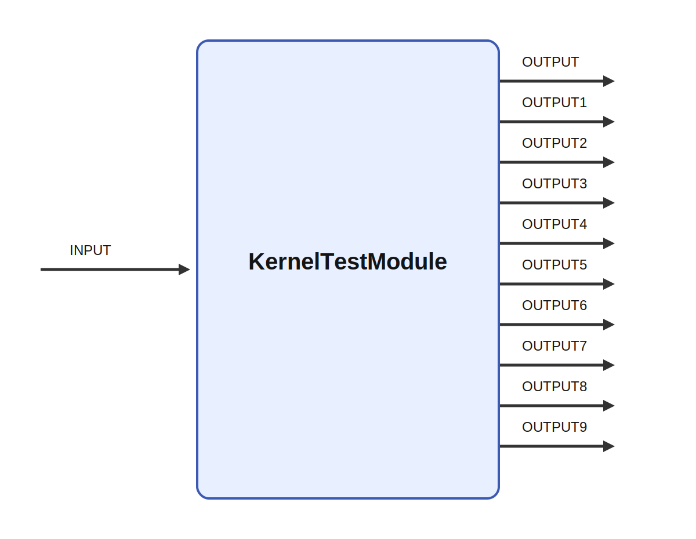

# KernelTestModule

## Description

Tests all parameter and io-functionality. Testing setting parameters from code

It receives INPUT and produces OUTPUT, OUTPUT1, OUTPUT2, and OUTPUT3 while parameters such as a, b,
c, d, and e shape its behavior. A meaningful use case is to place the module inside a larger
sensorimotor or cognitive architecture where it helps transform, summarize, or route signals between
neural subsystems and robot effectors.

## Parameters

| Name | Description | Type | Default |
| --- | --- | --- | --- |
| a | parameter a | string | 3 |
| b | parameter b | bool | true |
| c | parameter c | number | 6 |
| d | parameter d | string | text |
| e | parameter e | matrix | 4,5,6;4,3,2;9,8,7 |
| f1 | parameter f1 | number | B |
| f2 | parameter f2 | string | B |
| f3 | parameter f3 | bool | B |
| g | parameter g | rate | 0.1 |
| data | parameter data | matrix | 1, 2, 3, 4 |
| mdata | parameter data | matrix | 1, 2; 3, 4 |
| x | parameter x | number | 7 |
| y | parameter y | number | 9 |
| codeparam_1 | parameter that is set in code | number | 888 |
| codeparam_2 | parameter  that is set in code and redefined in ikg file | number | 999 |

## Inputs

| Name | Description | Optional |
| --- | --- | --- |
| INPUT |  |  |

## Outputs

| Name | Description |
| --- | --- |
| OUTPUT | The output. Copy of input. |
| OUTPUT1 | The output |
| OUTPUT2 | The output |
| OUTPUT3 | The output |
| OUTPUT4 | The output |
| OUTPUT5 | The output |
| OUTPUT6 | The output |
| OUTPUT7 | The output |
| OUTPUT8 | The output |
| OUTPUT9 | The output |

*This description was automatically created and may not be an accurate description of the module.*
