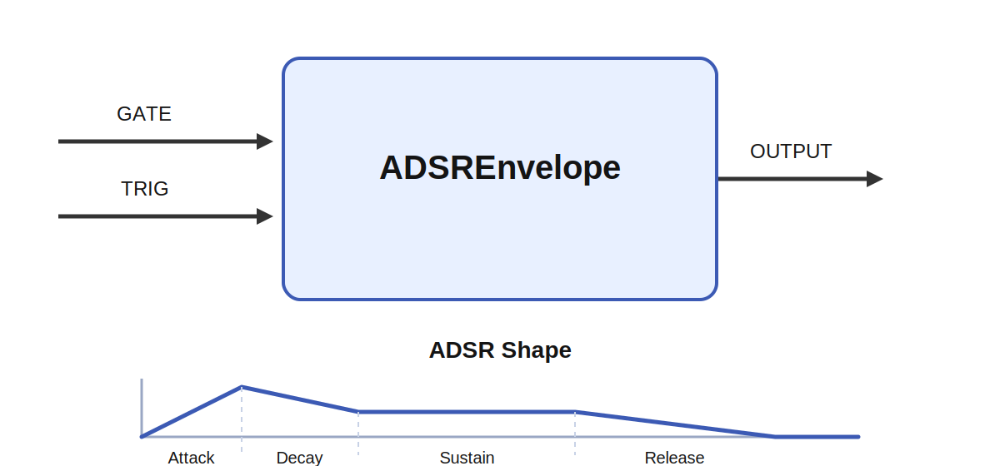

# ADSREnvelope

## Overview

`ADSREnvelope` is an audio-rate envelope generator that produces one control buffer per tick. The
buffer follows the standard `attack -> decay -> sustain -> release` shape and is intended to shape
the amplitude of an audio signal, typically by multiplying it with the output of `AudioOscillator`.

The module keeps a small internal state machine with these phases:

- `Idle`: output is `0`
- `Attack`: output rises toward `1`
- `Decay`: output falls from `1` toward `sustain`
- `Sustain`: output holds at the sustain level while `GATE` stays high
- `Release`: output falls from the current level to `0`

Because `OUTPUT` is generated at audio rate, the envelope can be multiplied directly with an audio
buffer without the stepped artifacts you get from a low-rate control signal.



## Inputs

### `GATE`

Optional gate input. A positive value means the note is held open. While the gate is high, the
envelope will move through attack and decay and then remain in sustain.

When the gate falls to `0`, the envelope enters the release phase.

### `TRIG`

Optional trigger input. A positive sample retriggers the attack phase immediately, even if the
envelope is currently in decay, sustain, or release.

This is useful when you want explicit note onsets from a sequencer like `TimeSeries.TRIG`.

## Output

### `OUTPUT`

A 1D audio-rate envelope buffer with size:

`sample_rate * tick_duration`

This is typically routed into a `Multiply` module together with an oscillator signal:

```xml
<connection source="Oscillator.OUTPUT" target="VCA.INPUT1" delay="0" />
<connection source="Envelope.OUTPUT" target="VCA.INPUT2" delay="0" />
```

## Parameters

| Name | Meaning |
| --- | --- |
| `sample_rate` | Audio sample rate in samples per second. If `0`, the module falls back to `1 / tick_duration`. |
| `attack` | Seconds taken to rise from the current level to `1`. |
| `decay` | Seconds taken to fall from `1` to `sustain`. |
| `sustain` | Held output level in the range `0..1` while the gate remains high. |
| `release` | Seconds taken to fall from the current level to `0` after note-off. |

## Behavior

For each audio sample, the module:

1. Reads the current `GATE` and `TRIG` sample.
2. Starts `Attack` on a trigger or a rising gate edge.
3. Advances the active ADSR state by one sample interval.
4. Writes the current envelope value to `OUTPUT`.

The segments are linear:

- `Attack` rises with slope `1 / attack`
- `Decay` falls with slope `(1 - sustain) / decay`
- `Release` falls from the current level to `0` over `release` seconds

## Example

```xml
<module class="AudioOscillator" name="Oscillator" sample_rate="10000" />
<module class="ADSREnvelope" name="Envelope" sample_rate="10000" attack="0.01" decay="0.08" sustain="0.6" release="0.25" />
<module class="Multiply" name="VCA" />

<connection source="Notes.OUTPUT" target="Oscillator.INPUT" delay="0" />
<connection source="Notes.TRIG" target="Envelope.TRIG" delay="0" />
<connection source="Gate.OUTPUT" target="Envelope.GATE" delay="0" />
<connection source="Oscillator.OUTPUT" target="VCA.INPUT1" delay="0" />
<connection source="Envelope.OUTPUT" target="VCA.INPUT2" delay="0" />
```

## Notes

- `sustain` is clamped to the range `[0, 1]`.
- Negative times are treated as `0`.
- Retriggering during `Release` restarts the attack from the current level.
- The implementation is single-channel and expects a 1D output buffer.
