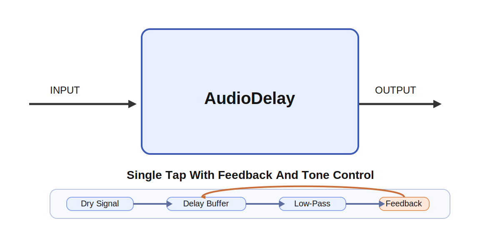

# AudioDelay

## Overview

`AudioDelay` is a simple single-tap delay effect with feedback. It processes one 1D audio buffer
per tick and stores the delay history in an internal circular buffer that persists across ticks.
The module also supports dry/wet mixing and low-pass filtering in the delayed path.

The module is useful for echoes, rhythmic repeats, and simple ambience in patches built from
`AudioOscillator`, `ADSREnvelope`, `AudioFilter`, and `AudioOutput`.

Musically, `delay_time` sets the spacing between repeats, `feedback_gain` controls how long those
repeats last, `mix` balances the original sound against the echoes, and `lowpass_cutoff` determines
how bright the repeats remain over time. Short delay times with low feedback give slapback and
doubling effects, while longer times with higher feedback move toward audible rhythmic echo lines.

## How It Works

For each sample:

1. Read the sample currently stored at the delay tap.
2. Low-pass filter the delayed signal.
3. Mix the dry input and filtered delayed signal according to `mix`.
3. Write the new sample back into the delay line as:

   `input + feedback_gain * filtered_delayed_sample`

4. Advance the circular buffer position by one sample.

This produces a classic feedback delay with one repeat path.

## Inputs

### `INPUT`

Audio buffer to delay.

## Output

### `OUTPUT`

Delayed audio buffer for the current tick.

## Parameters

| Name | Meaning |
| --- | --- |
| `sample_rate` | Audio sample rate in samples per second |
| `delay_time` | Delay time in seconds |
| `feedback_gain` | Feedback amount for the repeated echoes |
| `mix` | Dry/wet balance in the range `0..1` |
| `lowpass_cutoff` | Low-pass cutoff in Hz for the delayed path |

## Notes

- `feedback_gain` is internally limited to `-0.999 .. 0.999` to keep the delay stable.
- `mix` is clamped to the range `0 .. 1`.
- `lowpass_cutoff` is clamped to a safe range between `20 Hz` and `0.45 * sample_rate`.
- Changing `delay_time` resizes the delay buffer and clears previous delay history.
