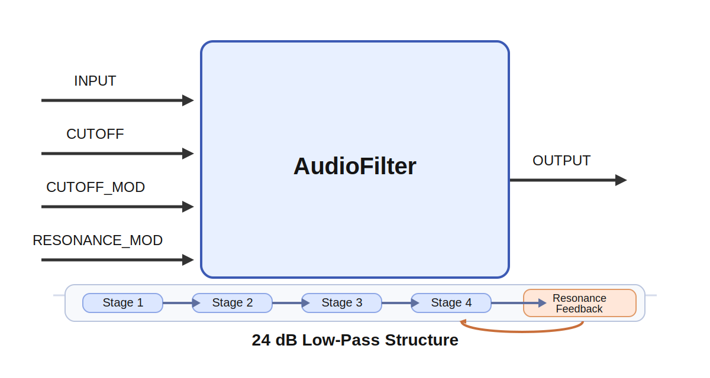

# AudioFilter

## Overview

`AudioFilter` is a buffered 24 dB/oct low-pass filter designed for the same audio-rate workflow as
`AudioOscillator` and `ADSREnvelope`. It processes one 1D audio buffer per tick and keeps its
filter state between ticks so the sound remains continuous over time.

This module is intended for subtractive synthesis patches where an oscillator provides harmonically
rich input and an envelope opens and closes the filter.

In practice, `cutoff` sets how bright the sound is, `resonance` emphasizes frequencies near that
cutoff, and `envelope_amount` determines how strongly an envelope sweep opens or closes the tone.
Low cutoff with modest resonance gives muted, rounded sounds, while higher cutoff and stronger
envelope modulation produce the classic bright synth pluck or sweep associated with subtractive
synthesis.

## Signal Flow

The filter uses four cascaded one-pole low-pass stages:

1. Read the input sample.
2. Compute a cutoff frequency from the `cutoff` parameter or the `CUTOFF` input.
3. Apply exponential modulation from `CUTOFF_MOD`:

   `cutoff_hz = base_cutoff * 2^(envelope_amount * modulation)`

4. Convert the cutoff to a one-pole coefficient.
5. Run the sample through four low-pass stages.
6. Feed back part of the final stage through the `resonance` control.

This gives a steep low-pass response that works well with ADSR-driven sweeps.

## Inputs

### `INPUT`

Audio buffer to filter.

### `CUTOFF`

Optional base cutoff in Hz. If disconnected, the `cutoff` parameter is used.

### `CUTOFF_MOD`

Optional audio-rate modulation signal, typically from `ADSREnvelope.OUTPUT`.

### `RESONANCE_MOD`

Optional modulation added to the `resonance` parameter.

## Output

### `OUTPUT`

Filtered audio buffer for the current tick.

## Parameters

| Name | Meaning |
| --- | --- |
| `sample_rate` | Audio sample rate in samples per second |
| `cutoff` | Base cutoff in Hz |
| `resonance` | Feedback amount for the four-pole structure; internally limited to a stable range |
| `envelope_amount` | Cutoff modulation depth in octaves |

## Notes

- The cutoff is clamped to a safe range of `20 Hz` to `0.45 * sample_rate`.
- Resonance is internally limited to `1.2` in this implementation to keep the simple four-stage feedback filter usable during live control.
- `CUTOFF_MOD` uses exponential mapping so ADSR control feels musical rather than linear.
- The implementation is a practical four-stage filter, not a transistor-ladder emulation.
- If the internal filter state ever becomes non-finite or explodes numerically, the state is reset so the signal path recovers immediately when the control returns to a safe range.
