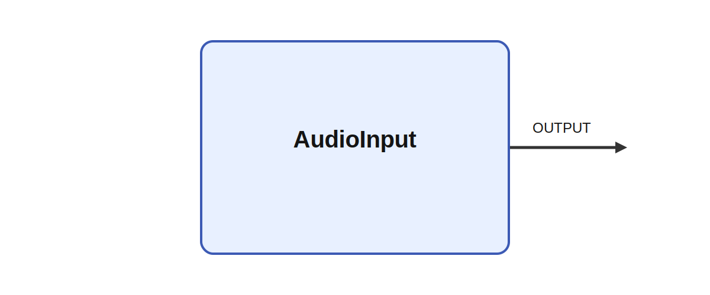

# AudioInput

## Description

Records sound from the default input device. Re-enqueue the buffer for continuous recording

It produces OUTPUT while parameters such as samplingrate and buffersize shape its behavior. A
meaningful use case is to place the module inside a larger sensorimotor or cognitive architecture
where it helps transform, summarize, or route signals between neural subsystems and robot effectors.

## Parameters

| Name | Description | Type | Default |
| --- | --- | --- | --- |
| samplingrate | Sampling rate in Hz | int | 44100 |
| buffersize | Size of output buffer | int | 4096 |

## Outputs

| Name | Description |
| --- | --- |
| OUTPUT | The recorded audio samples |

*This description was automatically created and may not be an accurate description of the module.*
