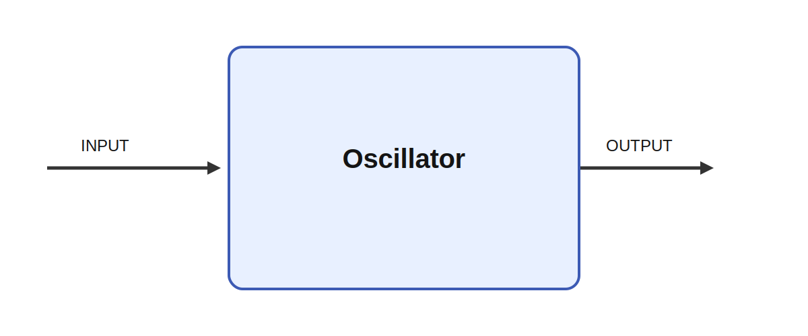

# AudioOscillator

## Overview

`AudioOscillator` is a single-channel digital audio oscillator that produces one audio buffer on
each tick. The module is intended for audio-rate synthesis inside an Ikaros graph, where the output
buffer is forwarded to an audio sink such as `AudioOutput`.

The oscillator supports:

- a fixed base frequency from the `frequency` parameter
- optional frequency control from the `INPUT`
- optional additive frequency modulation from `MODULATION`
- octave-style scaling with `multiplier`
- fixed offset with `detune`
- output scaling with `volume`
- `sine`, `square`, `saw`, `triangle`, `ramp`, and `pulse` waveforms through `wave_shape`
- adjustable pulse width through `duty_cycle` when `wave_shape` is `pulse`

The implementation uses a **phase accumulator**. That means the oscillator keeps a persistent phase
between ticks and advances that phase sample by sample. This is important because it makes frequency
changes continuous instead of restarting the waveform every tick.

## How It Works

The oscillator stores a phase value in the interval `[0, 1)`, where one full cycle corresponds to a
phase increase of `1.0`.

For each generated sample:

1. The module chooses a base frequency.
   If `INPUT` is connected, the input value is used.
   Otherwise the `frequency` parameter is used.
2. The base frequency is modified as:

   `instant_frequency = base_frequency * multiplier + detune + modulation_gain * modulation`

3. The waveform is evaluated from the current phase.
4. The phase is advanced by:

   `phase += instant_frequency / sample_rate`

5. The phase is wrapped back into `[0, 1)` after each sample.

This makes the oscillator behave correctly when the frequency changes over time. The waveform stays
phase-continuous, which avoids the clicks and pitch discontinuities that appear if the signal is
recomputed from absolute time on every tick.

## Timing And Buffer Size

`sample_rate` is the audio sampling frequency in **samples per second**. It is intentionally a
plain `number`, not an Ikaros `rate`, because the oscillator must use the real sample rate in the
phase increment formula.

The output size is:

`sample_rate * tick_duration`

So if:

- `sample_rate = 10000`
- `tick_duration = 0.1`

then the module produces `1000` samples per tick.

If `sample_rate` is `0`, the module falls back to:

`1 / tick_duration`

which means “one sample per tick”.

## Inputs

### `INPUT`

Optional frequency control input in Hz.

This input is treated as the base frequency for the oscillator. In the current implementation the
module is single-channel, so the normal use case is a scalar control signal, for example from
`TimeSeries`.

### `MODULATION`

Optional additive frequency modulation in Hz.

If connected, it is multiplied by `modulation_gain` and added to the already scaled base
frequency. This is useful for vibrato, slow sweeps, or other modulation sources.

## Output

### `OUTPUT`

A 1D audio buffer containing the generated waveform for the current tick.

## Parameters

| Name | Meaning |
| --- | --- |
| `wave_shape` | Waveform type. Supported values are `sine`, `square`, `saw`, `triangle`, `ramp`, and `pulse`. |
| `frequency` | Default base frequency in Hz when `INPUT` is not connected. |
| `sample_rate` | Audio sample rate in samples per second. |
| `multiplier` | Multiplies the base frequency before modulation and detune are applied. |
| `detune` | Adds a fixed offset in Hz. |
| `volume` | Multiplies the final waveform amplitude. |
| `modulation_gain` | Scales the `MODULATION` input before adding it to the frequency. |
| `duty_cycle` | Pulse width in the range `[0, 1]` when `wave_shape` is `pulse`. |

## Formula Summary

For each sample, the module effectively computes:

```text
base_frequency = INPUT if connected else frequency
instant_frequency = base_frequency * multiplier + detune + modulation_gain * MODULATION
phase = wrap(phase + instant_frequency / sample_rate)
output = volume * waveform(phase)
```

For the supported waveforms:

- `sine`: `sin(2 * pi * phase)`
- `square`: sign of `sin(2 * pi * phase)`
- `saw`: `2 * phase - 1`
- `triangle`: `4 * abs(phase - 0.5) - 1`
- `ramp`: `1 - 2 * phase`
- `pulse`: `1` while `phase < duty_cycle`, otherwise `-1`

## Notes

- Negative instantaneous frequencies are clamped to `0`.
- `duty_cycle` is clamped to the interval `[0, 1]`.
- The current implementation is single-channel and expects a 1D output buffer.
- Because the oscillator uses a phase accumulator, it is well suited for continuously varying pitch
  control from modules like `TimeSeries`.


