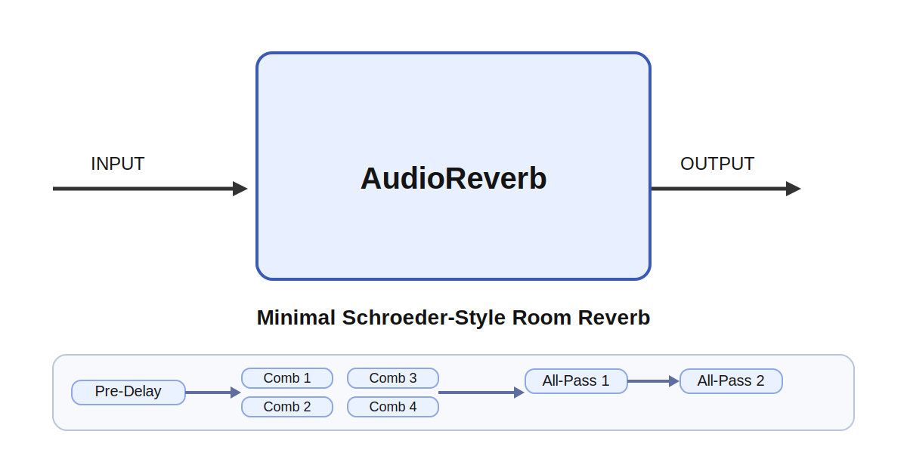

# AudioReverb

## Overview

`AudioReverb` is a minimal Schroeder-style room reverb. It processes one 1D audio buffer per tick
and keeps its internal delay-line state between ticks so the tail remains continuous over time.

The effect consists of:

- a short `pre_delay`
- four parallel comb filters that create the decaying tail
- two all-pass stages that diffuse the comb output
- a `mix` control that blends dry and wet signal

From a sound-design perspective, `mix` controls how far back the sound sits in the virtual room,
`decay` determines how long the room rings, `damping` makes the tail darker and softer, and
`pre_delay` separates the dry attack from the reverb bloom. Small pre-delay with moderate decay
feels like a compact room, while longer pre-delay and higher decay push the sound toward a larger,
more obvious ambient space.

## Parameters

| Name | Meaning |
| --- | --- |
| `sample_rate` | Audio sample rate in samples per second |
| `mix` | Dry/wet balance in the range `0..1` |
| `decay` | Reverb tail length control |
| `damping` | High-frequency damping inside the feedback paths |
| `pre_delay` | Delay before the reverb tail begins, in seconds |

## Notes

- `mix` is clamped to `0 .. 1`.
- `decay` is clamped to `0 .. 0.98` to keep the reverb stable.
- `damping` is clamped to `0 .. 1`.
- Changing `pre_delay` resizes the pre-delay line and clears its history.
- The comb and all-pass sizes are fixed internally to keep the implementation compact.
