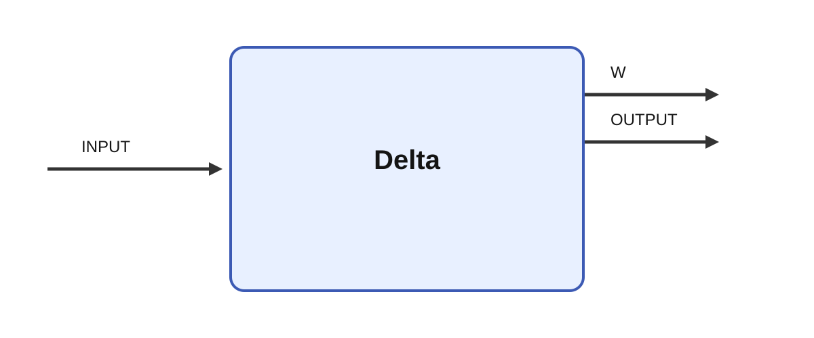

# Cerebellum

## Description

A cerebellar learning model. It combines flattened `INPUT`, `STATE`, and `TARGET` signals and
produces a scalar learned response on `OUTPUT`.

## Parameters

| Name | Description | Type | Default |
| --- | --- | --- | --- |
| learning_rate | learning rate | rate | 0.1 |
| isi_mu | Optimal inter-stimulus interval in seconds. | number | 0 |
| isi_sigma | Standard deviation of the interval curve in seconds. | number | 0 |
| isi_tau | Exponential decay time in seconds. | number | 0 |

## Inputs

| Name | Description | Optional |
| --- | --- | --- |
| INPUT | The  input |  |
| STATE | The current state. |  |
| TARGET | The target signal. |  |

## Outputs

| Name | Description |
| --- | --- |
| OUTPUT | The output |
