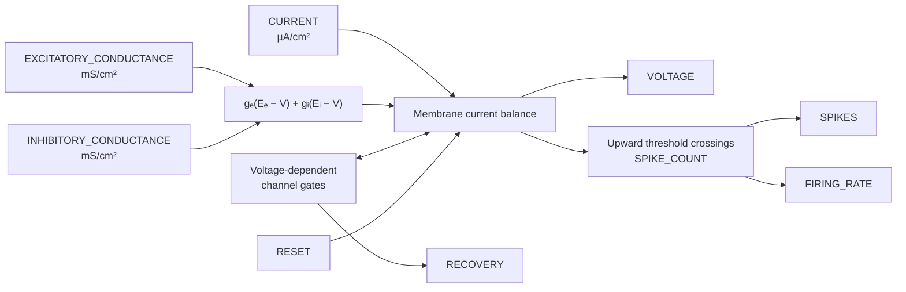

# ConductanceNeuronPopulation

## Purpose

`ConductanceNeuronPopulation` simulates a fixed-size vector of biophysical membrane models. It
supports:

- **Hodgkin–Huxley (HH)** — explicit sodium, potassium, and leak conductances with three gating
  variables.
- **Morris–Lecar (ML)** — a reduced two-state calcium/potassium model that retains nonlinear
  excitability and oscillation.

Unlike the current-driven integrate-and-fire module, synaptic inputs here are conductances. Their
currents depend on both the supplied conductance and the current membrane voltage. This makes the
driving force shrink as voltage approaches a synapse's reversal potential.

## Signal flow



Each neuron is independent inside the module. Network structure, presynaptic weights, synaptic
decay, and delays are supplied by other modules that produce the per-neuron conductance vectors.

## Units and sign convention

The module uses the conventional area-density units of classic conductance models:

- voltage: mV;
- current density: µA/cm²;
- conductance density: mS/cm²;
- capacitance density: µF/cm²; and
- time parameters: seconds.

Because \(1\ \mathrm{mS/cm^2}\times1\ \mathrm{mV}=1\ \mathrm{\mu A/cm^2}\), conductance and
reversal-potential terms combine directly. The synaptic current entering the membrane equation is

\[
I_{\mathrm{syn}} = g_e(E_e-V)+g_i(E_i-V).
\]

Both conductance inputs should normally be non-negative. The sign of each resulting current is set
by its driving force. For example, an excitatory conductance becomes progressively less
depolarizing as \(V\) approaches `excitatory_reversal_potential`.

## Hodgkin–Huxley model

The implemented HH current balance is

\[
C_m\frac{dV}{dt} = I_{\mathrm{app}} + I_{\mathrm{syn}}
- \bar g_{Na}m^3h(V-E_{Na})
- \bar g_Kn^4(V-E_K)
- g_L(V-E_L).
\]

The gates follow

\[
\frac{dx}{dt}=\alpha_x(V)(1-x)-\beta_x(V)x,
\qquad x\in\{m,h,n\}.
\]

The implemented rate functions use the modern absolute-voltage convention, with voltage in mV and
rates initially expressed per millisecond:

\[
\alpha_m=0.1\frac{V+40}{1-e^{-(V+40)/10}},
\qquad
\beta_m=4e^{-(V+65)/18},
\]

\[
\alpha_h=0.07e^{-(V+65)/20},
\qquad
\beta_h=\frac{1}{1+e^{-(V+35)/10}},
\]

\[
\alpha_n=0.01\frac{V+55}{1-e^{-(V+55)/10}},
\qquad
\beta_n=0.125e^{-(V+65)/80}.
\]

The removable singularities in \(\alpha_m\) and \(\alpha_n\) are evaluated with a stable limiting
form. Rates are converted internally from ms⁻¹ to s⁻¹. At startup and external reset, all gates are
placed at their steady-state values for `initial_voltage`:

\[
x_\infty(V)=\frac{\alpha_x(V)}{\alpha_x(V)+\beta_x(V)}.
\]

`RECOVERY` exposes the potassium activation gate \(n\); sodium activation \(m\) and inactivation
\(h\) remain internal. The formulation and default conductance values follow the classic model of
[Hodgkin and Huxley (1952)](https://doi.org/10.1113/jphysiol.1952.sp004764).

## Morris–Lecar model

Morris–Lecar reduces the membrane to voltage \(V\) and one potassium recovery variable \(w\):

\[
C_m\frac{dV}{dt}=I_{\mathrm{app}}+I_{\mathrm{syn}}
-\bar g_{Ca}m_\infty(V)(V-E_{Ca})
-\bar g_Kw(V-E_K)
-g_L(V-E_L),
\]

\[
\frac{dw}{dt}=
\frac{\cosh\!\left((V-V_3)/(2V_4)\right)}{\tau_w}
\left(w_\infty(V)-w\right).
\]

The steady-state functions are

\[
m_\infty(V)=\frac{1}{2}\left[1+\tanh\!\left(\frac{V-V_1}{V_2}\right)\right],
\]

\[
w_\infty(V)=\frac{1}{2}\left[1+\tanh\!\left(\frac{V-V_3}{V_4}\right)\right].
\]

The parameters \(V_1,V_2,V_3,V_4\) are the activation and recovery midpoint/slope parameters.
`ml_recovery_time_constant` is the base \(\tau_w\); the voltage-dependent cosh factor accelerates
recovery away from its midpoint. `RECOVERY` directly exposes \(w\). This two-dimensional structure
is based on [Morris and Lecar (1981)](https://doi.org/10.1016/S0006-3495(81)84782-0).

## Spike reporting

Conductance models generate their own action-potential waveform, so the module does **not** impose
an integrate-and-fire reset or refractory period. A spike is reported when voltage crosses
`spike_threshold` upward between consecutive internal integration states:

\[
V_{k-1}<V_{\mathrm{spike}}
\quad\text{and}\quad
V_k\ge V_{\mathrm{spike}}.
\]

This crossing rule avoids repeatedly counting a voltage that remains above threshold. The threshold
is a reporting criterion only and does not alter the membrane trajectory.

`RESET(i) > 0` restores voltage and all gates of neuron \(i\) before integrating that tick.

## Tick duration and RK4 integration

Every outer tick is divided into equal RK4 steps:

\[
N=\max\!\left(1,
\left\lceil\frac{\mathtt{tick\_duration}}
{\mathtt{maximum\_internal\_step}}\right\rceil\right),
\qquad
\Delta t=\frac{\mathtt{tick\_duration}}{N}.
\]

The default maximum step is 0.025 ms. At the reference 1 ms Ikaros tick, each neuron therefore
takes 40 RK4 steps. Inputs are sampled once per outer tick and held across those steps.

A 100 ms tick can remain numerically stable because the internal step remains small, but network
communication is still coarse: changing inputs and emitted spikes are visible to other modules only
at outer-tick boundaries. The module warns above 10 ms and describes its spike output as binned.

## Reading the outputs

- `VOLTAGE` is the final membrane voltage after the complete outer tick.
- `RECOVERY` is \(n\) for HH and \(w\) for Morris–Lecar.
- `SPIKES` indicates whether any upward crossing occurred.
- `SPIKE_COUNT` preserves multiple crossings in a coarse tick.
- `FIRING_RATE = SPIKE_COUNT / tick_duration` is an unsmoothed bin rate.

The exposed recovery variable is especially useful for phase-plane plots against `VOLTAGE`. Other
HH gates remain internal to keep a stable model-independent output shape.

## Common parameters

| Parameter | Default | Unit | Meaning |
| --- | ---: | --- | --- |
| `population_size` | 1 | neurons | Number of independent neurons and size of every port. |
| `model` | `hodgkin_huxley` | — | `hodgkin_huxley` or `morris_lecar`. |
| `initial_voltage` | -65 | mV | Voltage at startup and external reset. |
| `spike_threshold` | 0 | mV | Upward-crossing level used only for spike reporting. |
| `excitatory_reversal_potential` | 0 | mV | Excitatory synaptic reversal potential \(E_e\). |
| `inhibitory_reversal_potential` | -80 | mV | Inhibitory synaptic reversal potential \(E_i\). |
| `maximum_internal_step` | 0.000025 | s | Largest RK4 step. |

## Hodgkin–Huxley parameters

| Parameter | Default | Unit | Meaning |
| --- | ---: | --- | --- |
| `hh_capacitance_density` | 1 | µF/cm² | Membrane capacitance density. |
| `hh_sodium_conductance` | 120 | mS/cm² | Maximum sodium conductance \(\bar g_{Na}\). |
| `hh_potassium_conductance` | 36 | mS/cm² | Maximum potassium conductance \(\bar g_K\). |
| `hh_leak_conductance` | 0.3 | mS/cm² | Leak conductance \(g_L\). |
| `hh_sodium_reversal_potential` | 50 | mV | Sodium reversal potential \(E_{Na}\). |
| `hh_potassium_reversal_potential` | -77 | mV | Potassium reversal potential \(E_K\). |
| `hh_leak_reversal_potential` | -54.387 | mV | Leak reversal potential \(E_L\). |

## Morris–Lecar parameters

| Parameter | Default | Unit | Meaning |
| --- | ---: | --- | --- |
| `ml_capacitance_density` | 20 | µF/cm² | Membrane capacitance density. |
| `ml_calcium_conductance` | 4.4 | mS/cm² | Maximum calcium conductance \(\bar g_{Ca}\). |
| `ml_potassium_conductance` | 8 | mS/cm² | Maximum potassium conductance \(\bar g_K\). |
| `ml_leak_conductance` | 2 | mS/cm² | Leak conductance \(g_L\). |
| `ml_calcium_reversal_potential` | 120 | mV | Calcium reversal potential \(E_{Ca}\). |
| `ml_potassium_reversal_potential` | -84 | mV | Potassium reversal potential \(E_K\). |
| `ml_leak_reversal_potential` | -60 | mV | Leak reversal potential \(E_L\). |
| `ml_activation_midpoint` | -1.2 | mV | Calcium activation midpoint \(V_1\). |
| `ml_activation_slope` | 18 | mV | Calcium activation slope \(V_2\). |
| `ml_recovery_midpoint` | 2 | mV | Potassium recovery midpoint \(V_3\). |
| `ml_recovery_slope` | 30 | mV | Potassium recovery slope \(V_4\). |
| `ml_recovery_time_constant` | 0.025 | s | Base recovery time constant \(\tau_w\). |

Only the parameter family belonging to the selected model affects execution.

## Inputs

| Input | Shape | Unit | Optional | Meaning |
| --- | --- | --- | --- | --- |
| `CURRENT` | `[population_size]` | µA/cm² | yes | Applied current density. |
| `EXCITATORY_CONDUCTANCE` | `[population_size]` | mS/cm² | yes | Total excitatory synaptic conductance density. |
| `INHIBITORY_CONDUCTANCE` | `[population_size]` | mS/cm² | yes | Total inhibitory synaptic conductance density. |
| `RESET` | `[population_size]` | — | yes | Positive elements restore corresponding initial states. |

## Outputs

| Output | Shape | Unit | Meaning |
| --- | --- | --- | --- |
| `SPIKES` | `[population_size]` | — | One if at least one upward crossing occurred. |
| `SPIKE_COUNT` | `[population_size]` | spikes | Number of crossings during the tick. |
| `FIRING_RATE` | `[population_size]` | Hz | `SPIKE_COUNT / tick_duration`. |
| `VOLTAGE` | `[population_size]` | mV | End-of-tick membrane voltage. |
| `RECOVERY` | `[population_size]` | 1 | HH \(n\) gate or Morris–Lecar \(w\). |

## Demo and test

- `ConductanceNeuronPopulation_demo.ikg` drives four HH neurons and four Morris–Lecar neurons with
  different constant current densities and displays voltage and recovery-state trajectories.
- `tests/ConductanceNeuronPopulation_test.ikg` is the module-local smoke model.

Run the demo from the repository root:

```sh
./Bin/ikaros Source/Modules/BrainModels/ConductanceNeuronPopulation/ConductanceNeuronPopulation_demo.ikg
```
