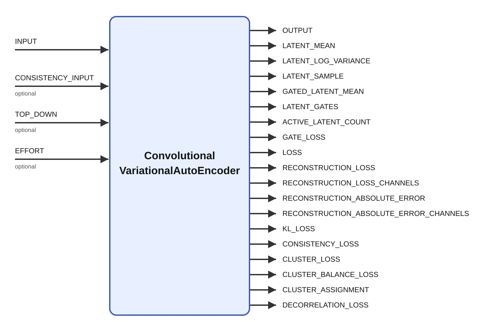

# ConvolutionalVariationalAutoEncoder

A **variational auto-encoder (VAE)** is a neural network that learns to represent data using a set
of hidden, or *latent*, variables [1]. An encoder maps an input, such as an image, to a probability
distribution over these variables, and a decoder maps a latent value back to a reconstruction of
the input. In this module, the encoder predicts a mean and variance for each Gaussian latent
variable. This lets the representation describe uncertainty and allows different samples from the
same encoded distribution to produce different reconstructions.

A VAE learns by balancing reconstruction accuracy against a regularization term that encourages its
encoded distributions to resemble a chosen prior, here a standard normal distribution [1]. The
reconstruction term rewards retaining information about the input, while the prior constraint limits
how freely the encoder can use the latent space. Sampling is made differentiable through the
reparameterization trick: the network scales and shifts independent Gaussian noise using its
predicted mean and standard deviation. Once trained, a VAE can reconstruct inputs and can also
generate new examples by decoding samples from the prior; the quality of those generated examples
depends on how well the learned latent distributions match that prior.

A **convolutional variational auto-encoder (CVAE)** applies this idea to spatially structured data
using convolutional layers. These layers reuse learned filters across an image to extract local
patterns, while the decoder combines latent information into a reconstruction. This module supports
either a dense latent vector representing the whole input or spatial latent maps that retain a grid
of local representations. Here, **CVAE means convolutional variational auto-encoder**; the same
abbreviation is also commonly used for a *conditional* VAE, whose encoder and decoder receive
additional conditioning information such as a class label. The architecture and parameters described
below refer to this module's convolutional model, which also offers a direct, nonconvolutional mode.

## Description

Learns a compact latent representation with a variational auto-encoder. The module expects a
two-dimensional `INPUT` or a rank-3 tensor using the Ikaros image convention
`[channels,height,width]`. The default `feature_stage="convolutional"` encodes the input through a
trainable convolutional feature bank before the latent bottleneck. With `feature_stage="direct"`,
the input is flattened and connected directly to a dense latent bottleneck without convolution;
this requires `latent_mode="dense"`.

When `train` is enabled, eligible ticks perform an online gradient update using reconstruction loss
plus `beta` times the KL divergence to a unit Gaussian prior; `train_interval` controls eligibility. An optional running latent
decorrelation penalty can also be enabled to discourage redundant latent features. `OUTPUT` contains
the reconstruction, while `LATENT_MEAN`, `LATENT_LOG_VARIANCE`, and `LATENT_SAMPLE` expose the
bottleneck state for other modules. Optional hard-concrete latent gates can learn which dense latent
variables or spatial latent maps are needed by the decoder.



## Parameters

| Name | Description | Type | Default | Options |
| --- | --- | --- | --- | --- |
| latent_mode | Latent bottleneck architecture | number | dense | `dense`, `spatial` |
| feature_stage | Feature transformation around the latent bottleneck (`direct` or `convolutional`) | number | convolutional | `direct`, `convolutional` |
| latent_size | Number of latent variables in dense mode | number | 8 | — |
| latent_maps | Number of latent feature maps in spatial mode | number | 4 | — |
| latent_kernel_size | Encoder neighborhood size used to form spatial latent maps | number | 1 | — |
| feature_maps | Number of convolutional feature maps | number | 4 | — |
| kernel_size | Convolution kernel size | number | 3 | — |
| padding | Convolution padding mode | number | valid | `valid`, `same` |
| learning_rate | Learning rate used when training | number | 0.001 | — |
| optimizer | Optimizer used for training | string | adam | `adam`, `sgd` |
| adam_beta1 | Adam first moment decay | number | 0.9 | — |
| adam_beta2 | Adam second moment decay | number | 0.999 | — |
| adam_epsilon | Adam numerical stability term | number | 0.00000001 | — |
| random_seed | Random initialization and sampling seed; negative values use a nondeterministic seed | number | -1 | — |
| beta | Weight of the KL-divergence term | number | 1 | — |
| latent_gating | Learn hard-concrete gates that select latent features used by the decoder | bool | no | — |
| latent_gate_penalty | Loss added for each expected open latent gate | number | 0.0001 | — |
| latent_gate_temperature | Hard-concrete gate sampling temperature | number | 0.666667 | — |
| latent_gate_initial_probability | Initial probability that a latent gate is open | number | 0.99 | — |
| latent_gate_threshold | Deterministic gate threshold used to count active latent features | number | 0.5 | — |
| latent_gate_warmup_updates | Training updates before gate learning and its sparsity penalty begin; zero disables warm-up | number | 0 | — |
| latent_gate_ramp_updates | Training updates used to linearly ramp the gate penalty to `latent_gate_penalty`; zero applies it immediately | number | 0 | — |
| latent_gate_freeze_update | Training update at which gates become deterministic and stop learning; zero disables freezing | number | 0 | — |
| reconstruction_loss | Reconstruction likelihood model (`mse` or `bernoulli`) | number | mse | `mse`, `bernoulli` |
| latent_consistency_weight | Weight of the paired-view latent mean consistency penalty | number | 0 | — |
| latent_cluster_count | Number of learned latent prototype clusters | number | 1 | — |
| latent_cluster_temperature | Soft-assignment temperature for latent prototype clusters | number | 0.1 | — |
| latent_cluster_weight | Weight of the latent prototype attraction penalty | number | 0 | — |
| latent_cluster_balance_weight | Weight of the running cluster-usage balance penalty | number | 0 | — |
| latent_cluster_balance_decay | Exponential decay used by the running cluster-usage estimate | number | 0.99 | — |
| latent_cluster_update | Prototype update rule (`gradient` or `vq`) | number | gradient | `gradient`, `vq` |
| latent_cluster_commitment_weight | Weight of the VQ-style encoder commitment penalty; zero uses `latent_cluster_weight` | number | 0 | — |
| latent_decorrelation_weight | Weight of the running latent decorrelation penalty | number | 0 | — |
| latent_decorrelation_decay | Exponential decay used by the running latent covariance estimate | number | 0.99 | — |
| train | Enable online training | bool | yes | — |
| train_interval | Run a training update every N ticks | number | 1 | — |
| dense_train_interval | Update dense VAE weights every N training updates | number | 1 | — |
| sample | Sample from the latent distribution instead of using the mean | bool | yes | — |
| reconstruction_source | Latent source used by the decoder reconstruction path | number | sample | `sample`, `mean`, `top_down` |
| output_activation | Activation applied to the reconstructed output | number | linear | `linear`, `sigmoid` |

### Reading the parameter reference

The table above lists all module parameters with their declared Ikaros types, defaults, and option
lists. An em dash in the Options column means no explicit option list is declared.
Number parameters with named options are enumerations; configure them using the displayed names.
Dimensions, seeds, and update intervals should be supplied as integers. Architecture and shape
parameters are startup configuration: reload the model after changing them. Input and output shapes
remain fixed during execution.

### Architecture

#### `latent_mode`

Options: `dense` (default), `spatial`. Dense mode produces a vector of `latent_size` Gaussian
variables. Every dense variable can combine information from the entire encoded input. Spatial mode
produces `[latent_maps,latent_height,latent_width]`: local Gaussian variables arranged on a grid,
with shared convolutional filters. Spatial mode preserves spatial organization but can contain many
more scalar latent variables than dense mode. It requires `feature_stage="convolutional"`.

#### `feature_stage`

Options: `direct`, `convolutional` (default). Convolutional mode applies a learned convolution and
ReLU before the Gaussian bottleneck, and a learned feature expansion with ReLU and a transposed
convolution on the decoder side. Direct mode flattens all input channels and connects them to the
Gaussian mean and log-variance through affine maps; its decoder is another affine map followed by
the output activation. Direct mode requires `latent_mode="dense"`; `feature_maps`, `kernel_size`,
`padding`, and `latent_kernel_size` do not affect its computation. See the direct-mode equations below.

#### `latent_size`

Positive integer, default `8`. Sets the number of scalar Gaussian variables in dense mode and the
length of the latent outputs. Larger values increase representation capacity and the size of the
dense encoder and decoder weight matrices. Smaller values impose a tighter bottleneck. It has no
effect on spatial mode. With gating enabled it is the maximum number of dense features, not the
number currently counted as active.

#### `latent_maps`

Positive integer, default `4`. Sets the number of Gaussian feature maps in spatial mode; it has no
effect on dense mode. The total scalar latent count is `latent_maps * latent_height * latent_width`.
Gating uses one gate per complete map, while clustering and decorrelation use one spatially averaged
feature per map. Increasing this parameter increases channel capacity throughout the spatial bottleneck.

#### `latent_kernel_size`

Positive integer, default `1`. Side length of the square filters mapping convolutional features to
spatial mean and log-variance maps and mapping spatial latents back to decoder features. A value of
`1` mixes feature channels at each location; larger values also combine neighboring locations.
Used only in spatial mode. With valid padding, it must fit inside the first encoded feature map.

#### `feature_maps`

Positive integer, default `4`. Number of channels in the convolutional feature bank before and after
the bottleneck. Increasing it adds learned filters and computation; in dense mode it also increases
the flattened feature count and therefore the dense weight matrices. It is independent of
`latent_maps` and is unused by the direct feature stage.

#### `kernel_size`

Positive integer, default `3`. Side length of the square input encoder and output decoder filters.
Larger kernels give each first-stage feature a wider input neighborhood and increase filter parameter
count. Convolutions use stride one. Under valid padding, the kernel must fit both input dimensions.
This parameter is unused by the direct feature stage.

#### `padding`

Options: `valid` (default), `same`. Applies to both convolutional stages, including spatial latent
filters. For input height `H` and width `W`, the first encoded map has dimensions
`H - kernel_size + 1` by `W - kernel_size + 1` with valid padding, or `H` by `W` with same padding.
Spatial latent maps have dimensions `H - kernel_size - latent_kernel_size + 2` by
`W - kernel_size - latent_kernel_size + 2` with valid padding, or `H` by `W` with same padding.
All resulting dimensions must be positive. Same padding uses zero padding at boundaries. The
transposed decoder stages restore the original input shape in either case. Unused in direct mode.

### Optimization and update timing

#### `learning_rate`

Nonnegative number, default `0.001`. Step size for the selected optimizer. Larger values move
parameters more quickly but can produce unstable updates; smaller values adapt more slowly.
In VQ clustering it also controls the direct prototype movement, whose fraction is
`clamp(learning_rate * latent_cluster_weight, 0, 1)`. A value of zero skips weight updates, but
training counters and cluster-usage statistics can still advance. Use `train="no"` to disable
training rather than treating a zero learning rate as a complete state freeze.

#### `optimizer`

Options: `adam` (default), `sgd`; string parameter. Adam uses bias-corrected exponential estimates
of gradients and squared gradients to adapt each parameter's step [3]. SGD subtracts
`learning_rate * gradient` without momentum. The choice applies to ordinary network weights,
trainable gates, and gradient-mode prototypes. VQ-mode prototype movement uses its own direct update.

#### `adam_beta1`

Number in `[0,1]`, default `0.9`; used only with Adam. Decay of the first-moment estimate:
`m = adam_beta1 * m + (1 - adam_beta1) * gradient`. Larger values retain gradient direction longer;
zero uses the current gradient. The implementation clamps the value to at most `0.999999` so that
bias correction remains defined [3]. This parameter is unrelated to the VAE loss weight `beta`.

#### `adam_beta2`

Number in `[0,1]`, default `0.999`; used only with Adam. Decay of the second-moment estimate:
`v = adam_beta2 * v + (1 - adam_beta2) * gradient^2`. Larger values smooth the scale estimate over a
longer history; smaller values react faster to changes. Internally capped at `0.999999` [3].

#### `adam_epsilon`

Nonnegative number, default `0.00000001` (`1e-8`); used only with Adam. Small positive term in the
adaptive-step denominator that prevents division by zero. Increasing it reduces adaptation for
parameters with very small gradient scales. The implementation uses a minimum of `1e-12` [3].

#### `random_seed`

Integer, default `-1`. Nonnegative values seed the module's random generator for weight
initialization, Gaussian latent sampling, and stochastic gates. Negative values retain
nondeterministic seeding. Use the same nonnegative seed, configuration, input sequence, and update
schedule for repeatable comparisons in the same execution environment. Changing sampling or gating
changes random-number consumption; a seed alone does not make such runs equivalent. The generator
is seeded at initialization, so changing this value requires restarting the module.

#### `train`

Boolean, default `yes`. Enables online training on the current input, one example per eligible tick.
With `no`, forward encoding, decoding, and loss reporting continue, but learned weights are not
updated. Sampling remains controlled separately by `sample`. If connected `EFFORT` has a sum less
than or equal to zero, the entire tick is skipped and existing outputs are retained, regardless of
`train`; effort does not scale the learning rate.

#### `train_interval`

Positive integer, default `1`. Selects every Nth eligible processing tick while `train="yes"`,
starting with the first tick. For `N=3`, training is selected on eligible ticks 1, 4, 7, and so on.
Intermediate ticks still run inference and report losses. Ticks skipped by `EFFORT` or an unusable
input, and ticks with `train="no"`, do not advance this counter. Cluster-usage statistics still
update on processed intermediate ticks while training is enabled.

#### `dense_train_interval`

Positive integer, default `1`. Updates bottleneck parameters every N training steps, starting with
the first step. Despite its name, it controls both dense Gaussian/decoder weights and spatial
Gaussian/decoder filters, including their biases and learned gate logits. Shared outer convolution
weights and prototype updates continue on every training step. Gradients are not accumulated across
skipped bottleneck updates. With `train_interval=2` and `dense_train_interval=3`, outer convolution
updates occur on eligible ticks 1, 3, 5, 7, ... and bottleneck updates on 1, 7, 13, ... . Adam keeps
separate step counters for shared and bottleneck parameters.

### Reconstruction and variational regularization

#### `beta`

Nonnegative number, default `1`. Multiplies `KL_LOSS`, the divergence between the diagonal Gaussian
encoder distribution and a standard normal prior. Increasing it puts more pressure on means toward
zero and variances toward one, potentially sacrificing reconstruction detail. Zero removes the KL
penalty but does not disable latent sampling. This weighting is motivated by beta-VAE [2], building
on the VAE objective [1]; it does not guarantee disentangled features. Here reconstruction loss is
averaged over input elements and KL over latent elements, so numerical beta values are not directly
interchangeable with implementations using summed losses. See the objective below.

#### `reconstruction_loss`

Options: `mse` (default), `bernoulli`. MSE is half the mean squared reconstruction error, suitable
for real-valued targets. Bernoulli uses mean binary cross-entropy and forces sigmoid output;
normalize such input targets to `[0,1]`. The implementation clamps Bernoulli targets to `[0,1]` and
probabilities to `[1e-6,1-1e-6]` when reporting the loss. Binary targets have a Bernoulli likelihood
interpretation [1]; fractional grayscale targets use the same cross-entropy expression. The choice
changes both the decoder gradient and reported reconstruction loss.

#### `sample`

Boolean, default `yes`. Enables Gaussian reparameterization, `z = mean + stddev * epsilon`, with
standard-normal noise [1]. With `no`, `LATENT_SAMPLE` equals the mean and a requested `sample`
reconstruction uses the mean. With `yes`, noise is drawn even during inference and even if another
reconstruction source is selected. It does not control hard-concrete gate sampling; gates can still
be stochastic on gate-training ticks. For deterministic mean inference use `train="no"`,
`sample="no"`, and `reconstruction_source="mean"`.

#### `reconstruction_source`

Options: `sample` (default), `mean`, `top_down`. Chooses the decoder's latent input before gating.
`sample` uses the Gaussian sample unless `sample="no"`; `mean` uses the encoder mean. `top_down`
uses `TOP_DOWN` only when it is connected, initialized, nonempty, and has exactly the latent shape;
otherwise it falls back to the mean. During top-down training, the displayed output and losses
remain based on the selected top-down reconstruction, but a separate mean-based reconstruction is
used internally for weight updates. Thus displayed reconstruction loss need not describe the
reconstruction used for that training step. This setting does not replace the encoder latent outputs.

#### `output_activation`

Options: `linear` (default), `sigmoid`. Linear leaves decoder values unbounded, allowing negative
and arbitrary real-valued reconstructions. Sigmoid restricts reconstructed values to `[0,1]` and
also affects the reconstruction gradient. It can be used with MSE for bounded targets. Bernoulli
reconstruction always uses sigmoid, including when this parameter says `linear`.

### Latent gates

The following parameters use hard-concrete feature gates [4]. The module-specific warm-up, ramp,
and freeze schedule is described explicitly here; it is not a required part of the cited method.

#### `latent_gating`

Boolean, default `no`. Enables a learned multiplicative gate for each dense variable or complete
spatial map. Active gate-training ticks sample gates; other ticks use deterministic stretched and
clipped sigmoid values, including warm-up and frozen periods. Gates multiply whichever decoder
source is selected. They do not remove dimensions or reduce allocated tensor sizes, and KL,
consistency, clustering, and decorrelation still operate on ungated encoder values.

#### `latent_gate_penalty`

Nonnegative number, default `0.0001`. Cost per expected open gate, multiplied by `GATE_LOSS` and the
schedule factor. Increasing it favors fewer decoder features, trading reconstruction capacity for
sparsity. The expected count is summed over gates, not averaged, so its scale grows with the
configured feature count. Zero removes this sparsity pressure but still permits gates to learn from
reconstruction gradients when gating and gate training are enabled.

#### `latent_gate_temperature`

Positive number, default `0.666667`; declared minimum `0.000001`. Controls smoothness of sampled
hard-concrete gates. Lower values make the underlying samples sharper and gradients more concentrated;
higher values soften them. Temperature also enters the expected-open probability and initialization
formula. Deterministic gate values use the logits without dividing by temperature. The implementation
floors this value at `1e-6`; see the equations below.

#### `latent_gate_initial_probability`

Number in `[0.000001,0.999999]`, default `0.99`. Expected probability that each gate is nonzero
when gate logits are first initialized. High values initially expose most features to the decoder;
lower values start with more suppression. This is an open probability, not the deterministic gate
amplitude. Existing persistent logits are retained on restore, so changing this parameter does not
reset learned gates.

#### `latent_gate_threshold`

Number in `[0,1]`, default `0.5`. Reporting threshold for `ACTIVE_LATENT_COUNT`: a deterministic gate
must be strictly greater than the threshold to count as active. It does not binarize decoder gates,
change gradients, or prune parameters. A value equal to the threshold is not counted. Compare
`LATENT_GATES` and `GATE_LOSS` as well as the active count when assessing sparsity.

#### `latent_gate_warmup_updates`

Nonnegative integer, default `0`. Holds logits fixed, uses deterministic gates, and sets the gate
penalty to zero for the first W scheduled training updates with gating enabled. Other network
parameters continue training. Zero starts gate learning immediately. Warm-up does not force gates
to one: their initialized or restored deterministic values remain in use.

#### `latent_gate_ramp_updates`

Nonnegative integer, default `0`. After warm-up, increases the sparsity coefficient over R updates.
Let `u` be the number of completed training updates with gating enabled. For `u >= W` and `R > 0`,
the multiplier is `min((u - W + 1) / R, 1)`; during warm-up it is zero. Thus the first post-warm-up
update uses `1/R` of the configured penalty. Zero applies the full coefficient immediately after
warm-up. This ramps the penalty only, not the learning rate or gate temperature.

#### `latent_gate_freeze_update`

Nonnegative integer, default `0` (no freezing). With value F greater than zero, gate learning stops
when the completed gate-training schedule counter reaches F; later ticks use fixed deterministic
gates. Other weights continue training and the scheduled gate penalty remains in reported `LOSS`.
F at or below the warm-up length leaves no active gate-learning phase. Gate schedule counters are
persistent and advance on scheduled training ticks with gating enabled, even when
`dense_train_interval` skips a gate optimizer update or `learning_rate=0` skips weight updates.

### Paired-view consistency

#### `latent_consistency_weight`

Nonnegative number, default `0`. Weight on half the mean squared difference between the encoder
means of `INPUT` and `CONSISTENCY_INPUT`. Requires a connected, nonempty second view with exactly
the input shape; zero disables the extra encoding and penalty. The same encoder processes both
views, but the second view is a stop-gradient target: only the first branch receives the consistency
gradient. Larger weights encourage invariance to the supplied augmentations and may suppress useful
input differences. No augmentation is generated by this module. Paired-view representation learning
is related to BYOL [6], but this module has neither its predictor nor its moving-average target
network and does not implement BYOL's complete objective.

### Latent clustering

Clustering uses ungated means: the whole vector in dense mode, or a spatial mean per map in spatial
mode. It is enabled when `latent_cluster_count > 1` and either `latent_cluster_weight > 0` or
`latent_cluster_commitment_weight > 0`. Balance weight alone does not enable it. The decoder still
receives continuous Gaussian latents; prototypes do not replace them with quantized codes.

#### `latent_cluster_count`

Positive integer, default `1`. Number of learned prototype vectors and length of `CLUSTER_ASSIGNMENT`.
One disables clustering and produces assignment `[1]`. With multiple prototypes but clustering
disabled, assignments are zero. Increasing the count provides more groups but requires enough varied
inputs to train them. Cluster indices are unsupervised identifiers, not class labels.

#### `latent_cluster_temperature`

Positive number, default `0.1`; minimum `0.000001`. Temperature in the gradient-mode assignment
`softmax(-distance / temperature)`. Small values concentrate responsibility on close prototypes;
large values distribute it more evenly. Its effect depends on the latent scale because distance is
half the mean squared feature difference. The VQ update uses a hard winner and is unaffected by this
temperature.

#### `latent_cluster_weight`

Nonnegative number, default `0`. Scales the attraction loss in reported `LOSS`. In gradient mode it
also scales the assignment-weighted attraction gradients for encoder features and centers. In VQ
mode it controls prototype movement, and supplies the encoder commitment weight when the explicit
commitment weight is zero. Setting it to zero with a positive commitment weight permits VQ encoder
attraction toward fixed centers. See the distinct reporting and update rules below.

#### `latent_cluster_balance_weight`

Nonnegative number, default `0`. Adds a squared deviation of running prototype usage from uniform
usage to `LOSS`. In gradient mode it contributes gradients through soft assignments. In VQ mode it
adds `weight * max(usage - 1/count, 0)` to each candidate distance before winner selection, discouraging
overused prototypes. Large values favor equal usage even when input groups are naturally unequal.
It has no effect unless clustering is enabled by the attraction or commitment weight.

#### `latent_cluster_balance_decay`

Number in `[0,1]`, default `0.99`, internally capped at `0.999999`. Sets the usage moving average:
`usage = decay * usage + (1 - decay) * assignment`. Larger values remember a longer history; zero
uses only the current assignment. At `0.99`, the rough memory scale is 100 processed samples.
Usage updates on every processed tick with `train="yes"` and clustering enabled, including ticks
without an optimizer update. It stays fixed during inference and is not persistent saved state.

#### `latent_cluster_update`

Options: `gradient` (default), `vq`. Gradient mode uses soft responsibilities and optimizer updates
for centers. Its attraction gradient treats current responsibilities as fixed; the balance gradient
differentiates through the assignments. VQ mode selects one winner, applies an encoder commitment
gradient, and moves that center toward the current features directly. This is inspired by the
codebook and commitment ideas in VQ-VAE [5], but it is an auxiliary clustering rule for a continuous
VAE, not a discrete VQ-VAE bottleneck. `CLUSTER_ASSIGNMENT` is one-hot in VQ mode.

#### `latent_cluster_commitment_weight`

Nonnegative number, default `0`. In VQ mode, a positive value sets the encoder's attraction strength
toward the selected center independently of prototype movement. Zero falls back to
`latent_cluster_weight`, so zero does not disable commitment when that weight is positive. It has
no separate commitment-gradient role in gradient mode, although a positive value enables clustering
there too. The reported total loss uses `latent_cluster_weight * CLUSTER_LOSS`; it does not add a
separately weighted commitment loss when the two weights differ.

### Latent decorrelation

#### `latent_decorrelation_weight`

Nonnegative number, default `0`. Weights the mean squared off-diagonal entries of a running latent
covariance matrix. Zero disables it; at least two latent features are required. Dense mode uses
ungated mean coordinates; spatial mode uses each map's spatial average. Increasing the weight
penalizes linear redundancy, but does not establish statistical independence or force individual
variances to one. Related covariance regularization appears in DIP-VAE [7]; this implementation
uses an online estimate and no diagonal covariance penalty, so it is not the full DIP-VAE objective.

#### `latent_decorrelation_decay`

Number in `[0,1]`, default `0.99`, internally capped at `0.999999`. Controls the running mean and
covariance history. Larger values smooth over more training examples; zero replaces history with
the current update. The rough memory scale at `0.99` is 100 training updates. Unlike cluster usage,
these statistics update only inside training steps with positive learning rate. The first sample
initializes the mean and zero covariance; gradients start after another sample. Reported
`DECORRELATION_LOSS` is computed before the current training update, from the preceding statistics.
These statistics are not persistent saved state.

## Objective and implementation details

The Gaussian encoder and reparameterized sampling follow the VAE formulation [1]. With `P` input
elements and `N` scalar latent elements, the module reports

```math
L_{\mathrm{MSE}} = \frac{1}{2P}\sum_i(\hat{x}_i-x_i)^2,\qquad
L_{\mathrm{KL}} = \frac{1}{2N}\sum_j
\left(\mu_j^2 + \exp(\ell_j) - \ell_j - 1\right),\quad \ell_j=\log\sigma_j^2.
```

The total reported loss is

```math
L = L_{\mathrm{reconstruction}} + \beta L_{\mathrm{KL}}
  + \lambda_g(u)L_{\mathrm{gate}} + \lambda_s L_{\mathrm{consistency}}
  + \lambda_c L_{\mathrm{cluster}} + \lambda_b L_{\mathrm{balance}}
  + \lambda_d L_{\mathrm{decorrelation}}.
```

The lambdas correspond respectively to the scheduled gate penalty, consistency weight, cluster
weight, balance weight, and decorrelation weight. Individual loss outputs are unweighted. The
reported objective and the update rules differ in the explicitly documented stop-gradient,
VQ commitment, running-statistics, and top-down cases. Outputs describe the forward pass before
that tick's optimizer update.

The direct feature stage implements a minimal one-layer variational auto-encoder. For flattened
input \(x\), it computes

```math
\mu = xW_\mu + b_\mu, \qquad
\log \sigma^2 = xW_\sigma + b_\sigma,
```

samples \(z = \mu + \sigma \odot \epsilon\), where
\(\epsilon \sim \mathcal{N}(0,I)\), and reconstructs the input as

```math
\hat{x} = g(zW_d + b_d).
```

Here, \(g\) is the selected output activation and is always sigmoid for Bernoulli reconstruction.
No convolutional forward, backward, or optimizer operation runs in direct mode.

When `latent_gating="yes"`, each dense latent variable has one learned gate. In spatial mode, one
gate controls each complete latent map. Given a learned gate logit \(a_j\), training samples

```math
u_j \sim \mathcal{U}(0,1), \qquad
s_j = \operatorname{sigmoid}\left(
    \frac{a_j + \log u_j - \log(1-u_j)}{T}
\right),
```

then stretches and clips the sample to obtain a hard-concrete gate

```math
g_j = \operatorname{clip}_{[0,1]}\left(s_j(\zeta-\gamma)+\gamma\right),
\qquad \gamma=-0.1,\quad\zeta=1.1,
```

where \(T\) is `latent_gate_temperature`. The decoder receives
\(\tilde z_j=g_jz_j\). The expected number of open gates is

```math
L_0 = \sum_j \operatorname{sigmoid}\left(
    a_j-T\log\frac{-\gamma}{\zeta}
\right),
```

and the total objective includes `latent_gate_penalty` times \(L_0\). During ticks without a
training update, deterministic gates are obtained by stretching and clipping
\(\operatorname{sigmoid}(a_j)\). This follows the differentiable \(L_0\) regularization method of
Louizos, Welling, and Kingma [4].

The gate penalty and gate updates are constant by default. For an optional staged comparison,
`latent_gate_warmup_updates` first holds the gate logits fixed with no sparsity penalty,
`latent_gate_ramp_updates` then increases the penalty linearly from zero to
`latent_gate_penalty`, and `latent_gate_freeze_update` can finally hold deterministic gates fixed
while the remaining network weights continue to train. These values count scheduled training updates with gating enabled,
not ticks skipped by `train_interval`; bottleneck-update skips and a zero learning rate do not pause
this gate schedule. Schedule progress is persistent module state, so saving and
resuming training does not restart the warm-up or ramp.

The latent matrix shapes remain fixed at their configured maximum sizes. Inactive features are
multiplied by zero rather than removed or reallocated. `LATENT_MEAN` remains the ungated encoder
mean so existing hierarchies retain their previous behavior. Use `GATED_LATENT_MEAN` when the learned
feature selection should be passed upward or evaluated as the compact representation.

## Inputs

| Name | Description | Optional |
| --- | --- | --- |
| INPUT | Input image or matrix | no |
| CONSISTENCY_INPUT | Optional augmented view of `INPUT` used for latent mean consistency | yes |
| TOP_DOWN | Optional top-down latent target used when `reconstruction_source` is `top_down` | yes |
| EFFORT | Training effort gate; values less than or equal to zero skip processing | yes |

## Outputs

| Name | Description |
| --- | --- |
| OUTPUT | Reconstructed input |
| LATENT_MEAN | Latent Gaussian mean |
| LATENT_LOG_VARIANCE | Latent Gaussian log variance |
| LATENT_SAMPLE | Ungated sample from the latent Gaussian |
| GATED_LATENT_MEAN | Latent mean multiplied by deterministic learned gates |
| LATENT_GATES | Deterministic gate value for each dense latent variable or spatial latent map |
| ACTIVE_LATENT_COUNT | Number of deterministic gate values above `latent_gate_threshold` |
| GATE_LOSS | Expected number of open latent gates |
| LOSS | Total VAE loss |
| RECONSTRUCTION_LOSS | Mean reconstruction loss |
| RECONSTRUCTION_LOSS_CHANNELS | Mean reconstruction loss for each input channel |
| RECONSTRUCTION_ABSOLUTE_ERROR | Mean absolute error against the original input |
| RECONSTRUCTION_ABSOLUTE_ERROR_CHANNELS | Mean absolute error for each input channel |
| KL_LOSS | KL divergence from the unit Gaussian prior |
| CONSISTENCY_LOSS | Paired-view latent mean consistency loss |
| CLUSTER_LOSS | Latent prototype attraction loss |
| CLUSTER_BALANCE_LOSS | Running latent prototype usage balance loss |
| CLUSTER_ASSIGNMENT | Soft prototype assignments in gradient mode; one-hot winner in VQ mode |
| DECORRELATION_LOSS | Running off-diagonal latent covariance penalty |

`reconstruction_loss="mse"` uses the original half mean squared error objective. For normalized
binary or grayscale image inputs, `reconstruction_loss="bernoulli"` treats each reconstructed pixel
as a Bernoulli probability and uses binary cross-entropy. Bernoulli reconstruction uses a sigmoid
decoder output even when `output_activation` is left at its default; higher hierarchy levels that
reconstruct continuous latent means should usually keep the default `mse` objective.

The latent consistency term is disabled when `latent_consistency_weight` is `0` or
`CONSISTENCY_INPUT` is unconnected. When enabled, the module encodes `CONSISTENCY_INPUT` with the
same encoder weights and adds a stop-gradient penalty that pulls the current latent mean toward the
latent mean of the paired view:

```math
L_\mathrm{consistency} =
\frac{1}{2N}\sum_i \left(\mu_i(x)-\mu_i(\tilde{x})\right)^2
```

This can be used with paired augmentations of the same input to encourage invariant codes without
using class labels.

The latent clustering term is disabled when both `latent_cluster_weight` and
`latent_cluster_commitment_weight` are `0`, or when `latent_cluster_count` is `1`. When enabled,
the module learns `latent_cluster_count` prototype centers in latent-feature space. Dense mode uses the latent mean directly. Spatial mode summarizes
each latent map by its spatial mean. In gradient mode, a soft assignment is computed from squared
distances to the prototypes:

```math
q(c=k|x) =
\frac{\exp(-d_k/\tau)}{\sum_j \exp(-d_j/\tau)}
```

where \(\tau\) is `latent_cluster_temperature` and

```math
d_k = \frac{1}{2D}\sum_i \left(f_i(x)-m_{k,i}\right)^2 .
```

The prototype attraction loss is the assignment-weighted distance,

```math
L_\mathrm{cluster} = \sum_k q(c=k|x)d_k .
```

An optional running balance term can discourage collapse onto a single prototype by penalizing
deviations between the exponential moving average of `CLUSTER_ASSIGNMENT` and uniform prototype
usage. This remains unsupervised because no class labels are used; labels can be used afterward only
to inspect whether learned prototypes align with categories.

With `latent_cluster_update="gradient"`, prototype centers are ordinary trainable parameters updated
by the selected optimizer using assignment-weighted attraction and the optional balance gradient.
Attraction treats the current soft assignments as fixed responsibilities. With
`latent_cluster_update="vq"`, the module uses a vector-quantization-style update: the winning
prototype receives a hard one-hot assignment, the encoder receives a commitment gradient toward that
winner, and the winning prototype is moved directly toward the current latent feature vector:

```math
c^* = \arg\min_k \left[d_k + \lambda_b\max(v_k-1/K,0)\right]
```

```math
L_\mathrm{commit} =
\frac{\lambda}{2D}\sum_i \left(f_i(x)-m_{c^*,i}\right)^2
```

```math
m_{c^*} \leftarrow m_{c^*} +
\operatorname{clip}_{[0,1]}(\eta \alpha) \left(f(x)-m_{c^*}\right)
```

Here \(v_k\) is running usage, \(K\) is the prototype count, and \(\lambda_b\) is the
balance weight. The winner is nearest by distance alone when balance weight is zero.
The commitment coefficient \(\lambda\) is `latent_cluster_commitment_weight` unless it is zero, in which case
`latent_cluster_weight` is used; \(\eta\) is `learning_rate`; and \(\alpha\) is
`latent_cluster_weight`. In VQ mode, a positive `latent_cluster_balance_weight` also biases winner
selection away from prototypes whose running usage is above uniform usage.

The decorrelation penalty is disabled when `latent_decorrelation_weight` is `0`. When enabled, the
module maintains an exponential running covariance estimate of the latent mean features. In dense
mode each latent unit is treated as one feature. In spatial mode each latent map is summarized by its
spatial mean, and the resulting decorrelation gradient is distributed over the map.


## Hierarchical models with bottom-up and top-down processing

Multiple CVAE modules can be stacked so that each level learns to represent the latent activity of
the level below. The lowest level encodes sensory data, such as an image. Its latent means become
the next level's input, allowing that level to learn relationships among lower-level features.
In the reverse direction, the upper decoder reconstructs its input: this is an estimate of the
lower level's latent representation. The lower decoder can then turn that estimate back into
sensory space. Repeating these connections creates a hierarchy with an ascending encoding path
and a descending reconstruction path.



*Three CVAE layers exchange bottom-up latent means (blue) and top-down reconstructions (green).
Each dashed feedback connection has a one-tick delay. Sensory input and reconstructed sensory
input are shown side by side beneath the lowest layer.*

### Connecting adjacent levels

For modules named `Lower` and `Upper`, use the following connections:

| Direction | Source | Target | Purpose |
| --- | --- | --- | --- |
| Bottom-up | `Lower.LATENT_MEAN` | `Upper.INPUT` | Encode the lower level's mean representation at the next level. |
| Top-down | `Upper.OUTPUT` | `Lower.TOP_DOWN` | Supply a reconstruction in the lower level's latent coordinates. |

Use the upper module's **`OUTPUT`** for feedback: its shape matches its own input, which is the
lower latent representation. The upper module's `LATENT_MEAN` belongs to a different latent space
and is intended for a further level above it. Select `reconstruction_source="top_down"` on the
lower module to use feedback for decoding. At the highest level, select `mean` for mean-based
reconstruction or `sample` for stochastic reconstruction. In a deeper hierarchy, intermediate
modules also use `top_down`, so a high-level reconstruction can pass through successive decoders.

For shape-compatible ports, the connection fragment is:

```xml
<connection source="Lower.LATENT_MEAN" target="Upper.INPUT" delay="0" />
<connection source="Upper.OUTPUT" target="Lower.TOP_DOWN" delay="1" />
```

A positive feedback delay breaks the execution cycle; making both directions zero-delay creates a
zero-delay loop that Ikaros rejects. With the fragment above, the upper encoder receives the current
lower mean, while the lower decoder receives the preceding tick's upper reconstruction. Descending
information therefore takes time to propagate through a deeper hierarchy. Account for this latency
when changing inputs or comparing a reconstruction with its target; a feedback buffer's initial
value is not yet a learned prediction for the current input.

### Matching shapes and reconstruction losses

Spatial latents provide a direct interface between modules: a lower latent tensor of shape
`[latent_maps,height,width]` is a valid rank-3 `INPUT` for the next CVAE. For example, a lower module
with a `28 x 28` input, `latent_mode="spatial"`, `padding="same"`, and `latent_maps=4` produces
`[4,28,28]` latent means. An upper module receiving these means produces an `OUTPUT` of exactly
`[4,28,28]`, suitable for feedback to the lower `TOP_DOWN`. The upper bottleneck can itself be dense
or spatial; choose spatial if its latents should feed another CVAE without a reshape.

Dense latents are rank-1 vectors, but this module accepts only rank-2 or rank-3 inputs. To stack
above a dense bottleneck, explicitly reshape its `[latent_size]` mean to a matrix such as
`[1,latent_size]`, and reshape the upper reconstruction back to `[latent_size]` before feedback.
For a one-row upper input, `feature_stage="direct"` with `latent_mode="dense"` avoids a convolution
kernel that would not fit under valid padding. Keep these shapes fixed at startup. `TOP_DOWN`
requires an exact shape match; an absent, empty, or mismatched feedback input falls back to the
local mean instead of supplying top-down information.

Upper levels reconstruct continuous latent means, which can be negative or exceed one. Use
`reconstruction_loss="mse"` and `output_activation="linear"` for these levels. At the sensory
level, Bernoulli reconstruction may be appropriate for normalized image targets. Passing
`LATENT_MEAN` upward avoids adding Gaussian sampling noise to the next encoder's input. If learned
feature gates should affect the ascending representation, use `GATED_LATENT_MEAN` instead; shapes
remain unchanged. Remember that the lower decoder applies its gates to top-down input as well, so
feedback learned in already-gated coordinates can be attenuated again by fractional gates.

### Training and interpreting the hierarchy

A practical starting point is to train each level using local mean or sample reconstruction before
enabling top-down decoding. Train the lowest level first, then freeze its weights with `train="no"`
while training the next level on its representations; repeat for additional levels. This gives each
new level a stable input representation. Modules can also train together online, but changes in a
lower encoder change the input distribution seen above it. Per-level learning rates and training
intervals can control their adaptation rates. For deterministic evaluation, disable training and
sampling and use a mean reconstruction at the top, with top-down reconstruction below.

Training remains **local to each module**. When `reconstruction_source="top_down"` and training is
enabled, the module displays the feedback-based reconstruction but internally trains from a separate
decode of its own encoder mean. It does not backpropagate gradients across module connections.
Consequently, the displayed reconstruction loss can differ from the reconstruction objective used
for that tick's weight update. `TOP_DOWN` selects the decoder input; it does not modify the encoder's
mean or variance, combine a top-down prior with bottom-up evidence, or iteratively correct the
posterior. This hierarchy provides bottom-up encoding and top-down generation from independently
trained VAEs [1], rather than a jointly optimized hierarchical probabilistic inference algorithm.

## References

These publications provide the underlying methods or related approaches. The parameter reference
above identifies module-specific adaptations and differences.

1. Kingma, D. P., and Welling, M. (2014). [Auto-Encoding Variational Bayes](https://arxiv.org/abs/1312.6114). *ICLR*. Preprint first published in 2013.
2. Higgins, I., Matthey, L., Pal, A., Burgess, C., Glorot, X., Botvinick, M., Mohamed, S., and Lerchner, A. (2017). [beta-VAE: Learning Basic Visual Concepts with a Constrained Variational Framework](https://openreview.net/forum?id=Sy2fzU9gl). *ICLR*.
3. Kingma, D. P., and Ba, J. (2015). [Adam: A Method for Stochastic Optimization](https://arxiv.org/abs/1412.6980). *ICLR*.
4. Louizos, C., Welling, M., and Kingma, D. P. (2018). [Learning Sparse Neural Networks through L0 Regularization](https://arxiv.org/abs/1712.01312). *ICLR*.
5. van den Oord, A., Vinyals, O., and Kavukcuoglu, K. (2017). [Neural Discrete Representation Learning](https://arxiv.org/abs/1711.00937). *Advances in Neural Information Processing Systems*, 30.
6. Grill, J.-B., Strub, F., Altché, F., Tallec, C., Richemond, P. H., Buchatskaya, E., Doersch, C., Avila Pires, B., Guo, Z., Gheshlaghi Azar, M., Piot, B., Kavukcuoglu, K., Munos, R., and Valko, M. (2020). [Bootstrap Your Own Latent: A New Approach to Self-Supervised Learning](https://arxiv.org/abs/2006.07733). *Advances in Neural Information Processing Systems*, 33.
7. Kumar, A., Sattigeri, P., and Balakrishnan, A. (2018). [Variational Inference of Disentangled Latent Concepts from Unlabeled Observations](https://arxiv.org/abs/1711.00848). *ICLR*. DIP-VAE covariance regularization.
