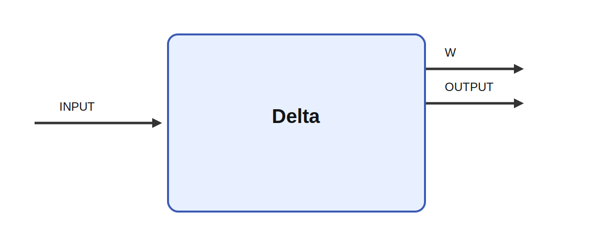

# Delta

## Description

`Delta` implements the well known delta rule for associative learning, also known as the Widrow-Hoff learning rule.
It learns a weighted response from a conditioned stimulus `CS` toward an unconditioned stimulus `US`.

On each tick, the module computes:

`CR = dot(CS, w)`

and updates the internal weights using the prediction error:

`delta = alpha * (sum(US) - CR)`

When `delta > 0`, the weights are increased in proportion to the active elements in `CS`.

If `inverse="yes"`, the output is reported as `max(0, CR - sum(US))`, which can be used to model a simple inhibitory cerebellar-style response.

## Parameters

| Name | Description | Type | Default |
| --- | --- | --- | --- |
| alpha | Learning rate | float | 0.1 |
| inverse | Report inhibitory output `max(0, CR-US)` instead of `CR` | bool | no |

## Inputs

| Name | Description | Optional |
| --- | --- | --- |
| CS | The conditioned stimulus input | yes |
| US | The unconditioned stimulus input | yes |

## Outputs

| Name | Description |
| --- | --- |
| CR | The conditioned response |
