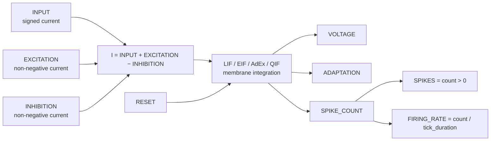

# IntegrateAndFirePopulation

## Purpose

`IntegrateAndFirePopulation` simulates a fixed-size vector of independent, current-driven spiking
neurons. It provides four related membrane models behind one stable I/O interface:

- **LIF** — leaky integrate-and-fire, the inexpensive baseline model.
- **EIF** — exponential integrate-and-fire, with a smooth accelerating spike onset.
- **AdEx** — adaptive exponential integrate-and-fire, adding a slow adaptation current.
- **QIF** — quadratic integrate-and-fire, a compact nonlinear model of spike onset.

The module models membrane dynamics only. Connectivity, synaptic filtering, propagation delays,
plasticity, and topology belong in upstream modules. Every connected current input is a vector with
`population_size` elements, and all output buffers have that same fixed setup-time size.

## Signal flow



Inputs are sampled once at the beginning of an Ikaros tick and held constant during all internal
integration steps. Neurons do not interact internally, so recurrent networks are constructed by
connecting their outputs through explicit synapse and connectivity modules.

## Common membrane quantities

Voltages are in mV, applied currents are in nA, membrane resistance is in MΩ, and time parameters
are in seconds. The passive membrane time constant is

\[
\tau_m = R_m C_m.
\]

With these units, `membrane_resistance × current` is a voltage in mV. The total applied current for
neuron \(i\) is

\[
I_i = I_{\mathrm{input},i} + I_{\mathrm{exc},i} - I_{\mathrm{inh},i}.
\]

An absent optional input contributes zero.

## Models

### Leaky integrate-and-fire (LIF)

The LIF membrane equation is

\[
\tau_m \frac{dV}{dt} = E_L - V + R_m I.
\]

For constant current during one internal interval \(\Delta t\), the module uses the exact passive
update

\[
V(t+\Delta t) = V_\infty + \left(V(t)-V_\infty\right)e^{-\Delta t/\tau_m},
\qquad
V_\infty = E_L + R_m I.
\]

This avoids the step-size-dependent passive decay of forward Euler integration. Threshold detection
still occurs at internal-step boundaries.

### Exponential integrate-and-fire (EIF)

EIF adds an exponential current that accelerates depolarization near threshold:

\[
C_m\frac{dV}{dt} =
\frac{E_L-V}{R_m} + I
+ \frac{\Delta_T}{R_m}
  \exp\!\left(\frac{V-V_T}{\Delta_T}\right).
\]

Here \(\Delta_T\) is `slope_factor` and \(V_T\) is `threshold`. The exponent is capped internally
before evaluation to avoid floating-point overflow after the trajectory has already entered the
spike region. EIF is integrated with fourth-order Runge–Kutta (RK4).

### Adaptive exponential integrate-and-fire (AdEx)

AdEx adds the adaptation current \(w\) to EIF:

\[
C_m\frac{dV}{dt} =
\frac{E_L-V}{R_m} + I - w
+ \frac{\Delta_T}{R_m}
  \exp\!\left(\frac{V-V_T}{\Delta_T}\right),
\]

\[
\tau_w\frac{dw}{dt} = a(V-E_L)-w.
\]

`subthreshold_adaptation` is \(a\), expressed in nS; the implementation converts
\(a(V-E_L)\) to nA. At every spike,

\[
w \leftarrow w+b,
\]

where \(b\) is `spike_adaptation`. This produces history-dependent firing and can create spike-rate
adaptation. The model follows the structure introduced by
[Brette and Gerstner (2005)](https://doi.org/10.1152/jn.00686.2005).

### Quadratic integrate-and-fire (QIF)

QIF adds a quadratic membrane current to the passive current:

\[
C_m\frac{dV}{dt} =
\frac{E_L-V}{R_m} + I
+ k(V-E_L)(V-V_T).
\]

The coefficient \(k\) is `quadratic_gain` in nA/mV². The quadratic term creates nonlinear spike
onset while retaining one membrane state. QIF is useful for dynamical-systems studies and compact
large-network simulations.

## Spike, reset, and refractory behavior

At an internal step where \(V\ge V_T\), the module:

1. increments `SPIKE_COUNT`;
2. sets \(V\) to `reset_potential`;
3. adds `spike_adaptation` to \(w\) for AdEx; and
4. starts `refractory_period`.

During the refractory interval, voltage is held at `reset_potential`. AdEx adaptation continues to
relax. Refractory time is stored as a continuous duration rather than as a number of outer ticks, so
changing `tick_duration` does not quantize the configured refractory period unnecessarily.

`RESET(i) > 0` restores neuron \(i\) to `initial_potential`, zero adaptation, and zero remaining
refractory time before processing that tick.

## Tick duration and numerical integration

The reference configuration uses `tick_duration = 0.001` s. Values from 0.0001 to 0.01 s are the
normal operating range. The module subdivides each outer tick into

\[
N = \max\!\left(1,
\left\lceil\frac{\mathtt{tick\_duration}}
{\mathtt{maximum\_internal\_step}}\right\rceil\right),
\qquad
\Delta t = \frac{\mathtt{tick\_duration}}{N}.
\]

The internal steps exactly cover the outer tick. LIF uses its exact passive update; EIF, AdEx, and
QIF use RK4. A 100 ms tick remains numerically subdivided and reports binned spike counts, but inputs
and inter-module feedback are still only exchanged every 100 ms. The module therefore warns when
`tick_duration` exceeds 10 ms.

## Reading the outputs

- `SPIKES` is an event-presence flag. It is always zero or one.
- `SPIKE_COUNT` preserves multiple spikes within a coarse tick.
- `FIRING_RATE` is the unsmoothed bin rate. At 1 ms a single spike produces 1000 Hz for one tick; it
  is not a long-term firing-rate estimate.
- `VOLTAGE` is the membrane state at the end of the tick.
- `ADAPTATION` is the AdEx current. It is zero for LIF, EIF, and QIF.

Use `SPIKE_COUNT` when each event should contribute synaptic weight. Use `SPIKES` for logic that only
needs to know whether any event occurred. Apply a separate low-pass or windowed estimator when a
smooth rate is required.

## Parameters

| Parameter | Type | Default | Unit | Meaning |
| --- | --- | ---: | --- | --- |
| `population_size` | number | 1 | neurons | Number of independent neurons and size of every port. |
| `model` | option | `lif` | — | `lif`, `eif`, `adex`, or `qif`. |
| `membrane_time_constant` | number | 0.02 | s | Passive membrane time constant \(\tau_m\). |
| `membrane_resistance` | number | 100 | MΩ | Membrane resistance \(R_m\). |
| `resting_potential` | number | -65 | mV | Passive reversal/rest potential \(E_L\). |
| `threshold` | number | -50 | mV | Spike threshold \(V_T\). |
| `reset_potential` | number | -65 | mV | Voltage imposed after a spike and during refractoriness. |
| `initial_potential` | number | -65 | mV | Voltage used at startup and external reset. |
| `refractory_period` | number | 0.002 | s | Absolute refractory duration. |
| `slope_factor` | number | 2 | mV | EIF/AdEx exponential slope \(\Delta_T\). |
| `adaptation_time_constant` | number | 0.1 | s | AdEx adaptation time constant \(\tau_w\). |
| `subthreshold_adaptation` | number | 4 | nS | AdEx voltage-dependent adaptation conductance \(a\). |
| `spike_adaptation` | number | 0.08 | nA | AdEx spike-triggered increment \(b\). |
| `quadratic_gain` | number | 0.004 | nA/mV² | QIF quadratic-current coefficient \(k\). |
| `maximum_internal_step` | number | 0.0001 | s | Largest numerical integration interval. |

## Inputs

| Input | Shape | Unit | Optional | Meaning |
| --- | --- | --- | --- | --- |
| `INPUT` | `[population_size]` | nA | yes | Signed applied current. |
| `EXCITATION` | `[population_size]` | nA | yes | Excitatory current added to `INPUT`. |
| `INHIBITION` | `[population_size]` | nA | yes | Inhibitory current subtracted from `INPUT`. |
| `RESET` | `[population_size]` | — | yes | Positive elements reset corresponding neurons. |

## Outputs

| Output | Shape | Unit | Meaning |
| --- | --- | --- | --- |
| `SPIKES` | `[population_size]` | — | One if at least one spike occurred in the tick. |
| `SPIKE_COUNT` | `[population_size]` | spikes | Number of spikes in the tick. |
| `FIRING_RATE` | `[population_size]` | Hz | `SPIKE_COUNT / tick_duration`. |
| `VOLTAGE` | `[population_size]` | mV | End-of-tick membrane voltage. |
| `ADAPTATION` | `[population_size]` | nA | AdEx adaptation current, otherwise zero. |

## Demo and test

- `IntegrateAndFirePopulation_demo.ikg` drives all four models with four current levels and displays
  their voltage and spike behavior in BrainStudio.
- `tests/IntegrateAndFirePopulation_test.ikg` is the module-local smoke model used across multiple
  tick durations.

Run the demo from the repository root:

```sh
./Bin/ikaros Source/Modules/BrainModels/IntegrateAndFirePopulation/IntegrateAndFirePopulation_demo.ikg
```
