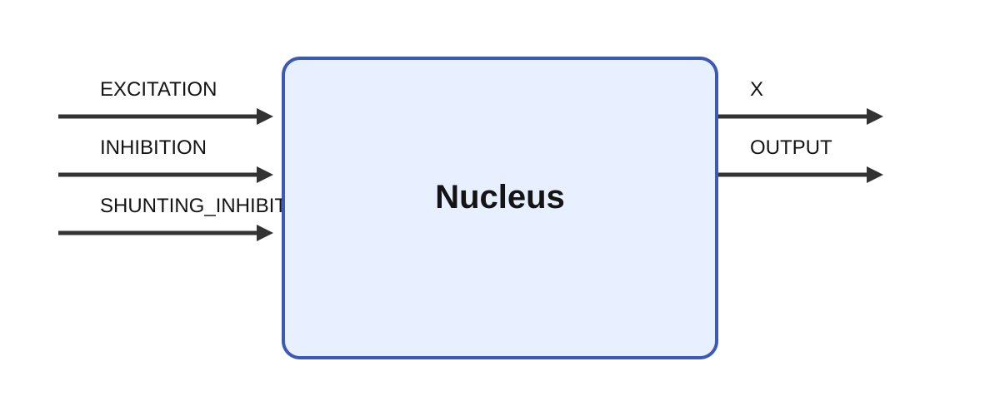

# Nucleus

## Purpose

`Nucleus` is a compact rate-coded model of a generic neural nucleus. It integrates a scalar internal
state from excitatory, subtractive inhibitory, and divisive shunting-inhibitory input. A selectable
activation function transforms that state into the public output.

The module is useful as a building block in larger functional circuits—for example, sensory
integration, action selection, gating, rhythmic control, or state estimation. It is not a detailed
model of the cellular composition or anatomy of any particular biological nucleus.



## Input aggregation

Each input port accepts any number of connected scalar or matrix elements and is flattened by
Ikaros. Let the resulting excitatory, inhibitory, and shunting values be \(e_i\), \(i_i\), and
\(s_i\). With `scale_inputs=yes`, the module uses their averages:

\[
E=\frac{1}{N_E}\sum_i e_i,
\qquad
I=\frac{1}{N_I}\sum_i i_i,
\qquad
S=\frac{1}{N_S}\sum_i s_i.
\]

With `scale_inputs=no`, it uses the corresponding sums. A disconnected optional input contributes
zero. Averaging makes the response less sensitive to the number of connected elements; summing
makes additional inputs increase the total drive.

The `beta` and `gamma` parameters are not changed automatically. Their defaults are both 1;
normalization by input count comes exclusively from `scale_inputs=yes`.

## State dynamics

Before applying the output nonlinearity, the module computes the drive

\[
D_k=
\alpha
+\beta\frac{E_k}{1+\psi S_k}
-\gamma I_k
-\delta x_k
+\eta_k,
\]

where \(x_k\) is the current internal state and
\(\eta_k\sim\mathcal N(0,\sigma^2)\) is one Gaussian sample per tick. The state is advanced with
forward Euler integration:

\[
x_{k+1}=x_k+\varepsilon\,\Delta t\,D_k.
\]

`epsilon` is an Ikaros `rate` parameter. Its configured value \(\varepsilon\) is expressed in
s\(^{-1}\), and Ikaros supplies \(\varepsilon\Delta t\) to the C++ module. Thus larger values make
the state respond faster. When interpreted as a conventional time scale, its reciprocal is
\(\tau=1/\varepsilon\).

Ordinary inhibition subtracts \(\gamma I\) from the drive. Shunting inhibition instead divides
only the excitatory term by \(1+\psi S\). With the usual non-negative inputs and \(\psi\ge0\), this
attenuates excitation without directly changing the resting or ordinary inhibitory terms. Parameter
combinations that make the denominator zero or nearly zero should be avoided.

For the unforced, noise-free linear state equation, forward-Euler stability requires approximately

\[
0<\varepsilon\delta\Delta t<2.
\]

Values well below the upper bound give a smoother and more accurate approximation. The noise is
sampled once per tick and then multiplied by \(\varepsilon\Delta t\); it is discrete-time drive
noise, not continuous white noise with \(\sqrt{\Delta t}\) scaling. Its effect therefore changes
when `tick_duration` changes.

## Output activation

Except in threshold mode, the module applies one of the following functions to the updated state:

\[
u=x_{k+1}-\theta.
\]

| `activation_function` | Activation \(f(u)\) | Notes |
| --- | --- | --- |
| `atan` | \(\operatorname{atan}(u)/\operatorname{atan}(1)\) | Default; equals 1 at \(u=1\) and approaches ±2. |
| `threshold` | \(1\) if \(x_{k+1}>\theta\), otherwise \(0\) | Resets the state after a crossing. |
| `ReLU` | \(\max(0,u)\) | Rectified linear output. |
| `tanh` | \(\tanh(u)\) | Bounded between −1 and 1. |
| `sigmoid` | \(1/(1+e^{-u})\) | Bounded between 0 and 1. |
| `linear` | \(u\) | No nonlinear transformation. |

The final output transformation is

\[
\mathrm{OUTPUT}
=\mathrm{output\_offset}
+\mathrm{output\_scale}\,f(u).
\]

Consequently, `output_offset` and `output_scale` affect `OUTPUT` but not the internal state `X` or
its feedback dynamics.

### Threshold and burst behavior

In `threshold` mode, a tick for which the updated state exceeds \(\theta\) produces an activation
of 1 and resets `X` to zero. With `burst_time=0`, this produces a single-tick pulse. With a positive
`burst_time`, the module retains that output and pauses state integration until the specified time
has elapsed. Processing then resumes from the reset state.

## Parameters

| Parameter | Type | Default | Unit | Meaning |
| --- | --- | ---: | --- | --- |
| `alpha` | number | 0 | state | Constant resting drive. |
| `beta` | number | 1 | context-dependent | Excitatory gain. |
| `gamma` | number | 1 | context-dependent | Subtractive inhibitory gain. |
| `delta` | number | 1 | 1 | State-decay coefficient inside the drive. |
| `psi` | number | 1 | context-dependent | Strength of divisive shunting inhibition. |
| `sigma` | number | 0 | state | Standard deviation of the per-tick Gaussian drive sample. |
| `seed` | number | -1 | 1 | Gaussian random seed; negative selects nondeterministic seeding. |
| `theta` | number | 0 | state | Activation threshold or horizontal offset. |
| `epsilon` | rate | 1 | s⁻¹ | Overall state-update rate; its reciprocal is a nominal time constant. |
| `scale_inputs` | bool | yes | 1 | Use the average of each input buffer instead of its sum. |
| `output_offset` | number | 0 | output | Offset applied after the activation function. |
| `output_scale` | number | 1 | output | Scale applied after the activation function. |
| `activation_function` | option | `atan` | 1 | `atan`, `threshold`, `ReLU`, `tanh`, `sigmoid`, or `linear`. |
| `burst_time` | number | 0 | s | Duration of a held threshold pulse; zero means one tick. |

Because this is a generic model, most signal units depend on the surrounding circuit. The units in
the table assume that the bracketed drive has the same units as `X`; multiplication by `epsilon`
then gives the state derivative in state units per second. A model may use another consistent
convention.

## Inputs

| Input | Shape | Optional | Meaning |
| --- | --- | --- | --- |
| `EXCITATION` | flattened | yes | Excitatory input elements contributing to \(E\). |
| `INHIBITION` | flattened | yes | Subtractive inhibitory input elements contributing to \(I\). |
| `SHUNTING_INHIBITION` | flattened | yes | Divisive inhibitory input elements contributing to \(S\). |

## Outputs

| Output | Shape | Meaning |
| --- | --- | --- |
| `X` | `[1]` | Integrated internal state after the current update. |
| `OUTPUT` | `[1]` | Offset and scaled activation of the state. |

## Example

`Nucleus_test.ikg` connects three `Nucleus` modules in series and drives them with a square-wave
oscillator. It provides a simple view of the state filtering and nonlinear response.

Run it from the repository root:

```sh
./Bin/ikaros Source/Modules/BrainModels/Nucleus/Nucleus_test.ikg
```
