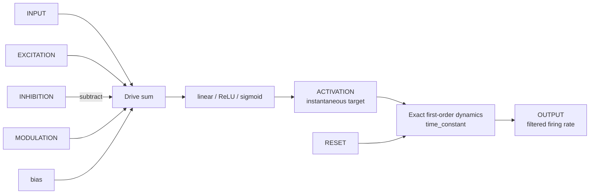
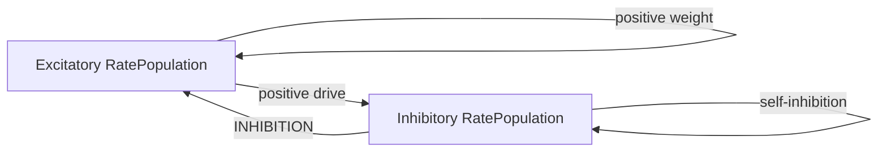

# RatePopulation

## Purpose

`RatePopulation` represents neural activity as a continuous firing rate rather than as individual
spikes. Each element is an independent first-order dynamical unit with a configurable static
activation function:

- **linear** — proportional response with output bounds;
- **ReLU** — rectified-linear response; or
- **sigmoid** — smooth saturating response between the configured bounds.

Rate models are appropriate when average activity matters more than millisecond spike timing. They
are useful for neural fields, decision and competition circuits, sensory preprocessing, motor
commands, and population-level approximations of larger spiking networks.

## Signal flow



All ports are fixed vectors of `population_size` elements. The module contains no internal
connectivity. Recurrent rate networks are built by feeding `OUTPUT` through explicit weight and
connection modules into one or more input ports.

## Total drive

For unit \(i\), the signed drive in Hz is

\[
d_i = I_i + E_i - H_i + M_i + b,
\]

where absent optional inputs contribute zero and \(b\) is `bias`. Although the quantities are
expressed in Hz for a direct population-rate interpretation, they are best understood as
rate-equivalent drives before the activation function.

## Activation functions

Let \(r_{\min}\) and \(r_{\max}\) be `minimum_output` and `maximum_output`, and let \(g\) be `gain`.

### Linear

\[
F(d)=\operatorname{clip}(g d,r_{\min},r_{\max}).
\]

The configured bounds make the linear option safe for non-negative firing rates while still
allowing signed state variables if `minimum_output` is set below zero.

### Rectified linear (ReLU)

\[
F(d)=\operatorname{clip}(\max(0,g d),r_{\min},r_{\max}).
\]

With the default minimum of zero, negative drive produces no activity. If a positive
`minimum_output` is configured, the final clip raises the result to that floor.

### Sigmoid

\[
F(d)=r_{\min}+
\frac{r_{\max}-r_{\min}}
{1+\exp[-g(d-d_{1/2})]},
\]

where \(d_{1/2}\) is `sigmoid_midpoint`. At that drive, the target is halfway between the minimum
and maximum. Larger gain produces a steeper transition. The exponent is capped internally to avoid
floating-point overflow without changing the saturated result materially.

`ACTIVATION` exposes \(F(d)\) directly, which is useful for separating static nonlinear effects
from temporal filtering.

## First-order rate dynamics

The population output follows

\[
\tau\frac{dr}{dt}=-r+F(d),
\]

where \(\tau\) is `time_constant`. Because inputs are held constant during an Ikaros tick, the
module evaluates the exact solution

\[
r(t+\Delta t)=F(d)+\left[r(t)-F(d)\right]e^{-\Delta t/\tau}.
\]

This is preferable to a forward-Euler blend: it is stable for every positive time constant and
scales consistently as `tick_duration` changes. Its qualitative response is an exponential
approach to the instantaneous activation target:

```text
rate
 ^                         ───────── F(d)
 |                    ─────
 |                ───
 |             ──
 |          ──
 |______────________________________________> time
        step in drive       time scale ≈ τ
```

After one time constant, approximately 63.2% of the distance to a new constant target has been
covered; after three, approximately 95% has been covered.

## Tick-duration behavior

`tick_duration` is the \(\Delta t\) in the exact update. No internal substeps are necessary. The
module therefore behaves well across the intended 0.1–10 ms range and remains mathematically stable
at 100 ms. A coarse tick still means that rapidly changing upstream inputs are sampled less often,
but it does not destabilize the first-order integration.

`RESET(i) > 0` first restores `OUTPUT(i)` to `initial_output`, clipped to the configured bounds. The
unit then performs the normal update during that same tick. Consequently, the end-of-tick output may
already have moved from the exact reset value toward the current activation target.

## Choosing parameters

- Use a small `time_constant` for fast tracking and a large value for slow population memory.
- Use `linear` for proportional state dynamics or when upstream modules already provide a
  nonlinearity.
- Use `relu` for sparse, non-negative activation with a simple threshold at zero drive.
- Use `sigmoid` for smooth saturation and bounded recurrent networks.
- Use `bias` to shift every unit's drive equally. For per-unit bias, connect a vector to
  `MODULATION`.
- Set `minimum_output` below zero only when `OUTPUT` represents a signed neural state rather than a
  literal firing rate.

## Parameters

| Parameter | Type | Default | Unit | Meaning |
| --- | --- | ---: | --- | --- |
| `population_size` | number | 1 | neurons | Number of independent rate units and size of every port. |
| `activation_function` | option | `linear` | — | `linear`, `relu`, or `sigmoid`. |
| `time_constant` | number | 0.02 | s | First-order response time constant \(\tau\). |
| `gain` | number | 1 | 1 | Activation slope or proportional gain \(g\). |
| `bias` | number | 0 | Hz | Scalar added to total drive before activation. |
| `sigmoid_midpoint` | number | 0 | Hz | Sigmoid half-activation drive \(d_{1/2}\). |
| `minimum_output` | number | 0 | Hz | Lower activation/output bound. |
| `maximum_output` | number | 100 | Hz | Upper activation/output bound. |
| `initial_output` | number | 0 | Hz | Startup and reset output before normal tick evolution. |

`maximum_output` must be greater than or equal to `minimum_output`; setup fails clearly otherwise.

## Inputs

| Input | Shape | Unit | Optional | Meaning |
| --- | --- | --- | --- | --- |
| `INPUT` | `[population_size]` | Hz | yes | Signed external drive. |
| `EXCITATION` | `[population_size]` | Hz | yes | Drive added to `INPUT`. |
| `INHIBITION` | `[population_size]` | Hz | yes | Drive subtracted from `INPUT`. |
| `MODULATION` | `[population_size]` | Hz | yes | Signed per-unit additive modulation. |
| `RESET` | `[population_size]` | — | yes | Positive elements reset corresponding units. |

## Outputs

| Output | Shape | Unit | Meaning |
| --- | --- | --- | --- |
| `OUTPUT` | `[population_size]` | Hz | Filtered population rate \(r\). |
| `ACTIVATION` | `[population_size]` | Hz | Instantaneous target \(F(d)\). |

## Recurrent population models

An excitatory/inhibitory rate circuit can be assembled from two module instances:



Keeping the two populations explicit preserves ordinary vector shapes and allows weights, delays,
and nonlinearities to be inspected independently.

## Demo and test

- `RatePopulation_demo.ikg` sends the same oscillating five-channel drive through linear, ReLU, and
  sigmoid populations, making their different transformations directly comparable.
- `tests/RatePopulation_test.ikg` is the module-local smoke model used at several tick durations.

Run the demo from the repository root:

```sh
./Bin/ikaros Source/Modules/BrainModels/RatePopulation/RatePopulation_demo.ikg
```
