# SpikeGenerator

## Purpose

`SpikeGenerator` creates synthetic spike events without simulating a membrane potential. A fixed
population can operate in one of three modes:

- **Poisson** — independent random counts with a specified mean firing rate;
- **regular** — deterministic periodic events with retained phase; or
- **triggered** — events derived from an external level or rising edge.

The module is useful for controlled network stimulation, stochastic background activity, periodic
pacemakers, sensor-to-spike conversion, repeatable tests, and comparisons between rate and spiking
representations.

## Signal flow



Each generator is independent. All input and output vectors contain `population_size` elements.

## Effective rate

If `RATE` is connected, element \(i\) supplies the firing rate \(r_i\) in Hz. Negative input rates
are clipped to zero. If `RATE` is absent, every element uses the scalar `firing_rate` parameter.

`firing_rate` is an Ikaros `rate` parameter. Ikaros converts its configured spikes/s value to an
expected amount per outer tick. The module divides that amount by `tick_duration` when it needs the
physical value in Hz. This preserves the configured frequency when the model's tick duration
changes.

`EFFECTIVE_RATE` exposes the resulting non-negative rate in Hz.

## Poisson mode

For each generator and outer tick, the module draws

\[
K \sim \operatorname{Poisson}(\lambda),
\qquad
\lambda=r\,\Delta t,
\]

where \(r\) is the effective rate in Hz and \(\Delta t\) is `tick_duration` in seconds. Thus

\[
P(K=k)=e^{-\lambda}\frac{\lambda^k}{k!}.
\]

At short ticks, \(K\) is usually zero or one. At coarse ticks it can be greater than one, and the
full value is retained in `SPIKE_COUNT`.

The optional `refractory_period` applies a simple per-bin cap after the Poisson draw:

\[
K \leftarrow \min\!\left(K,
1+\left\lfloor\frac{\Delta t}{t_{\mathrm{ref}}}\right\rfloor\right).
\]

This limits physically impossible event density in a bin, but it is an approximation rather than a
continuous-time Poisson renewal process with dead time. Leave it at zero for an exact Poisson count
process. Use a membrane model when detailed within-bin refractory timing matters.

## Regular mode

Regular mode stores a normalized phase \(\phi\in[0,1)\), measured in cycles. Each tick computes

\[
q=\phi+r\Delta t,
\qquad
K=\lfloor q\rfloor,
\qquad
\phi\leftarrow q-K.
\]

This analytical phase advance preserves every crossed period. For example, a 100 Hz generator in a
100 ms tick reports ten events rather than collapsing them to one. `initial_phase` offsets the
initial event timing, and `PHASE` exposes the retained fractional cycle.

## Triggered mode

Triggered mode ignores the rate for event generation, although `EFFECTIVE_RATE` still reports the
configured/input value. It supports two rules.

For `rising_edge`:

\[
K_i(t)=
\begin{cases}
1,&T_i(t)>0\ \text{and}\ T_i(t-1)\le0,\\
0,&\text{otherwise}.
\end{cases}
\]

For `level`:

\[
K_i(t)=
\begin{cases}
1,&T_i(t)>0,\\
0,&T_i(t)\le0.
\end{cases}
\]

Level mode therefore emits at most one event per outer tick while the trigger remains positive.
Rising-edge mode emits once at the transition.

## Enable and reset behavior

If `ENABLE` is absent, all generators are enabled. If connected, an element is enabled only when
its value is positive.

Disabled regular generators pause their phase rather than advancing invisibly. Disabled Poisson
generators perform no random draw, which means disabling also pauses consumption of that module's
random sequence.

`RESET(i) > 0` suppresses events from generator \(i\) for that tick, restores its regular phase to
`initial_phase`, and clears its remembered trigger state. Reset does not reseed the random-number
generator.

## Random seeds and reproducibility

Poisson draws use one persistent `std::mt19937` engine per module:

- `seed < 0` seeds it nondeterministically through `std::random_device`;
- `seed >= 0` produces a repeatable sequence for the same module configuration, tick duration,
  enable/reset history, rate inputs, and generator iteration order.

Two identical module instances with the same non-negative seed receive identical sequences when
they receive identical inputs and commands. Changing `population_size` can change later per-neuron
draws because all elements share one engine and are sampled in index order.

## Tick duration and binned output

Poisson and regular modes calculate event counts directly for the complete outer tick, so they scale
naturally from 0.1 ms through 100 ms. Trigger inputs are sampled once per tick and cannot reveal
transitions that occurred between samples.

```text
fine ticks:    |0|0|1|0|0|1|0|0|0|1|       SPIKE_COUNT is usually 0 or 1
coarse tick:   |          3          |       all three events remain in SPIKE_COUNT
SPIKES:        |          1          |       event-presence flag only
```

The module does not export within-bin event times. A downstream system needing exact timing should
use a sufficiently small outer tick. At coarse ticks, downstream weighted event accumulation should
consume `SPIKE_COUNT`, not `SPIKES`.

## Reading the outputs

- `SPIKES` is binary and reports event presence.
- `SPIKE_COUNT` is the authoritative number of events in the bin.
- `FIRING_RATE` is the realized unsmoothed bin rate, not the configured expectation.
- `EFFECTIVE_RATE` is the configured/input expectation in Hz.
- `PHASE` is meaningful in regular mode; it remains at its initialized value in other modes.

For Poisson mode, `FIRING_RATE` is intentionally noisy. Average it over time or across a population
when estimating whether the realized process matches `EFFECTIVE_RATE`.

## Parameters

| Parameter | Type | Default | Unit | Meaning |
| --- | --- | ---: | --- | --- |
| `population_size` | number | 1 | generators | Number of independent generators and size of every port. |
| `mode` | option | `poisson` | — | `poisson`, `regular`, or `triggered`. |
| `firing_rate` | rate | 10 | spikes/s | Scalar rate used when `RATE` is absent. |
| `initial_phase` | number | 0 | cycles | Initial regular phase in `[0,1]`; ordinary execution keeps it in `[0,1)`. |
| `refractory_period` | number | 0 | s | Optional approximate Poisson count-density limit. |
| `trigger_mode` | option | `rising_edge` | — | `rising_edge` or `level` event rule. |
| `seed` | number | -1 | — | Negative for nondeterministic seeding; otherwise deterministic. |

## Inputs

| Input | Shape | Unit | Optional | Meaning |
| --- | --- | --- | --- | --- |
| `RATE` | `[population_size]` | Hz | yes | Per-generator rates overriding `firing_rate`. |
| `TRIGGER` | `[population_size]` | — | yes | Trigger values used in triggered mode. |
| `ENABLE` | `[population_size]` | — | yes | Positive elements enable corresponding generators. |
| `RESET` | `[population_size]` | — | yes | Positive elements reset and suppress corresponding generators for the tick. |

## Outputs

| Output | Shape | Unit | Meaning |
| --- | --- | --- | --- |
| `SPIKES` | `[population_size]` | — | One if at least one event occurred. |
| `SPIKE_COUNT` | `[population_size]` | spikes | Number of events in the tick. |
| `FIRING_RATE` | `[population_size]` | Hz | Realized `SPIKE_COUNT / tick_duration`. |
| `EFFECTIVE_RATE` | `[population_size]` | Hz | Non-negative configured or input rate. |
| `PHASE` | `[population_size]` | cycles | Retained regular-generator phase. |

## Demo and test

`SpikeGenerator_demo.ikg` contains four-channel Poisson, regular, and rising-edge generators. Each
`SPIKE_COUNT` vector feeds an `Integrator`, making cumulative event totals visible despite the
BrainStudio update interval. The Poisson generator uses a fixed seed so the demonstration is
repeatable.

`tests/SpikeGenerator_test.ikg` contains two identically seeded Poisson instances plus regular and
triggered instances for module-local smoke testing.

Run the demo from the repository root:

```sh
./Bin/ikaros Source/Modules/BrainModels/SpikeGenerator/SpikeGenerator_demo.ikg
```
