# WilsonCowan

## Purpose

`WilsonCowan` models the mean firing rates of one interacting excitatory population and one
inhibitory population. It is a code-free Ikaros composition built from ordinary arithmetic and
`RatePopulation` modules. One instance therefore represents one E/I population pair, not a vector
of individual neurons.

The module offers two equation forms through `model`:

- `0` — standard firing-rate dynamics;
- `1` — refractory dynamics with the Wilson–Cowan sensitive-population factor.

The public activities and drives are in Hz. This makes the output directly interpretable and easy
to connect to other rate-based modules.

## Signal flow



Recurrent rates are delayed by one Ikaros tick. This breaks the algebraic feedback loop and makes
the state used on tick (n) explicit: the drives and refractory availability are computed from the
rates completed on tick (n-1).

## Population drives

Let (E) and (I) be the excitatory and inhibitory firing rates. The signed drives are

\[
d_E = w_{EE}E-w_{IE}I+P,
\]

\[
d_I = w_{EI}E-w_{II}I+Q,
\]

where (P) and (Q) are the two external inputs. All terms are in Hz. The four weights are
dimensionless and their inhibitory signs are supplied by the composition, so the corresponding
weight parameters are normally non-negative.

## Sigmoid response

For population (X\in\{E,I\}), the instantaneous response is

\[
S_X(d)=\frac{S_{X,\max}}
{1+\exp[-g_X(d-\theta_X)]}.
\]

(S_{X,\max}) is the maximum response in Hz, (g_X) is the gain in Hz\(^{-1}\), and
(\theta_X) is the midpoint in Hz. At the midpoint, the response is half its maximum.

The logistic is supplied by a `RatePopulation` stage with a 1 µs internal time constant. Across the
documented 0.1–100 ms tick range its output reaches the instantaneous logistic target to floating-
point precision within the same tick. The original Wilson–Cowan papers often wrote a baseline-
shifted response that is zero at zero input; this implementation uses the unshifted logistic, so a
sufficiently low midpoint or high gain can produce noticeable spontaneous activity at zero drive.

## Standard and refractory targets

In standard mode, the target rate is simply

\[
T_X=S_X(d_X).
\]

In refractory mode, the available sensitive fraction is

\[
a_X=\operatorname{clip}(k_X-r_X X,0,k_X),
\]

and the target becomes

\[
T_X=a_X S_X(d_X).
\]

Here (k_X) is dimensionless and restricted to 0–1. The refractory period (r_X) is in seconds,
so (r_X X) is dimensionless when (X) is in s\(^{-1}\), or Hz. Before clipping, the formal
availability ceiling corresponds to (X=k_X/r_X). The sigmoid maximum generally imposes a lower
practical ceiling.

Internally the two targets are combined as

\[
T_X=(1-m)S_X(d_X)+m\,a_XS_X(d_X),
\]

where (m) is `model`. The intended settings are exactly 0 and 1. Intermediate values are accepted
and provide a continuous interpolation, which can be useful for parameter sweeps.

## Rate dynamics

Each population follows

\[
\tau_E\frac{dE}{dt}=-E+T_E,
\qquad
\tau_I\frac{dI}{dt}=-I+T_I.
\]

With the target held constant over one tick, the composed `RatePopulation` stages use the exact
first-order update

\[
X(t+\Delta t)=T_X+\left[X(t)-T_X\right]e^{-\Delta t/\tau_X}.
\]

This update is stable for every positive time constant. Rates and targets are clipped to the range
from 0 to the corresponding maximum response.

## Tick-duration behavior

The intended default is 1 ms. Tick durations from 0.1 to 10 ms work well: the first-order update
scales exactly with `tick_duration`, while the explicit recurrent delay changes to the same physical
duration as one tick. Consequently, changing the tick duration can still shift oscillation phase or
stability because it changes the feedback delay and how often the nonlinear drive is sampled.

At 100 ms the dynamics remain finite and the exact relaxation step remains stable, but the model is
only a coarse discrete approximation. Fast E/I transients, oscillations, and the original
millisecond-scale refractory interpretation are not resolved. Such a setting is useful for rough
steady-state behavior, not temporal neuroscience.

## Choosing parameters

- Begin with a 1 ms tick and time constants near 10–20 ms.
- Increase `excitatory_self_weight` to strengthen positive feedback; excessive values drive sigmoid
  saturation.
- Increase either inhibitory weight to suppress its destination population.
- Move a sigmoid midpoint upward to require more net drive, or increase gain to make the transition
  sharper.
- Use `model=0` when refractory occupancy is not needed. Use `model=1` when high rates should reduce
  the currently responsive fraction.
- Weight values from normalized-activity Wilson–Cowan examples should not be copied blindly into
  this Hz convention; rescale them for the chosen maximum response.

## Parameters

| Parameter | Type | Default | Unit | Meaning |
| --- | --- | ---: | --- | --- |
| `model` | number | 1 | 1 | Equation form: 0 standard, 1 refractory. |
| `excitatory_time_constant` | number | 0.01 | s | Excitatory relaxation time constant (\tau_E\). |
| `inhibitory_time_constant` | number | 0.01 | s | Inhibitory relaxation time constant (\tau_I\). |
| `excitatory_self_weight` | number | 0.8 | 1 | Recurrent E-to-E weight (w_{EE}). |
| `inhibitory_to_excitatory_weight` | number | 0.6 | 1 | I-to-E weight (w_{IE}), subtracted internally. |
| `excitatory_to_inhibitory_weight` | number | 0.7 | 1 | E-to-I weight (w_{EI}). |
| `inhibitory_self_weight` | number | 0.4 | 1 | Recurrent I-to-I weight (w_{II}), subtracted internally. |
| `excitatory_sigmoid_gain` | number | 0.15 | Hz\(^{-1}\) | Excitatory sigmoid steepness (g_E). |
| `inhibitory_sigmoid_gain` | number | 0.15 | Hz\(^{-1}\) | Inhibitory sigmoid steepness (g_I). |
| `excitatory_sigmoid_midpoint` | number | 10 | Hz | Excitatory half-activation drive (\theta_E\). |
| `inhibitory_sigmoid_midpoint` | number | 10 | Hz | Inhibitory half-activation drive (\theta_I\). |
| `excitatory_maximum_response` | number | 100 | Hz | Maximum excitatory response and rate. |
| `inhibitory_maximum_response` | number | 100 | Hz | Maximum inhibitory response and rate. |
| `excitatory_response_maximum` | number | 1 | 1 | Excitatory sensitive-fraction maximum (k_E\). |
| `inhibitory_response_maximum` | number | 1 | 1 | Inhibitory sensitive-fraction maximum (k_I\). |
| `excitatory_refractory_period` | number | 0.002 | s | Excitatory refractory period (r_E\). |
| `inhibitory_refractory_period` | number | 0.002 | s | Inhibitory refractory period (r_I\). |
| `initial_excitatory_rate` | number | 0 | Hz | Excitatory startup rate. |
| `initial_inhibitory_rate` | number | 0 | Hz | Inhibitory startup rate. |

The `model` parameter is deliberately numeric because Ikaros option labels are strings when passed
to parameters of composed arithmetic modules. A step of 1 exposes the intended two settings while
retaining code-free composition.

## Inputs

| Input | Shape | Unit | Meaning |
| --- | --- | --- | --- |
| `EXTERNAL_EXCITATION` | `[1]` | Hz | External drive (P) applied to the excitatory population. |
| `EXTERNAL_INHIBITION` | `[1]` | Hz | External drive (Q) applied to the inhibitory population. |

Both inputs are required. Connect a scalar `Constant` with value zero when a population has no
external drive.

## Outputs

| Output | Shape | Unit | Meaning |
| --- | --- | --- | --- |
| `EXCITATORY_RATE` | `[1]` | Hz | Excitatory firing rate (E). |
| `INHIBITORY_RATE` | `[1]` | Hz | Inhibitory firing rate (I). |
| `EXCITATORY_TARGET` | `[1]` | Hz | Current excitatory target (T_E). |
| `INHIBITORY_TARGET` | `[1]` | Hz | Current inhibitory target (T_I). |

## Demo and test

`WilsonCowan_demo.ikg` drives standard and refractory instances with the same square-wave
excitation and constant inhibitory input. Its dashboard compares both rate pairs and their
excitatory targets. `tests/WilsonCowan_test.ikg` is the module-local smoke model.

Run the demo from the repository root:

```sh
./Bin/ikaros Source/Modules/BrainModels/WilsonCowan/WilsonCowan_demo.ikg
```
