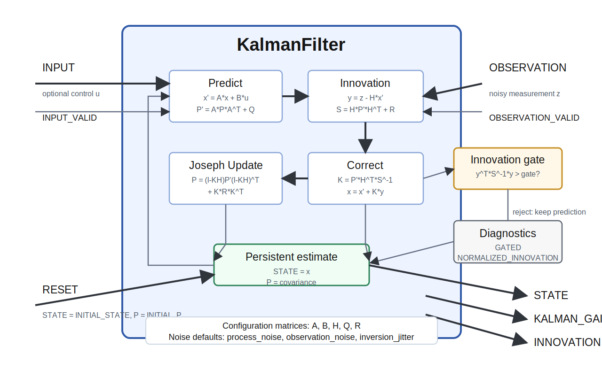

# KalmanFilter



`KalmanFilter` estimates a hidden state vector from noisy observations. It implements a discrete linear Kalman filter with an optional control input.

A Kalman filter is a recursive estimator. On each tick it first predicts what the state should be according to a model, then corrects that prediction using the newest observation. The filter keeps both:

- a state estimate, `STATE`, which is the best current estimate of the hidden variables
- a covariance estimate, `P`, which describes the uncertainty in that state estimate

This is useful when measurements are noisy, incomplete, delayed, or indirect. Typical examples include tracking position and velocity from noisy sensors, estimating robot state from motor commands and observations, or smoothing a measured signal while keeping a model of its uncertainty.

## Model

The module uses the linear process and observation model:

```text
x' = A*x + B*u
z  = H*x
```

where:

- `x` is the current state estimate
- `x'` is the predicted state
- `u` is the optional control input
- `z` is the observation
- `A` describes how the state evolves by itself
- `B` describes how the control input changes the state
- `H` maps the state into observation space

The covariance prediction is:

```text
P' = A*P*A^T + Q
```

where `Q` is process noise. Larger `Q` means the model prediction is considered less certain.

The correction step computes:

```text
y = z - H*x'
S = H*P'*H^T + R
K = P'*H^T*S^-1
x = x' + K*y
```

where:

- `y` is the innovation, the difference between the observation and the predicted observation
- `S` is the residual covariance
- `R` is observation noise
- `K` is the Kalman gain

The Kalman gain controls how strongly the filter trusts the observation relative to the prediction. If observation noise is high, the gain becomes smaller and the filter follows the model more. If model uncertainty is high, the gain becomes larger and the filter follows observations more.

## Covariance Update

The module updates `P` with the Joseph form:

```text
P = (I - K*H)*P'*(I - K*H)^T + K*R*K^T
```

This is slightly more expensive than the compact covariance update, but it is numerically safer and helps preserve a symmetric positive covariance matrix. The module also symmetrizes `P` after the update to remove small numerical asymmetries.

## Timing And Rate Parameters

`process_noise` is an Ikaros `rate` parameter. If `Q` is left as a zero matrix, the module creates a diagonal process covariance from `process_noise`, scaled by the group `tick_duration`.

This means `process_noise` is interpreted as process uncertainty per second:

```text
Q = process_noise * tick_duration * I
```

`observation_noise` is not a rate parameter. It describes the variance of a single observation sample. Changing `tick_duration` may change how often observations arrive, but it does not automatically change the variance of one observation.

Explicit `Q` and `R` matrices are treated as already-discretized covariance matrices and are not automatically scaled.

## Optional Control Input

`INPUT` is optional. If it is disconnected, prediction uses:

```text
x' = A*x
```

If `INPUT` is connected, prediction uses:

```text
x' = A*x + B*u
```

`INPUT_VALID` is also optional. If connected and all elements are zero, the control input is ignored for that tick, even if `INPUT` is connected.

## Missing Observations

`OBSERVATION_VALID` is optional. If connected and all elements are zero, the filter runs prediction only:

```text
STATE = x'
P = P'
```

No correction is performed for that tick. This is useful for intermittent sensors, dropped frames, temporarily invalid tracking, or observations rejected by upstream modules.

## Innovation Gating

`innovation_gate` can reject unlikely observations. The module computes the squared normalized innovation:

```text
NORMALIZED_INNOVATION = y^T*S^-1*y
```

If `innovation_gate > 0` and `NORMALIZED_INNOVATION > innovation_gate`, the observation is rejected. In that case the module keeps the prediction:

```text
STATE = x'
P = P'
```

and sets:

```text
GATED = 1
KALMAN_GAIN = 0
```

If `innovation_gate` is `0`, gating is disabled and `GATED` remains `0`.

## Inversion Jitter

The correction step requires inverting the residual covariance `S`. If `S` is singular, the default behavior is to issue a warning and skip the update, preserving the previous state and covariance.

`inversion_jitter` is optional and defaults to `0`. If it is greater than zero, the module retries the inversion after adding the jitter value to the diagonal of `S`:

```text
S_retry = S + inversion_jitter * I
```

This can help in nearly singular numerical cases, but it should be used deliberately because it changes the effective observation uncertainty.

## Reset

`RESET` is optional. If connected and any element is nonzero, the filter state is reset:

- `STATE` is copied from `INITIAL_STATE`
- `P` is copied from `INITIAL_P`
- `INNOVATION`, `KALMAN_GAIN`, `GATED`, and `NORMALIZED_INNOVATION` are cleared

No prediction or correction is computed on the reset tick.

## Inputs

- `INPUT`: optional control input vector `u`
- `INPUT_VALID`: optional validity signal for `INPUT`; all zero means ignore `INPUT`
- `OBSERVATION`: observation vector `z`
- `OBSERVATION_VALID`: optional validity signal for `OBSERVATION`; all zero means prediction only
- `RESET`: optional reset signal; any nonzero value resets the filter

## Outputs

- `STATE`: estimated state vector `x`
- `INNOVATION`: observation residual `y = z - H*x'`
- `KALMAN_GAIN`: Kalman gain matrix `K`
- `GATED`: `1` when the current observation was rejected by `innovation_gate`, otherwise `0`
- `NORMALIZED_INNOVATION`: squared normalized innovation `y^T*S^-1*y`

## Parameters

| Parameter | Type | Default | Role |
| --- | --- | --- | --- |
| `process_noise` | rate | `1` | Diagonal process covariance per second when `Q` is not explicitly set. Higher values make the filter trust the model less and adapt faster to observations. |
| `observation_noise` | number | `1` | Diagonal observation covariance when `R` is not explicitly set. Higher values make the filter trust observations less. |
| `state_size` | number | `1` | Number of state variables in `STATE`. |
| `input_size` | number | `1` | Number of control input variables used to size default `B` when `INPUT` is disconnected at setup. |
| `innovation_gate` | number | `0` | Maximum allowed squared normalized innovation. `0` disables outlier rejection. |
| `inversion_jitter` | number | `0` | Diagonal jitter added to `S` if inversion fails. `0` disables the retry. |
| `A` | matrix | `0` | State transition matrix. A zero matrix is replaced by identity where possible. |
| `B` | matrix | `0` | Control input matrix. Used only when `INPUT` is connected and valid. |
| `H` | matrix | `0` | Observation matrix. A zero matrix is replaced by identity where possible. |
| `Q` | matrix | `0` | Process covariance. A zero matrix uses diagonal `process_noise`. |
| `R` | matrix | `0` | Observation covariance. A zero matrix uses diagonal `observation_noise`. |
| `INITIAL_STATE` | matrix | `0` | State copied to `STATE` on reset. |
| `INITIAL_P` | matrix | `0` | Covariance copied to `P` on reset. A zero matrix uses the initialized `P`. |

## State

- `P`: current state covariance matrix

`P` is persistent state. If it is left as a zero matrix, it is initialized from `INITIAL_P`; if `INITIAL_P` is also zero, `P` is initialized as identity.

## Matrix Parameters

The model matrices are matrix parameters, so they can be set directly in an `.ikg` file:

```xml
<module
    class="KalmanFilter"
    name="Tracker"
    state_size="2"
    input_size="1"
    A="[[1, 1], [0, 1]]"
    B="[[0.5], [1]]"
    H="[[1, 0]]"
    Q="[[0.01, 0], [0, 0.01]]"
    R="[[0.25]]"
    INITIAL_STATE="[0, 0]" />
```

This example is a simple position/velocity model where the observation measures position.

## Tuning Notes

Start with a simple model and diagonal `Q` and `R`. Increase `observation_noise` or `R` if the estimate follows noisy observations too closely. Increase `process_noise` or `Q` if the estimate is too sluggish or the model does not capture the true motion well.

Use `innovation_gate` when observations occasionally contain large outliers. Use `OBSERVATION_VALID` when an upstream module can explicitly tell whether the observation is available. Use `inversion_jitter` only for numerical robustness when the residual covariance can become nearly singular.
