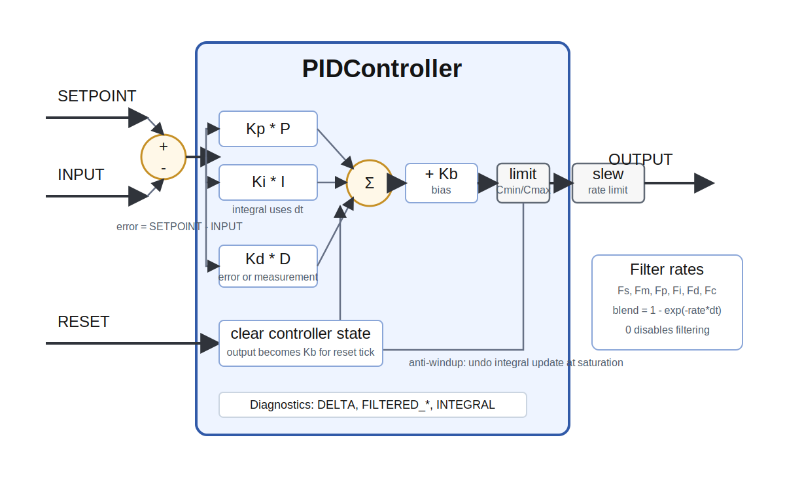

# PIDController



`PIDController` applies independent PID control to each element of `INPUT`.

A PID controller is a feedback controller that tries to drive a measured signal toward a desired set point. It computes an error,

```text
error = SETPOINT - INPUT
```

and combines three terms:

```text
OUTPUT = Kb + Kp * P + Ki * I + Kd * D
```

- The proportional term `P` reacts to the current error.
- The integral term `I` accumulates past error and removes steady-state offset.
- The derivative term `D` reacts to how quickly the error or measurement is changing and can add damping.

The module runs the same controller for every element in the input vector or matrix. `INPUT`, `SETPOINT`, all diagnostic outputs, and optional `RESET` must have the same shape.

## Timing

The integral and derivative calculations use the group `tick_duration`:

```text
I += error * tick_duration
D = delta / tick_duration
```

This keeps the controller behavior independent of the simulation tick duration when the gains are interpreted in normal continuous-time units.

## Derivative Mode

`derivative_mode` controls the derivative source.

- `measurement` is the default. It uses `-d(INPUT)/dt`, which avoids derivative kick when `SETPOINT` changes suddenly. This is usually the most practical choice for set-point tracking.
- `error` uses `d(error)/dt`, the textbook PID form. A step in `SETPOINT` creates a derivative kick.

Both modes use the same sign convention: if the measurement rises toward a fixed set point, the derivative contribution becomes negative when `Kd` is positive.

## Filtering

The module can filter the set point, measurement, error terms, and final control output with exponential moving averages.

`Fs`, `Fm`, `Fp`, `Fi`, `Fd`, and `Fc` are Ikaros `rate` parameters. A value of `0` disables that filter. Positive values are rates in `1/s`; internally the module converts each rate to a per-tick blend:

```text
blend = 1 - exp(-rate * tick_duration)
filtered = filtered + blend * (target - filtered)
```

Using `rate` parameters keeps the filter behavior independent of `tick_duration`.

## Saturation And Anti-Windup

`Cmin` and `Cmax` limit the control output. If the computed control signal saturates, the module undoes the integral update for that tick. This simple anti-windup rule prevents the integral term from continuing to grow while the actuator is already at its limit.

`Cmin` must be less than or equal to `Cmax`.

## Slew-Rate Limiting

`output_rate_limit` optionally limits how fast `OUTPUT` can change. It is an Ikaros `rate` parameter, so the configured value is interpreted as maximum output change per second. A value of `0` disables the limiter.

Slew-rate limiting is applied after PID computation, saturation, and output filtering. It is useful when the controlled actuator should not receive abrupt command changes.

## Reset

`RESET` is optional. When connected and nonzero for an element, the controller state for that element is cleared:

- filtered proportional, integral, and derivative errors are set to zero
- the integral accumulator is set to zero
- derivative history is reset to the current error and filtered input
- `OUTPUT` is set to `Kb`

No PID update is computed for that element on the reset tick.

## Inputs

- `INPUT`: current measured signal
- `SETPOINT`: desired value
- `RESET`: optional reset signal; nonzero resets the corresponding element

## Outputs

- `OUTPUT`: control output
- `DELTA`: current filtered set-point error, `FILTERED_SETPOINT - FILTERED_INPUT`
- `FILTERED_SETPOINT`: filtered set point
- `FILTERED_INPUT`: filtered measurement
- `FILTERED_ERROR_P`: filtered proportional error
- `FILTERED_ERROR_I`: filtered integral error contribution before integration
- `FILTERED_ERROR_D`: filtered derivative term
- `INTEGRAL`: accumulated integral state

## Parameters

| Parameter | Type | Default | Role |
| --- | --- | --- | --- |
| `Kb` | number | `0` | Bias added to the control output. Also used as the reset output value. |
| `Kp` | number | `0.1` | Proportional gain. Higher values react more strongly to current error. |
| `Ki` | number | `0` | Integral gain. Removes steady-state error, but too much can cause overshoot or slow recovery from saturation. |
| `Kd` | number | `0` | Derivative gain. Adds damping from the selected derivative source. |
| `derivative_mode` | option | `measurement` | Selects `measurement` or `error` derivative mode. |
| `Fs` | rate | `0` | Set-point filter rate. `0` disables filtering. |
| `Fm` | rate | `0` | Measurement filter rate. `0` disables filtering. |
| `Fp` | rate | `0` | Proportional error filter rate. `0` disables filtering. |
| `Fi` | rate | `0` | Integral error filter rate. `0` disables filtering. |
| `Fd` | rate | `0` | Derivative filter rate. `0` disables filtering. |
| `Fc` | rate | `0` | Control output filter rate. `0` disables filtering. |
| `Cmin` | number | `-1000` | Minimum output value. |
| `Cmax` | number | `1000` | Maximum output value. |
| `output_rate_limit` | rate | `0` | Maximum output change per second. `0` disables limiting. |

## Tuning Notes

Start with `Ki = 0` and `Kd = 0`, then increase `Kp` until the response is useful but not too oscillatory. Add `Kd` when the response needs damping. Add `Ki` only when steady-state error remains.

For noisy measurements, prefer `derivative_mode="measurement"` and add derivative filtering with `Fd`. For noisy input signals in general, use `Fm` to filter the measurement before control.
