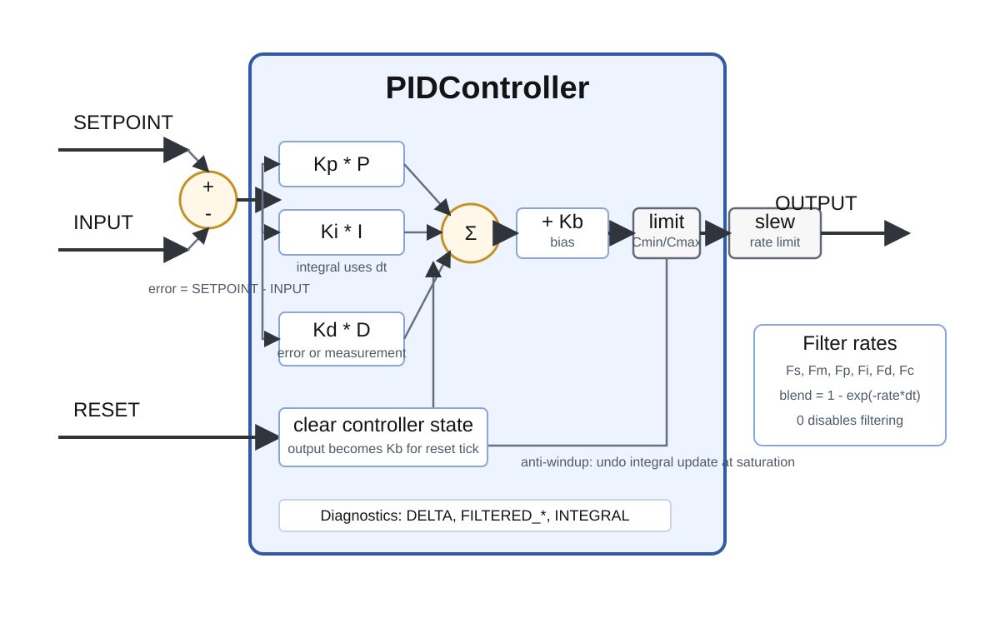

# PIDController



`PIDController` applies independent PID control to each element of `INPUT`.

A PID controller is a feedback controller that tries to drive a measured signal toward a desired set point. It computes an error,

```text
error = SETPOINT - INPUT
```

and combines three terms:

```text
OUTPUT = Kb + Kp * P + Ki * I + Kd * D
```

- The proportional term `P` reacts to the current error.
- The integral term `I` accumulates past error and removes steady-state offset.
- The derivative term `D` reacts to how quickly the error or measurement is changing and can add damping.

The module runs the same controller for every element in the input vector or matrix. `INPUT`, `SETPOINT`, all diagnostic outputs, and optional `RESET` must have the same shape.

## Timing

The integral and derivative calculations use the group `tick_duration`:

```text
I += error * tick_duration
D = delta / tick_duration
```

This keeps the controller behavior independent of the simulation tick duration when the gains are interpreted in normal continuous-time units.

## Derivative Mode

`derivative_mode` controls the derivative source.

- `measurement` is the default. It uses `-d(INPUT)/dt`, which avoids derivative kick when `SETPOINT` changes suddenly. This is usually the most practical choice for set-point tracking.
- `error` uses `d(error)/dt`, the textbook PID form. A step in `SETPOINT` creates a derivative kick.

Both modes use the same sign convention: if the measurement rises toward a fixed set point, the derivative contribution becomes negative when `Kd` is positive.

## Filtering

The module can filter the set point, measurement, error terms, and final control output with exponential moving averages.

`Fs`, `Fm`, `Fp`, `Fi`, `Fd`, and `Fc` are Ikaros `rate` parameters. A value of `0` disables that filter. Positive values are rates in `1/s`; internally the module converts each rate to a per-tick blend:

```text
blend = 1 - exp(-rate * tick_duration)
filtered = filtered + blend * (target - filtered)
```

Using `rate` parameters keeps the filter behavior independent of `tick_duration`.

## Saturation And Anti-Windup

`Cmin` and `Cmax` limit the control output. If the computed control signal saturates, the module undoes the integral update for that tick. This simple anti-windup rule prevents the integral term from continuing to grow while the actuator is already at its limit.

`Cmin` must be less than or equal to `Cmax`.

## Slew-Rate Limiting

`output_rate_limit` optionally limits how fast `OUTPUT` can change. It is an Ikaros `rate` parameter, so the configured value is interpreted as maximum output change per second. A value of `0` disables the limiter.

Slew-rate limiting is applied after PID computation, saturation, and output filtering. It is useful when the controlled actuator should not receive abrupt command changes.

## Reset

`RESET` is optional. When connected and nonzero for an element, the controller state for that element is cleared:

- filtered proportional, integral, and derivative errors are set to zero
- the integral accumulator is set to zero
- derivative history is reset to the current error and filtered input
- `OUTPUT` is set to `Kb`

No PID update is computed for that element on the reset tick.

## Inputs

| Name | Description | Optional |
| --- | --- | --- |
| INPUT | Current signal |  |
| SETPOINT | Desired value |  |
| RESET | Optional reset signal | yes |

## Outputs

| Name | Description |
| --- | --- |
| OUTPUT | Control output |
| DELTA | Filtered set point minus filtered input |
| FILTERED_SETPOINT | Filtered set point |
| FILTERED_INPUT | Filtered input |
| FILTERED_ERROR_P | Filtered proportional error |
| FILTERED_ERROR_I | Filtered integral error |
| FILTERED_ERROR_D | Filtered derivative of error |
| INTEGRAL | Integrated error |

## Parameters

| Name | Description | Type | Default |
| --- | --- | --- | --- |
| Kb | Controller bias | number | 0 |
| Kp | Proportional gain | number | 0.1 |
| Ki | Integral gain applied to the time integral of error | number | 0 |
| Kd | Derivative gain applied to the selected derivative term in units per second | number | 0 |
| derivative_mode | Derivative source: error uses d(SETPOINT-INPUT)/dt; measurement uses -d(INPUT)/dt to avoid set-point derivative kick | number | 1 |
| Fs | Set-point filter rate; 0 disables filtering | rate | 0 |
| Fm | Measurement filter rate; 0 disables filtering | rate | 0 |
| Fp | Proportional error filter rate; 0 disables filtering | rate | 0 |
| Fi | Integral error filter rate; 0 disables filtering | rate | 0 |
| Fd | Derivative error filter rate; 0 disables filtering | rate | 0 |
| Fc | Control output filter rate; 0 disables filtering | rate | 0 |
| Cmax | Maximum control output | number | 1000 |
| Cmin | Minimum control output | number | -1000 |
| output_rate_limit | Maximum output change per second; 0 disables slew-rate limiting | rate | 0 |

## Tuning Notes

Start with `Ki = 0` and `Kd = 0`, then increase `Kp` until the response is useful but not too oscillatory. Add `Kd` when the response needs damping. Add `Ki` only when steady-state error remains.

For noisy measurements, prefer `derivative_mode="measurement"` and add derivative filtering with `Fd`. For noisy input signals in general, use `Fm` to filter the measurement before control.
