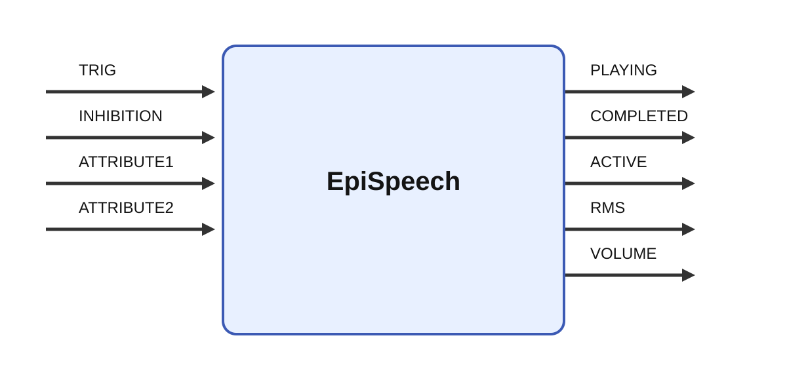

# EpiSpeech

  
## Short description

Plays a sound file

  

## Inputs

| Name | Description | Optional |
| --- | --- | --- |
| TRIG | vector with sounds to play. A transition from zero to one in an element starts the corresponding sound. A sound can be triggered several times even if it is already playing. |  |
| INHIBITION | No new sound is started while this input > 0. A single triggering input will be queued and start when the inhibition is removed. |  |
| ATTRIBUTE1 | Data to phrase as a feature vector or a number value. | yes |
| ATTRIBUTE2 | Data to phrase as a feature vector or a number value | yes |

## Outputs

| Name | Description |
| --- | --- |
| PLAYING | Set to 1 while a sound is playing, otherwise 0. |
| COMPLETED | Element for each sound set to 1 for one tick after a sound has complted playing. |
| ACTIVE | Set to 1 while a sound is playing, otherwise 0. |
| RMS | precalculated approximate volume (dB) of the current sound being played at relativey low temporal resolution. Can be used for VU-meter or other animation (left and right). |
| VOLUME | precalculated approximate volume of the current sound being played at relativey low temporal resolution. Linear version of VU (left and right). |

## Parameters

| Name | Description | Type | Default |
| --- | --- | --- | --- |
| voice | voice to be used. This voice must be installed and the module will silently fail if it is not. | string | Noelle (Enhanced) |
| text | comma separated list of texts to say. | string | hello there,yes,no |
| scale_volume | factor for scaling the volume output (not the actual volume). | number | 1.0 |
| lag | Lag in seconds before the sound starts. Used to correct timing of volume output for better animations. | number | 100.0 |

## Long description
Plays one or several named sound files. Requires that a command to play sounds is available that can be started from the system() call. The dafult is the afplay command available in OS X. On Linux, this can be replaced with the "play" command. There is no way to stop a playing sound so beware of long sound files.