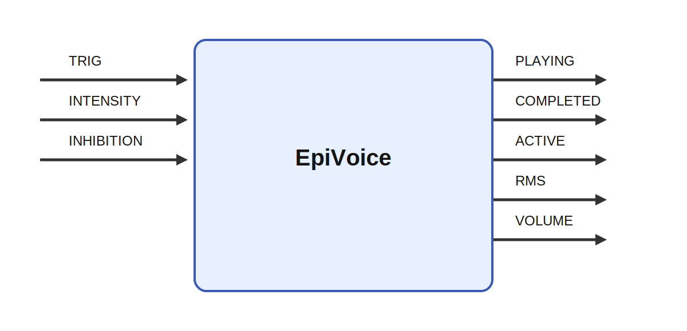

# EpiVoice

## Description

Plays a sound file. Plays one or several named sound files. Requires that a command to play sounds
is available that can be started from the posix_spawn() call. The default is the afplay command
available in OS X. On Linux, this can be replaced with the "play" command. There is no way to stop a
playing sound so beware of long sound files. If ffmpeg is installed ffproble is used to get the
volume of the sounds over time. In this case, the volume is sent to the VOLUME output. A sound is
triggered when its corresponding input goes from 0 to 1. While a sound is playing, a second sound
can be cueued. It will play when the first has completed. If inhibition is 1, no sound will start
playing but it is still possible to queue a sound that will be played when the inhibition is
removed. The interface for EpiVoice is meant to be similar to that for SequenceRecorder. The ACTIVE
output can be connected to the INHIBITION of another sound module to prevent multiple sounds from
being played at the same time. If both modules are triggered at the same times, their sounds will
play after each other.

It receives TRIG, INTENSITY, and INHIBITION and produces PLAYING, COMPLETED, ACTIVE, and RMS while
parameters such as command, sounds, scale_volume, lag, and intentities shape its behavior. A
meaningful use case is to place the module inside a larger sensorimotor or cognitive architecture
where it helps transform, summarize, or route signals between neural subsystems and robot effectors.

## Parameters

| Name | Description | Type | Default |
| --- | --- | --- | --- |
| command | the command to use to play sounds, The dafult is the OS X command afplay | string | /usr/bin/afplay |
| sounds | comma separated list of sound file names (including path). | string |  |
| scale_volume | factor for scaling the volume output (not the actual volume). | number | 1.0 |
| lag | Lag in ms before the sound starts. Used to correct timing of volume output for better animations. | number | 100.0 |
| intentities | number of intensity variants for the emotion sounds. | number | 3 |
| variants | number of variants of each emotion sound. | number | 5 |

## Inputs

| Name | Description | Optional |
| --- | --- | --- |
| TRIG | vector with sounds to play. A transition from zero to one in an element starts the corresponding sound. A sound can be triggered several times even if it is already playing. |  |
| INTENSITY | the intensity of the emotion. | yes |
| INHIBITION | No new sound is started while this input > 0. A single triggering input will be queued and start when the inhibition is removed. | yes |

## Outputs

| Name | Description |
| --- | --- |
| PLAYING | Set to 1 while a sound is playing, otherwise 0. |
| COMPLETED | Element for each sound set to 1 for one tick after a sound has complted playing. |
| ACTIVE | Set to 1 while a sound is playing, otherwise 0. |
| RMS | precalculated approximate volume (dB) of the current sound being played at relativey low temporal resolution. Can be used for VU-meter or other animation (left and right). |
| VOLUME | precalculated approximate volume of the current sound being played at relativey low temporal resolution. Linear version of VU (left and right). |

*This description was automatically created and may not be an accurate description of the module.*
