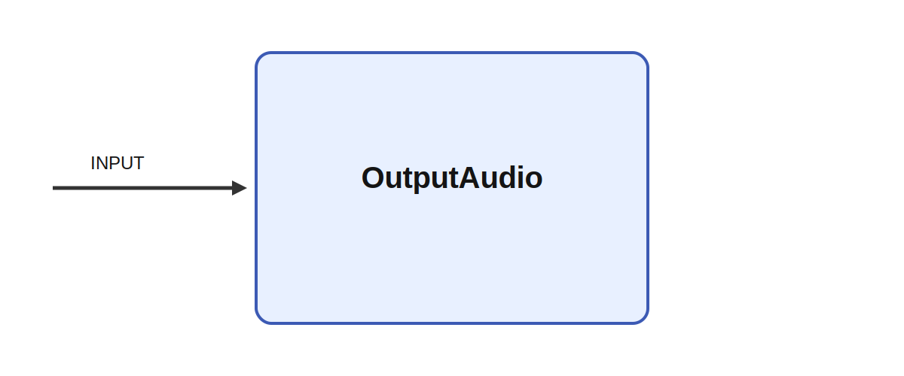

# OutputAudio

## Description

Plays audio received as input. OutputAudio sends a floating-point audio buffer from Ikaros to the
host audio device. Its implementation binds the INPUT signal, configures an AudioQueue output stream
using the selected sample rate and buffer size, and keeps a playback thread running so incoming
buffers can be copied to the system audio queue in real time.

It consumes INPUT while parameters such as sample_rate and buffer_size shape its behavior. It can
therefore act as the final stage of an active audition experiment, a speech-motor loop, or a robot
interaction system where synthesized or transformed sound has to be rendered with low latency.

Low-latency audio output is important whenever a system closes the loop through hearing. That
includes speech production, turn-taking, active audition, and experiments where generated sound must
align closely with movement or internal state in order for adaptation and interaction to remain
stable.

## Parameters

| Name | Description | Type | Default |
| --- | --- | --- | --- |
| sample_rate | Sample rate of the audio | int | 44100 |
| buffer_size | Size of the audio buffer | int | 4096 |

## Inputs

| Name | Description | Optional |
| --- | --- | --- |
| INPUT | Audio buffer to play |  |

*This description was automatically created and may not be an accurate description of the module.*
