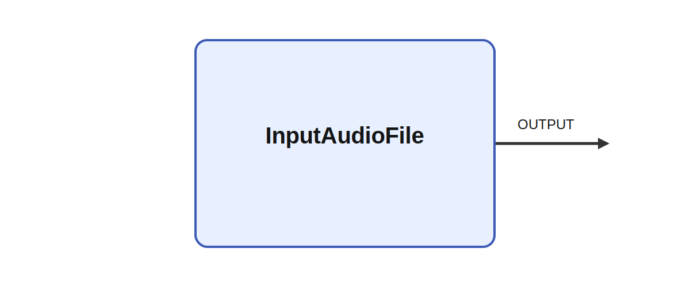

# InputAudioFile

## Description

Copies input. Use the Ikaros namespace to access the math library this is preferred to using math.h

It produces OUTPUT while parameters such as filename, buffer_size, channels, and repeat shape its
behavior. A meaningful use case is to place the module inside a larger sensorimotor or cognitive
architecture where it helps transform, summarize, or route signals between neural subsystems and
robot effectors.

## Parameters

| Name | Description | Type | Default |
| --- | --- | --- | --- |
| filename | Filename of audio file; supports wav and aiff | string | inputaudio.wav |
| buffer_size | Length of output buffer | int | 4096 |
| channels | Number of audio channels in file, e.g. 2 for stereo files | int | 1 |
| repeat | Whether to repeat playing the file | bool | true |

## Outputs

| Name | Description |
| --- | --- |
| OUTPUT | The output |

*This description was automatically created and may not be an accurate description of the module.*
