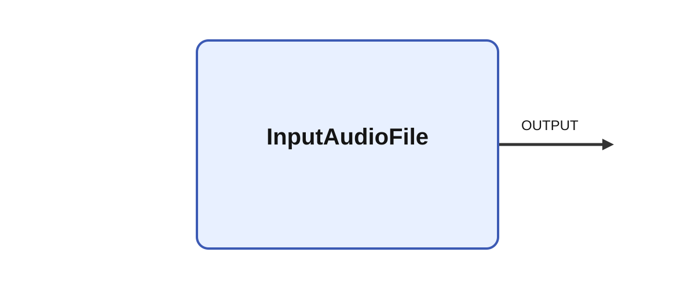

# InputAudioFile

`InputAudioFile` loads an uncompressed WAV or AIFF file during initialization
and emits successive audio blocks. `OUTPUT` has channel-first shape
`[channels, buffer_size]`.

The reader accepts WAV PCM with 8-, 16-, 24-, or 32-bit samples, WAV
floating-point data with 32- or 64-bit samples, and uncompressed AIFF PCM with
8-, 16-, 24-, or 32-bit samples. Container chunks are parsed by identifier, so
metadata chunks and nonstandard chunk ordering do not change the audio data.
AIFF-C containers and compressed WAV encodings are rejected.

When `repeat` is enabled, a block that crosses the end of the file continues
at its beginning without a gap. Otherwise, the remainder of that block and
subsequent blocks are filled with zero.

## Parameters

| Name | Description | Type | Default |
| --- | --- | --- | --- |
| `filename` | WAV or AIFF file inside the project directory or UserData | string | `inputaudio.wav` |
| `buffer_size` | Number of audio frames emitted per tick | number | `4096` |
| `channels` | Expected number of channels in the file | number | `1` |
| `repeat` | Wrap to the beginning at end of file | bool | `true` |

The configured channel count must match the file. This keeps the public output
shape fixed after startup and reports configuration mistakes immediately.

## Outputs

| Name | Description |
| --- | --- |
| OUTPUT | Channel-first audio block |
