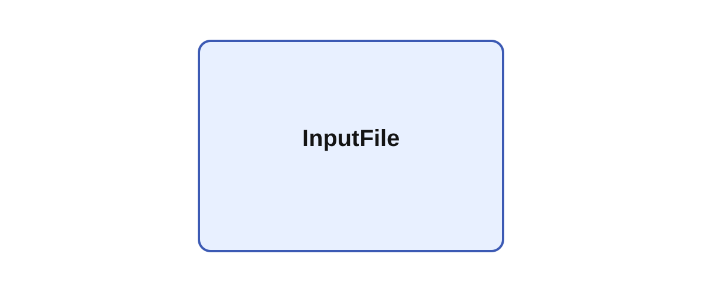

# InputFile

## Description

InputFile loads a delimited text file, conventional JSON array, or JSON Lines file and publishes one
record per tick. The file is validated and loaded during model setup, so all output names and matrix
shapes remain fixed during execution. After the final record, the outputs are reset to zero and the
module optionally sends an end-of-file notification.

The `format` parameter accepts `auto`, `text`, `csv`, `tsv`, `json`, and `jsonl`. In `auto` mode,
`.json`, `.jsonl`, `.csv`, and `.tsv` select their corresponding formats; other extensions use the
legacy whitespace-separated text format. Set `format` explicitly when the extension does not
identify the contents.

### Delimited files

CSV and TSV follow the quoting rules used by OutputFile. A nonempty `delimiter` overrides text,
CSV, or TSV parsing with exactly one literal character, including a space. Quoted header fields may
contain the delimiter, quotation marks escaped as `""`, and line breaks. Data fields must be
numeric.

With `header="true"`, the first record defines the outputs. The legacy `NAME/3` notation consumes
three data columns into one vector output. OutputFile writes vector columns as `NAME:0`, `NAME:1`,
and so on; InputFile recognizes each complete contiguous sequence and reconstructs one vector.
Delimited output cannot retain dimensions beyond that flattened vector shape.

With `header="false"`, the first record is data and every column is published through one vector
named `OUTPUT`. Headerless files cannot provide separate field names or shapes.

The legacy `text` format accepts whitespace, commas, or semicolons between values and removes `#`
comments. Its header continues to support `NAME/SIZE`.

### JSON and JSON Lines

`json` reads a complete top-level array of objects. `jsonl` reads one complete object per line.
Every object must contain the same fields and every field must retain the shape established by the
first record. Nested arrays become multidimensional Ikaros outputs without flattening. Numeric
scalars become one-element outputs because module outputs require a declared matrix dimension.
Ragged or empty field arrays cannot define fixed output shapes and are rejected.

JSON `null` values, including the representation written by OutputFile for NaN and infinity, are
read as quiet NaN values. Boolean, string, and object-valued fields are rejected.

Ikaros output names may contain only letters, digits, and underscores and cannot begin with a
digit. A file field that is not already a legal identifier is converted by replacing other
characters with underscores and prefixing an underscore when necessary. If two fields map to the
same output name, later fields receive `_2`, `_3`, and so on. The original field name remains in
the output description.

For recordings that may be interrupted, JSONL is safer than a conventional JSON array because
every completed line is independently valid. It can be converted after recording with:

```sh
jq -s . recording.jsonl > recording.json
```

If a crash interrupted the final JSONL record, remove that incomplete final line before conversion.



## Parameters

| Name | Description | Type | Default |
| --- | --- | --- | --- |
| filename | File to read from the project directory or UserData. | string |  |
| format | `auto`, `text`, `csv`, `tsv`, `json`, or `jsonl`. | string | auto |
| delimiter | Optional single-character delimiter for text, CSV, or TSV; a space is allowed. | string |  |
| header | Use the first delimited record to define outputs; otherwise publish all columns through `OUTPUT`. | bool | true |
| send_end_of_file | Send an end-of-file notification after the final record. | bool | true |
