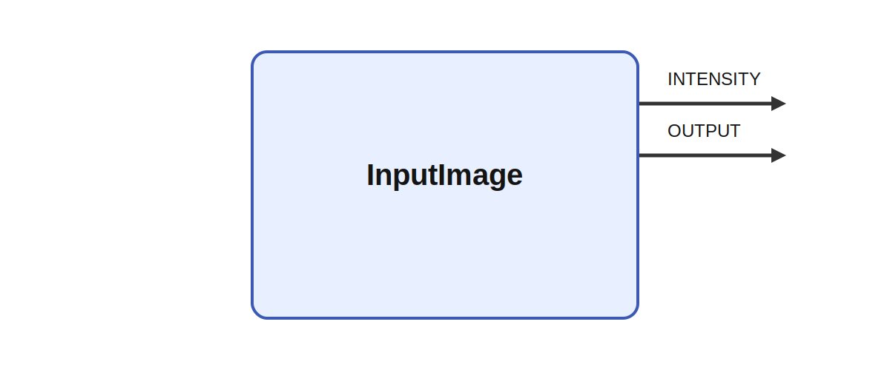

# InputImage

  
## Short description

Reads JPEG, PNG, TIFF, and WebP files

  

## Inputs

|Name|Description|Optional|
|:----|:-----------|:-------|

  

## Outputs

|Name|Description|
|:----|:-----------|
|INTENSITY|The intensity of the image.|
|OUTPUT|The red, green, and blue channels in channel-first order.|

  

## Parameters

|Name|Description|Type|Default value|
|:----|:-----------|:----|:-------------|
|filename|JPEG, PNG, TIFF, or WebP file to read. Formats other than JPEG require codec support in the current build. Use # for an unpadded sequence number or multiple hashes such as #### for a fixed-width zero-padded number. Escape a literal hash as \#.|string||
|filecount|Number of files to read|int|1|
|iterations|Number of times to read the image(s); 0 means unlimited|int|0|
|read_once|Makes the module only read a single image once.|bool|yes|

  
## Long description
The module reads JPEG images and, when their codec libraries were available at
build time, PNG, TIFF, and WebP images or numbered image sequences. Images are
decoded to channel-first RGB output, with a separate intensity output. The first
image determines the fixed output shape. A later missing, malformed, unsupported,
or differently sized image produces a warning and zero output for that tick;
execution then continues with the next image.

Sequence numbering starts at zero. For example, `image_#.png` produces
`image_0.png`, `image_1.png`, and so on, while `image_####.png` produces
`image_0000.png`, `image_0001.png`, and so on. A fixed-width placeholder limits
the sequence to the number of values that fit in that width.

JPEG support is always included. CMake options `IKAROS_PNG`, `IKAROS_TIFF`, and
`IKAROS_WEBP` control the other codecs using `AUTO`, `ON`, or `OFF`. Requesting a
format that is unavailable in the current build produces a startup error.
