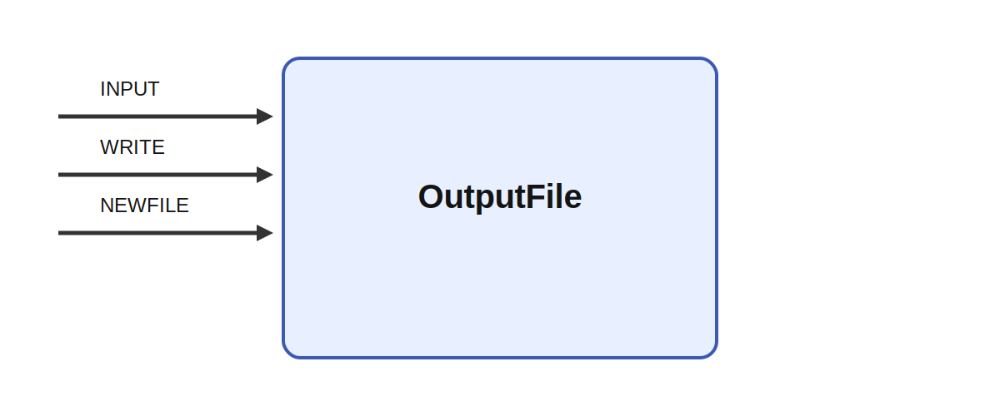

# OutputFile

## Description

Writes its input to a file each tick. OutputFile records streamed data from an Ikaros graph to disk.
The implementation opens a CSV- or TSV-style file, writes column labels when they are available on
the input matrix, and appends one flattened row of numeric values on every tick. This makes it a
simple sink for logging time-series activity or exporting module outputs for later analysis.

It receives INPUT, WRITE, and NEWFILE while parameters such as filename, format, decimals,
timestamp, and directory shape its behavior. That makes it suitable for logging latent state
trajectories from a cognitive model, capturing high-dimensional motor commands during imitation
learning, or exporting synchronized internal signals for offline analysis of closed-loop robot
behavior.

## Parameters

| Name | Description | Type | Default |
| --- | --- | --- | --- |
| filename | File to write the data to. The name may include a %d to automatcially enumerate sequences of files. | string | output.csv |
| format | File format: csv or tsv. | string | csv |
| decimals | Number of decimals for all columns | int | 4 |
| timestamp | Include time stamp column (T) in file | bool | yes |
| directory | Create a new directory for the files each time Ikaros is started using this directory name with a number is added. | string |  |

## Inputs

| Name | Description | Optional |
| --- | --- | --- |
| INPUT | The input to be written to file |  |
| WRITE | The input to be written to file | yes |
| NEWFILE | If connected, a 1 on the input will close the current file, increase the file number (if %d is in the name) and open a new file. | yes |

*This description was automatically created and may not be an accurate description of the module.*
