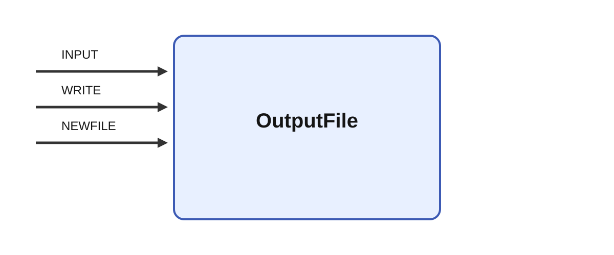

# OutputFile

## Description

OutputFile records streamed matrix data as delimited text, a JSON array, or JSON Lines. It writes
one record whenever WRITE is disconnected or greater than zero. Numeric values can use a fixed
number of decimal places or their full stored precision.

With `single_trigger="yes"`, a connected `WRITE` input writes one record on each rising edge
instead of writing continuously while positive. A disconnected `WRITE` input still writes every
tick.

The `format` parameter selects `csv`, `tsv`, `json`, or `jsonl`. For delimited formats, a nonempty
`delimiter` overrides the preset with exactly one literal character. For example, `delimiter=";"`
produces semicolon-separated data and `delimiter=" "` produces space-separated data. Fields
containing the selected delimiter are quoted. Line breaks, NUL, and `"` cannot be delimiters because
they conflict with record and quoting syntax. `delimiter` is not used with JSON formats.

`header="false"` suppresses the column header in CSV and TSV output. It does not remove the first
data record. In append mode, every existing record is then counted as data, so `timestamp="line"`
continues from the total record count. JSON formats have no separate header and ignore this option.

Both JSON formats write each record as an object whose connection labels become top-level keys:

```json
{"tick":17,"weights":[[1,2,3],[4,5,6]],"temperature":[21.5]}
```

`json` wraps the objects in one top-level array. The closing bracket is written when recording
stops or the file rolls over, so the file is not valid JSON while recording and can remain
incomplete after a crash. `jsonl` instead writes one independently valid object per line and is the
appropriate choice for live reading or crash tolerance.

For safer recording, use `format="jsonl"` and convert the completed JSONL file to a conventional
JSON array afterwards:

```sh
jq -s . recording.jsonl > recording.json
```

This preserves every complete, flushed JSONL record if recording is interrupted. If a crash occurs
partway through the final record, remove that incomplete final line before running `jq`.

JSON connections must have explicit, nonempty, unique labels. The timestamp names `line`, `tick`,
`time`, and `real_time` are reserved even when the corresponding timestamp is not selected.
Connection labels are JSON-escaped. Source matrix rank and singleton dimensions are retained:
one-dimensional inputs remain arrays, multidimensional inputs become nested arrays, and true scalar
inputs become numbers. When a connection selects multiple delays, delay is added as the outermost
array dimension in the declared delay order. Non-finite matrix values are written as `null`, since
JSON has no representation for NaN or infinity. CSV and TSV remain flattened and retain their
existing label behavior.

`number_format="fixed"` writes every matrix value with the number of fractional digits selected by
`decimals`. `number_format="full"` instead writes the shortest decimal representation that
round-trips to the exact stored float. Full formatting uses ordinary or scientific notation
automatically according to the value and does not use `decimals`.

By default, each completed row is explicitly flushed. This keeps rows that reached the operating
system if the Ikaros process crashes, although it does not provide the stronger power-loss
guarantee of an `fsync()` operation. `flush_interval` can trade some of that protection for higher
throughput.

The `timestamp` parameter controls the first delimited column or JSON top-level field:

- `none` omits the column.
- `line` writes `line/1` in delimited output or `line` in JSON and numbers successfully written
  data records. New files start at zero; appended files continue from their existing record count.
- `tick` writes the global kernel tick under `tick/1` or `tick`.
- `time` writes nominal simulation seconds under `time/1` or `time`.
- `real_time` writes the kernel-wide elapsed wall clock under `real_time/1` or `real_time`.

The `tick`, `time`, and `real_time` values continue across NEWFILE boundaries and WRITE gaps.
`line` advances only after a row is successfully written, so WRITE gaps do not create missing line
numbers. Time values use independent round-trip formatting, so the `decimals` setting for data
columns cannot reduce their resolution.

NEWFILE reacts to a rising edge. When the filename contains `#`, it closes the current file and
opens the next numbered file. A single `#` is an unpadded number of any length; multiple hashes
specify a fixed zero-padded width, so `samples_####.csv` produces
`samples_0000.csv`, `samples_0001.csv`, and so on. `start_index` selects the first filename number.
The next file is opened and initialized before the current file is closed, so a rollover failure
leaves the current recording active. Closing a JSON array writes its final bracket.

The same notation controls directories. `directory="recording"` reuses exactly that directory,
while `directory="recording_###"` selects the first available directory from `recording_000`,
`recording_001`, and so on. Filename and directory numbering are independent. Write `\#` for a
literal hash in either parameter.

`existing_file` controls accidental reuse:

- `error` refuses to replace an existing file and is the safe default.
- `overwrite` truncates the selected file.
- `append` validates and preserves the existing delimited header or JSON records, then continues
  `line` numbering. A JSON array must be complete and compatible; its closing bracket is removed
  before new objects are appended. A complete final JSONL record without a trailing newline is
  accepted and separated safely before the next record.

`flush_interval="1"` flushes every completed row and provides the strongest process-crash
protection for delimited and JSONL records. Larger values flush batches of rows for higher
throughput. Zero flushes data rows only when the file rolls over or the module stops. Headers and
the opening bracket of a JSON array are always flushed immediately, but a JSON array remains
incomplete until it is closed.



## Parameters

| Name | Description | Type | Default |
| --- | --- | --- | --- |
| filename | File to write inside UserData, optionally containing one `#` sequence placeholder. | string | output.csv |
| format | Output format: `csv`, `tsv`, `json`, or `jsonl`. | string | csv |
| delimiter | Optional single-character delimiter overriding `csv` or `tsv`; a space is allowed. | string |  |
| number_format | Data formatting: `fixed` uses `decimals`; `full` preserves exact float values and selects scientific notation automatically. | string | fixed |
| decimals | Number of digits after the decimal point, from 0 through 20. | int | 4 |
| timestamp | Timestamp column or field: `none`, `line`, `tick`, `time`, or `real_time`. | string | time |
| existing_file | Existing-file policy: `error`, `overwrite`, or `append`. | string | error |
| start_index | First filename sequence number. | int | 0 |
| flush_interval | Written rows per flush; zero flushes on rollover or stop. | int | 1 |
| header | Write the column header in CSV and TSV output; ignored by JSON formats. | bool | true |
| single_trigger | With WRITE connected, write only on its rising edge. | bool | no |
| directory | Exact reusable directory, or a unique directory pattern containing `#`; empty writes directly inside UserData. | string |  |

## Inputs

| Name | Description | Optional |
| --- | --- | --- |
| INPUT | Values written as one flattened delimited row or as labeled, shape-preserving JSON fields. |  |
| WRITE | Write while greater than zero; a disconnected input writes every tick. | yes |
| NEWFILE | A rising edge opens the next filename selected by the `#` placeholder. | yes |
