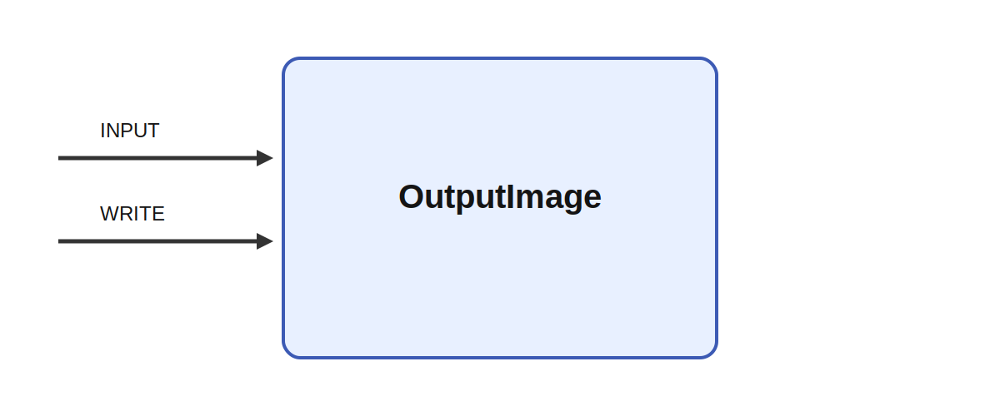

# OutputImage

## Description

`OutputImage` writes a grayscale `[height, width]` matrix or a channel-first RGB
`[3, height, width]` matrix as a JPEG, PNG, TIFF, or WebP file. The filename
extension selects the format. Values below zero or above one are clipped to the
supported image range.

Output files are restricted to the Ikaros `UserData` directory. Encoding and file
errors generate warnings during execution and do not stop the model.

## Inputs

| Name | Description | Optional |
|:-----|:------------|:---------|
| INPUT | Grayscale `[height, width]` or RGB `[3, height, width]` image. | no |
| WRITE | Writes while greater than zero. If disconnected, writes every tick. | yes |

## Parameters

| Name | Description | Type | Default |
|:-----|:------------|:-----|:--------|
| filename | Output filename ending in `.jpg`, `.jpeg`, `.png`, `.tif`, `.tiff`, or `.webp`. | string | `output.jpg` |
| quality | JPEG and WebP quality from 1 to 100; ignored for PNG and TIFF. | number | 90 |
| start_index | First sequence number. | number | 0 |
| single_trigger | With WRITE connected, write only on its rising edge. | bool | no |

## Image sequences

Use `#` for a sequence number with its natural width. For example,
`frame_#.png` writes `frame_0.png`, `frame_1.png`, and so on. Multiple hashes
request a fixed width with leading zeros: `frame_####.jpg` starts at
`frame_0000.jpg`. Escape a literal hash as `\#`.

Without a placeholder, each write replaces the same file. Sequence numbers advance
only after a file was written successfully.

## Codec availability

JPEG support is required in every Ikaros build. PNG, TIFF, and WebP are included
when their libraries are available. The CMake options `IKAROS_PNG`, `IKAROS_TIFF`,
and `IKAROS_WEBP` accept `AUTO`, `ON`, or `OFF`. `AUTO` enables an installed codec,
`ON` makes it a required dependency, and `OFF` disables it. Selecting an unavailable
format produces a clear startup error.
