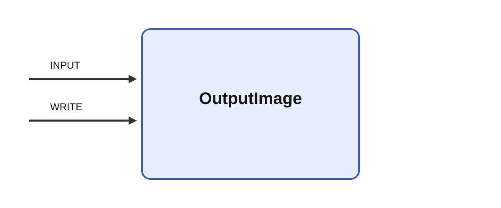

# OutputImage

## Description

`OutputImage` writes a grayscale `[height, width]` matrix or a channel-first RGB
`[3, height, width]` matrix as a JPEG, PNG, TIFF, or WebP file. Grayscale matrices
can also be written as binary P5 Portable Graymap (PGM) files. The filename
extension selects the format. Values below zero or above one are clipped to the
supported image range.

Output files are restricted to the Ikaros `UserData` directory. Encoding and file
errors generate warnings during execution and do not stop the model. Images are
encoded to a hidden sibling file and atomically moved into place, so readers see
either the previous complete image or the new complete image. Persistent failures
are retried at most once per second; a new `WRITE` edge retries immediately.

## Inputs

| Name | Description | Optional |
|:-----|:------------|:---------|
| INPUT | Grayscale `[height, width]` or RGB `[3, height, width]` image. | no |
| WRITE | Writes while greater than zero. If disconnected, writes every tick. | yes |

## Parameters

| Name | Description | Type | Default |
|:-----|:------------|:-----|:--------|
| directory | Exact reusable directory, or a unique directory pattern containing `#`; empty writes directly inside UserData. | string |  |
| filename | Output filename ending in `.jpg`, `.jpeg`, `.png`, `.pgm`, `.tif`, `.tiff`, or `.webp`. PGM accepts grayscale input only. | string | `output.jpg` |
| quality | JPEG and WebP quality from 1 to 100; ignored for PNG, PGM, and TIFF. | number | 90 |
| start_index | First non-negative integer sequence number. | number | 0 |
| single_trigger | With WRITE connected, write only on its rising edge. | bool | no |

## Image sequences

Use `#` for a sequence number with its natural width. For example,
`frame_#.png` writes `frame_0.png`, `frame_1.png`, and so on. Multiple hashes
request a fixed width with leading zeros: `frame_####.jpg` starts at
`frame_0000.jpg`. Escape a literal hash as `\#`.

Without a placeholder, each write replaces the same file. Sequence numbers advance
only after a file was written successfully.

The `directory` parameter uses the same notation independently of the filename.
`directory="recording"` reuses that directory, while
`directory="recording_###"` claims the first available directory such as
`recording_000` or `recording_001`. Numbered directories keep separate runs from
overwriting one another. A filename must be relative when `directory` is set.

## Migrating from OutputJPEG

`OutputImage` replaces the Ikaros 2 `OutputJPEG` module. Make these changes when
porting a model:

| OutputJPEG | OutputImage |
|:-----------|:------------|
| `INTENSITY` | `INPUT` with shape `[height, width]` |
| `RED`, `GREEN`, and `BLUE` | One channel-first `INPUT` with shape `[3, height, width]` |
| A `%d` filename placeholder such as `%04d` | A `#` placeholder such as `####` |
| `offset` | `start_index` |
| `single_trig` | `single_trigger` |

There is no `suppress` parameter; use the `WRITE` input to control when files are
written. Sequence numbers advance only after successful writes, which corresponds
to the old `increase_file_no_on_trig` behavior. Apply any required scaling to the
input matrix before connecting it because `OutputImage` has no `scale` parameter.
The `quality` parameter remains available, but its default is 90 rather than 100.

## Codec availability

JPEG and PGM support are included in every Ikaros build. PNG, TIFF, and WebP are
included when their libraries are available. The CMake options `IKAROS_PNG`,
`IKAROS_TIFF`, and `IKAROS_WEBP` accept `AUTO`, `ON`, or `OFF`. `AUTO` enables an
installed codec, `ON` makes it a required dependency, and `OFF` disables it.
Selecting an unavailable format produces a clear startup error.
