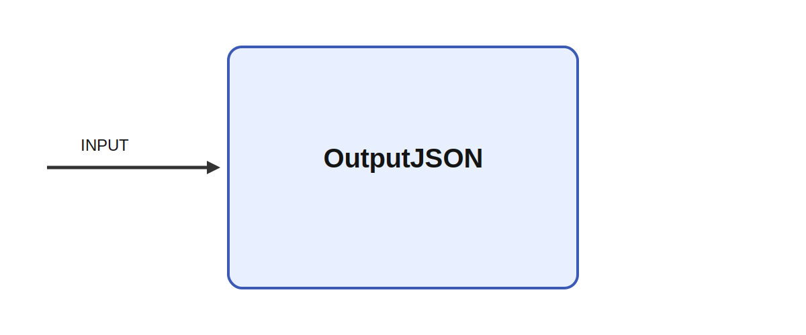

# OutputJSON

## Description

Streams input matrix data to a JSON or JSONL file. If filename already ends with the right
extension, keep it

It consumes INPUT while parameters such as filename, clear_file, and JSONL shape its behavior. A
meaningful use case is to place the module inside a larger sensorimotor or cognitive architecture
where it helps transform, summarize, or route signals between neural subsystems and robot effectors.

## Parameters

| Name | Description | Type | Default |
| --- | --- | --- | --- |
| filename | Output filename. | string | output.json |
| clear_file | Delete existing file at startup if true. | bool | true |
| JSONL | Write JSON Lines if true; otherwise maintain a JSON array. | bool | false |

## Inputs

| Name | Description | Optional |
| --- | --- | --- |
| INPUT | Input data matrix to be streamed. |  |

*This description was automatically created and may not be an accurate description of the module.*
