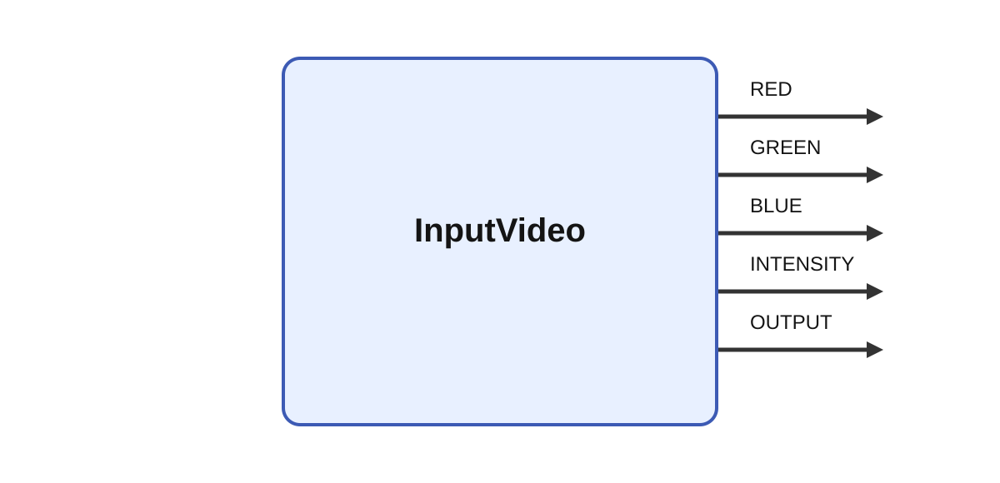

# InputVideo

  
## Short description

Grabs video using ffmpeg

  

## Inputs

|Name|Description|Optional|
|:----|:-----------|:-------|

  

## Outputs

| Name | Description |
| --- | --- |
| RED | The red channel. |
| GREEN | The green channel. |
| BLUE | The blue channel. |
| INTENSITY | The intensity channel. |
| OUTPUT | RGB image. |

## Parameters

| Name | Description | Type | Default |
| --- | --- | --- | --- |
| size_x | Size of the image | number | 1280 |
| size_y | Size of the image | number | 720 |
| list_devices | List the device ids of available devices on start-up | bool | no |
| frame_rate | Frame rate | number | 30 |
| id | id | number | 0 |
| device_name | name of device instead id | string |  |
| device_index | which of several devices with the same name to be used | number | 0 |

## Long description
Grabs the video from a camera using FFmpeg.