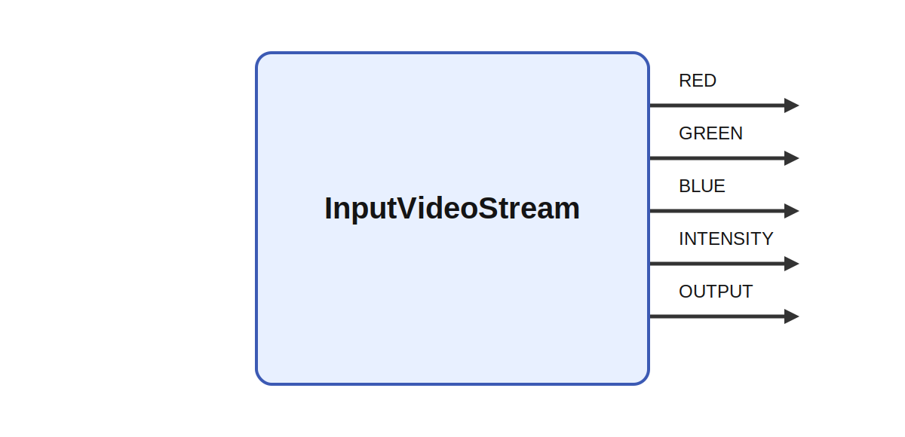

# InputVideoStream

  
## Short description

Grabs video using FFmpeg.

  

## Inputs

|Name|Description|Optional|
|:----|:-----------|:-------|

  

## Outputs

|Name|Description|
|:----|:-----------|
|RED|The red channel.|
|GREEN|The green channel.|
|BLUE|The blue channel.|
|INTENSITY|The intensity channel.|

  

## Parameters

|Name|Description|Type|Default value|
|:----|:-----------|:----|:-------------|
|size_x|Size of the image|int|640|
|size_y|Size of the image|int|480|
|url|Stream address|string||
|info|Print information about the stream|bool|false|
|synchronized_framegrabber|The framegrabber (grabs and decodes frames) is either synchronized with the tick or runs as fast or slow as it can. This is useful when grabbing live streams where the latest frame is more important than keeping every frame.|bool|false|
|synchronized_tick|Ikaros waits until a new frame is given by the framegrabber. If set to false, Ikaros does not care whether the input is new or not. This can give the module a faster tick time but could potentially feed unnecessary data into Ikaros (false is not recommended).|bool|true|
|uv4l|Forces the system to decode the stream as H.264. This is useful when receiving a raw H.264 stream from a UV4L server on a Raspberry Pi.|bool|false|

  
## Long description
Get video from a stream using FFmpeg.
