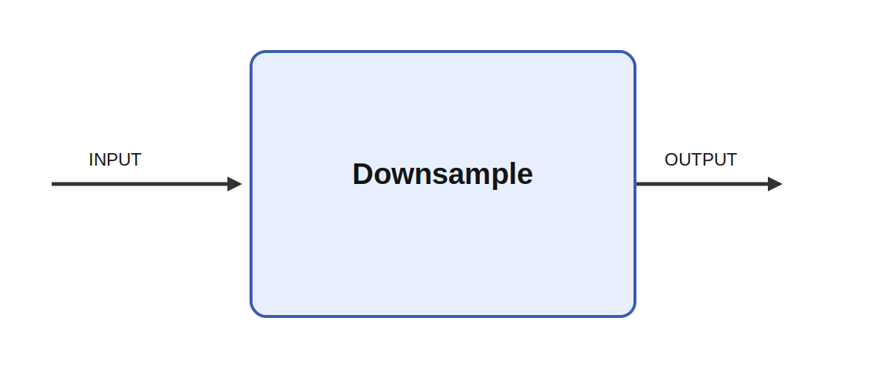

# Downsample

## Description

Downsamples an image by 2x using averaging. Downsample reduces the spatial resolution of an image-
like input by a factor of two. The module is intended for pyramid construction and efficient
preprocessing, and its behavior is described in the source as averaging neighboring pixels before
writing a smaller output image.

It consumes INPUT and produces OUTPUT. This is especially useful in hierarchical vision models where
coarse scales guide attention or motion segmentation, and in mobile robots where lower-resolution
channels provide fast peripheral context for later high-resolution processing.

Multi-scale representations are a standard idea in computer vision because coarse structure often
reveals global layout before fine detail is processed. Downsampling is therefore useful for foveated
vision, image pyramids, fast peripheral monitoring, and active vision systems that first detect
where to look coarsely and only then commit high-resolution resources.

## Inputs

| Name | Description | Optional |
| --- | --- | --- |
| INPUT | 2D input image |  |

## Outputs

| Name | Description |
| --- | --- |
| OUTPUT | Downsampled image (1/2x) |

*This description was automatically created and may not be an accurate description of the module.*
