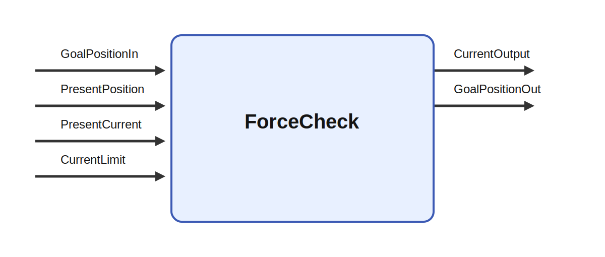

# ForceCheck

## Description

Checking the used current and increase it step by step to reach the target. Reduce the current with
too much restance is met.

It consumes GoalPositionIn, PresentPosition, PresentCurrent, and CurrentLimit and produces
CurrentOutput and GoalPositionOut while parameters such as GainConstant, SmoothFactor, and
ErrorThreshold shape its behavior. A strong use case is a layered robot architecture in which
perception and decision circuits choose targets, impedances, or action modes while this module
family handles the low-level interface needed to turn those choices into stable movement and usable
feedback.

## Parameters

| Name | Description | Type | Default |
| --- | --- | --- | --- |
| GainConstant | Gain constant for how much current should increased in relation to distance from goal position | double | 8.5 |
| SmoothFactor | Determines the influence of present current to goal current | double | 0.7 |
| ErrorThreshold | Threshold for position error (in degrees) for when the current should be reduced to avoid overshooting | double | 10 |

## Inputs

| Name | Description | Optional |
| --- | --- | --- |
| GoalPositionIn | The goal position of the servomotors in degrees |  |
| PresentPosition | The present position of the servomotors in degrees |  |
| PresentCurrent | The present current from the servomotors in mA |  |
| CurrentLimit | The present current from the servomotors in mA |  |

## Outputs

| Name | Description |
| --- | --- |
| CurrentOutput | Goal current in mA to be sent to the servos (only in current-based (position) control mode) |
| GoalPositionOut | The goal position of the servomotors in degrees |

*This description was automatically created and may not be an accurate description of the module.*
