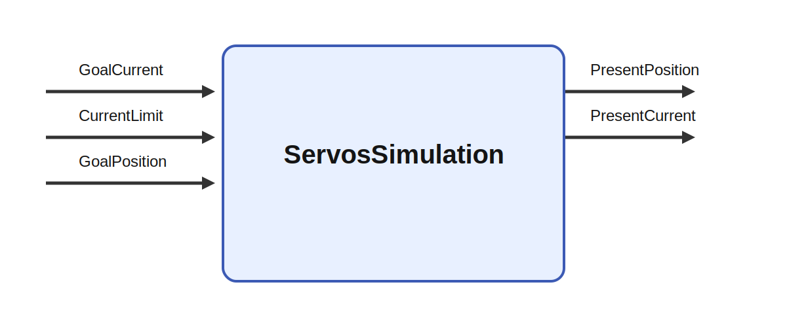

# ServosSimulation

## Description

Simple simulation of changing the position and currrent to the goals. Could also be done by using
dynamixel_sdk

It receives GoalCurrent, CurrentLimit, and GoalPosition and produces PresentPosition and
PresentCurrent. A strong use case is a layered robot architecture in which perception and decision
circuits choose targets, impedances, or action modes while this module family handles the low-level
interface needed to turn those choices into stable movement and usable feedback.

## Inputs

| Name | Description | Optional |
| --- | --- | --- |
| GoalCurrent | The goal current from the servomotors in mA |  |
| CurrentLimit | The present current from the servomotors in mA |  |
| GoalPosition | The goal position of the servomotors in degrees |  |

## Outputs

| Name | Description |
| --- | --- |
| PresentPosition | The present position of the servomotors in degrees |
| PresentCurrent | Current in the motors |

*This description was automatically created and may not be an accurate description of the module.*
