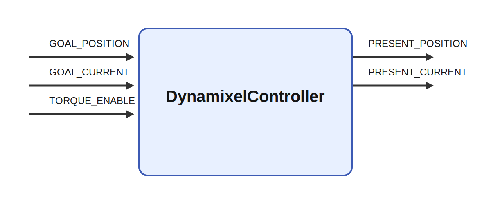

# DynamixelController

## Description

DynamixelController controls configured Dynamixel servo chains. It maps Ikaros goal-position,
current, PWM, and torque-enable inputs to Dynamixel writes, reads position/current
feedback, and supports both synchronized indirect communication and direct-position chains.
All configured servo models must use Dynamixel Protocol 2.0; mixed model types are supported
as long as their model JSON files reference Protocol 2 control tables.

Named robots and robot-type layouts are indexed by `ServoConfiguration.json`. Robot-specific serial
port assignments are loaded from separate files under `Robots/`. Robot-type chain layouts are loaded
from separate files under `RobotTypes/`, including baud rates, communication mode, flat per-servo dictionaries with
Dynamixel model names, output label, input unit, optional conversion factor from degrees to that unit,
startup/shutdown pose values, and `min`/`max` hardware position limits for parameter-chain servos, plus chain default gains. Supported
Dynamixel model files are listed in `DynamixelModels.json`, with each model described in a separate
JSON file under `DynamixelModels/`. Dynamixel control-table addresses and byte sizes are loaded from
`ServoControlTable.json`. Optional per-control-mode servo settings are loaded from
`ServoParameters/ServoParameters<robot-type>_<mode>.json`.

The bundled Epi configuration uses color names for physical robot instances and separate names for
robot types. For example, `EpiYellow`, `EpiRed`, and similar entries are individual `EpiHead`
robots, while `EpiBlue` is currently an `EpiBody` robot.

`GOAL_POSITION` uses the selected robot type's configured servo order. Direct-position chain goals use
the units defined in the robot type file. Parameter-chain servo goals are clipped to the
configured position limits before hardware communication. The robot-type JSON files provide the default
limits; `MinLimitPosition` and `MaxLimitPosition` are used only when `UsePositionLimitParameters` is true.
As an extra startup safety guard for legacy
models, normal tick-time communication does not send graph-driven servo commands until `GOAL_POSITION[0] > 0`.
Configured startup and shutdown poses are explicit exceptions to this guard.
On shutdown, the module interpolates slowly to the configured shutdown pose, then ramps down
normal-chain P gain and direct-chain torque limits before disabling torque.

In simulation mode, no servo ports are opened. `PRESENT_POSITION` and `PRESENT_CURRENT` are updated
from the goal inputs using a simple first-order approximation.

## Parameters

| Name | Type | Default | Description |
| --- | --- | --- | --- |
| `robot` | string | empty | Named robot entry in `ServoConfiguration.json`. Empty selects the first configured robot. |
| `Simulate` | bool | `False` | Run without connecting to Dynamixel hardware. |
| `ServoCount` | number | `0` | Startup-resolved servo-vector size. A value of 0 derives the count from the selected robot configuration; explicit nonzero values must match that configuration. |
| `SimulationRate` | rate | `0.4` | Maximum simulated position change in degrees/s. |
| `UsePositionLimitParameters` | bool | `False` | Use `MinLimitPosition` and `MaxLimitPosition` as runtime overrides instead of the robot-type JSON limits. |
| `MinLimitPosition` | matrix | see `.ikc` | Runtime override for parameter-chain lower limits, in degrees. |
| `MaxLimitPosition` | matrix | see `.ikc` | Runtime override for parameter-chain upper limits, in degrees. |
| `ServoControlMode` | string | `Position` | Selects the servo parameter file and current-control behavior. Options: `Position`, `CurrentPosition`. |

## Commands

| Name | Description |
| --- | --- |
| `SavePositionLimits` | Write the current effective parameter-chain position limits back to the selected robot type JSON file. If `UsePositionLimitParameters` is true, the parameter matrices are saved; otherwise the current JSON defaults are rewritten. |
| `SaveStartupPosition` | Write the current `PRESENT_POSITION` values back to the selected robot type JSON file as each servo's `startup_position`. |
| `SaveShutdownPosition` | Write the current `PRESENT_POSITION` values back to the selected robot type JSON file as each servo's `shutdown_position`. |
| `start_up` | Enter tick-driven startup mode. The module powers on the servos, then each following tick advances the move toward the configured startup pose. |
| `shut_down` | Enter tick-driven shutdown mode. Each following tick advances the shutdown pose move, ramp-down, torque-off, and settings-restore sequence. |

## Inputs

| Name | Optional | Description |
| --- | --- | --- |
| `GOAL_POSITION` | no | Servo goals in selected robot order, size `ServoCount`, using the units defined by the robot type configuration. |
| `GOAL_CURRENT` | yes | Goal current in mA, size `ServoCount`. Used for normal chains when `ServoControlMode` is `CurrentPosition`. |
| `TORQUE_ENABLE` | yes | Torque-enable values sent with the normal-chain sync-write packet, size `ServoCount`. |
| `GOAL_PWM` | yes | PWM limit percentage, size `ServoCount`. If omitted, normal chains use 100 percent. |

## Outputs

| Name | Description |
| --- | --- |
| `PRESENT_POSITION` | Present servo positions in selected robot order, size `ServoCount`, using the units defined by the robot type configuration. |
| `PRESENT_CURRENT` | Present current feedback in mA where supported, size `ServoCount`. |

## Configuration Files

| File | Purpose |
| --- | --- |
| `ServoConfiguration.json` | Index of named robot instance files and robot-type files. |
| `Robots/*.json` | Robot-specific type selection and serial-port assignments. |
| `RobotTypes/*.json` | Robot-type chain layouts, IO indexes, baud rates, `parameter_chain` role, communication modes (`sync_indirect` or `direct_position`), flat per-servo dictionaries with `model`, `label`, `unit`, optional `conversion_factor`, `startup_position`, `shutdown_position`, default gains, and parameter-chain `min`/`max` hardware limits. Model `position.unit_degrees` converts Dynamixel ticks to degrees; `conversion_factor` is applied after that conversion. Degree servos default to `1.0`. |
| `DynamixelModels.json` | Index of supported Dynamixel model names and their per-model JSON files. |
| `DynamixelModels/*.json` | Manual URL, Protocol 2.0 version marker, position unit/range, control-table label, and model-specific metadata for one Dynamixel model. |
| `ServoControlTable.json` | Named Dynamixel control tables and indirect address layouts. |
| `ServoParameters/*.json` | Optional per-control-mode startup settings for a robot type. |

## Bundled Robot Types

| Type | Description | Current instances |
| --- | --- | --- |
| `EpiHead` | Head-only Epi robot on a fixed support/base. | `EpiRed`, `EpiWhite`, `EpiYellow`, `EpiGray`, `EpiBlack`, `EpiGreen`, `EpiRedDemo`, `EpiOrange`, `EpiPink` |
| `EpiBody` | Epi upper body with arms and body axis; the mobile base is treated as support hardware here. | `EpiBlue` |

## Bundled Example Servo Order

| Index | Joint |
| --- | --- |
| 0 | Neck tilt |
| 1 | Neck pan |
| 2 | Left eye |
| 3 | Right eye |
| 4 | Pupil left |
| 5 | Pupil right |
| 6 | Left arm joint 1 |
| 7 | Left arm joint 2 |
| 8 | Left arm joint 3 |
| 9 | Left arm joint 4 |
| 10 | Left arm joint 5 |
| 11 | Left hand |
| 12 | Right arm joint 1 |
| 13 | Right arm joint 2 |
| 14 | Right arm joint 3 |
| 15 | Right arm joint 4 |
| 16 | Right arm joint 5 |
| 17 | Right hand |
| 18 | Body |

`direct_position` chains also define `startup_writes` and per-servo `direct_position`
dictionaries with software limits, input mapping limits, and initial direct-position limits.
Chains can optionally define `detect_range` to detect two mechanical endpoints in the separate
detect-range controller state. The lower measured endpoint is used as a reference, and
`position_min_offset`/`position_max_offset` define the working raw range from that reference.
The detection phase uses its own temporary `moving_speed` and `torque_limit`, then restores the
normal direct-position startup settings.

## Tests

The `tests/` directory contains simulated smoke models for the bundled `EpiHead` and `EpiBody`
robot types. They exercise automatic `ServoCount` derivation without opening Dynamixel hardware.
