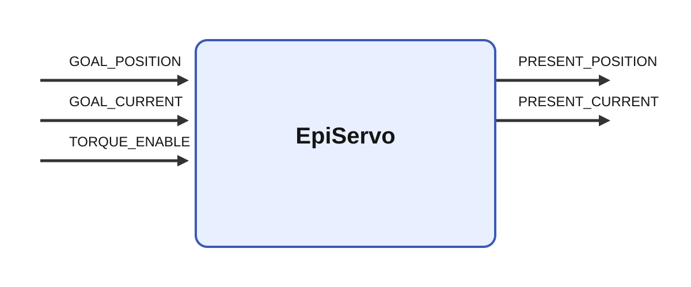

# EpiServos

## Description

Robot servo control module. EpiServos is a hardware interface module for commanding and monitoring
Dynamixel-based servo chains on the Epi robot platform. The implementation manages multiple serial
buses, sends goal positions and currents, reads present position and current feedback, and includes
protocol-level constants and safety logic needed for coordinated robot actuation.

It receives GOAL_POSITION, GOAL_CURRENT, and TORQUE_ENABLE and produces PRESENT_POSITION and
PRESENT_CURRENT while parameters such as robot and simulate shape its behavior. In embodied
cognitive architectures, this module can serve as the motor endpoint for learned gaze shifts,
coordinated head-arm orienting, or expressive whole-body behavior where high-level neural
controllers must be translated into synchronized servo commands.

Servo-interface modules benefit from the wider body of actuator control practice around synchronized
position updates, current limits, feedback monitoring, and fault handling. In cognitively inspired
robot systems, that matters because the neural side may choose goals or trajectories, but reliable
behavior still depends on a low-level layer that enforces physical constraints while exposing
measurable joint state back to the model.

## Parameters

| Name | Description | Type | Default |
| --- | --- | --- | --- |
| robot |  | string | EpiWhite |
| simulate | Simulation mode. No connecting is made to servos. The PRESENT POSITION output is calculated using previous position, goal position, maximum velocoty (no acceleration) and the time base of the simulation. | bool | False |
| MinLimitPosition | The minimum limit of the position in degrees of the servos. Not including pupils | matrix | 122, 130, 161, 156, 53, 73, 87, 53, 70, 0, 53, 79, 88, 158, 70, 0, 9 |
| MaxLimitPosition | The maximum limit of the position of the servos in degrees. Not including pupils | matrix | 237, 240, 202, 193, 281, 281, 263, 202, 342, 360, 281, 290, 264, 316, 343, 360, 343 |
| DataToWrite | The data names to write to the servos. The data names are separated by a comma. The data names are the same as the input names. | string | Goal Position,Goal Current,Torque Enable |
| ServoControlMode | The control mode of the servos. | string | Position |

## Inputs

| Name | Description | Optional |
| --- | --- | --- |
| GOAL_POSITION | Goal position of the joints in degrees. |  |
| GOAL_CURRENT | Goal current in mA. This is an optional input and only used if the servo uses current-based position control mode | true |
| TORQUE_ENABLE | Enable servos. This is an optional and not recommended input | true |
| GOAL_PWM | Pulse width modulation in percentage. This is an optional input that can be used to limit PWM and thereby force in position control mode. | true |

## Outputs

| Name | Description |
| --- | --- |
| PRESENT_POSITION | Present angle of the joints in degrees. |
| PRESENT_CURRENT | Present current (if supported by the servo) in mA. |

*This description was automatically created and may not be an accurate description of the module.*
