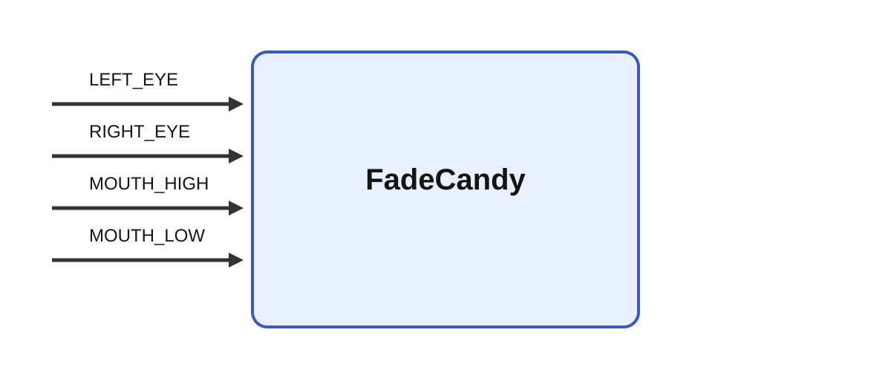

# FadeCandy

## Description

Controls the four NeoPixel groups on an Epi robot through a USB FadeCandy board. Set `simulate`
when developing without attached hardware.

## Inputs

| Name | Description | Optional |
| --- | --- | --- |
| LEFT_EYE | RGB matrix with shape `[3, 12]`. | No |
| RIGHT_EYE | RGB matrix with shape `[3, 12]`. | No |
| MOUTH_HIGH | RGB matrix with shape `[3, 8]`. | No |
| MOUTH_LOW | RGB matrix with shape `[3, 8]`. | No |

## Parameters

| Name | Description | Type | Default |
| --- | --- | --- | --- |
| simulate | Do not connect to a FadeCandy board or send LED updates. | bool | False |

Input values are converted from normalized RGB values to device bytes. The module reconnects when
the USB device is unavailable and reports connection problems through Ikaros notifications.
