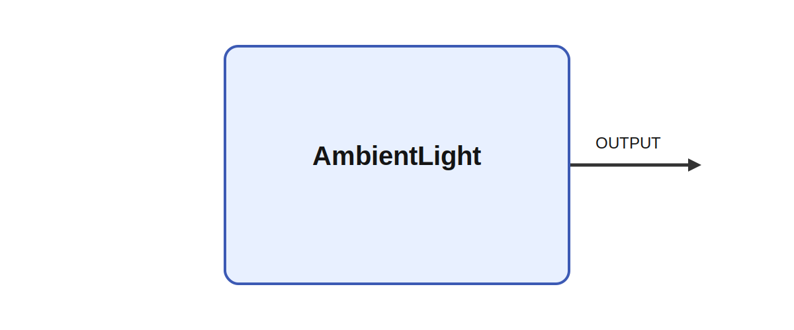

# AmbientLight

## Description

Calculare the ambient light at a place and tine using various methods. The module AmbientLight
calculates the light based on a tiem and location. The location is given by its latitde and lngitude
and the initial time is given by the year, month and day. The module always starts at midnight and
uses the internal Ikaros time to update its output. Note that the time is interpreted as local time
at the location. This means that if two instances are running for different locations, the time will
not be the same for both of them, i. e. as they both start at their respective local midnights.
There are several methods to calculate the ambient light: 12_12 produceses as 12h:12h light dark
cycles. Full on or off regardless of the set location. DSR calculates the Diffuse Sky Radiation
(DSR) at a place and time based on ChatGPT's interpretation of the model proposed by Erbs et al.
1982. May be wildly inaccurate.

It produces OUTPUT while parameters such as method, use_system_time, year, month, and day shape its
behavior. A meaningful use case is to place the module inside a larger sensorimotor or cognitive
architecture where it helps transform, summarize, or route signals between neural subsystems and
robot effectors.

## Parameters

| Name | Description | Type | Default |
| --- | --- | --- | --- |
| method | method used to calculate the ambient light | number | DSR |
| use_system_time | use system time instead of ikaros time (not implemented yet) | bool | fals |
| year | the initial year | number | 2024 |
| month | the initial month | number | 1 |
| day | the initial day | number | 1 |
| time | the initial time in seconds from midnight | number | 0 |
| radiation | the radiation level in W/m^2 for the on/off light | number | 1 |
| longitude | the longitude | number | 55.577918 |
| latitude | the latitude | number | 12.814571 |

## Outputs

| Name | Description |
| --- | --- |
| OUTPUT | The diffuse sky radiation in W/m^2 |

*This description was automatically created and may not be an accurate description of the module.*
