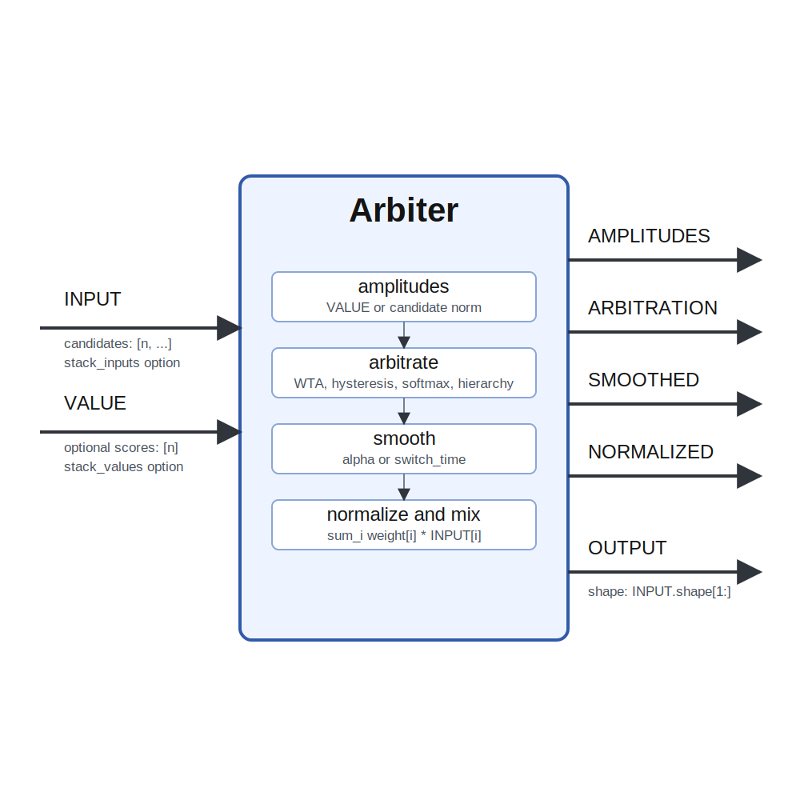

# Arbiter

## Description

Selects between multiple inputs. Module that selects between its inputs based on the values in the
value inputs or the amplitude of its inputs. 

The output is a weighted average of the inputs
depending on the corresponding value inputs. 

`INPUT` contains candidates along dimension 0. The remaining dimensions are the selected value shape.

When the values are equal, the lowest candidate index is selected.

If the value inputs are not
connected, the norms of the inputs are used instead. This is useful for population coded values. 

There are four arbitration methods: 

- WTA: winner take all. Input with maximum value is selected; 
- hysteresis: like WTA, but to switch, the new value must be higher than the last value plus the hysteresis threshold; 
- softmax: inputs are mixed according to the values to the power of the softmax exponent; 
- hierarchy: input with highest index and value > 0 is always selected, this can implement a subsumption architecture; Note
that changing to hysteresis arbitration during operation may initially select the wrong state. 

After arbitration, the state can be smoothed to avoid abrupt changes of the outputs. The switching time is set by the switching_time parameter or directly by the integration constant alpha. Finally, the convex combinations of inputs are calculated by first normalizaing the smoothed state and the calculating the weighted average of the inputs.

It receives INPUT and produces 

- AMPLITUDES
- ARBITRATION
- SMOOTHED
- NORMALIZED

Parameters such as metric, arbitration, and softmax_exponent shape its behavior. A meaningful use case is to place the module inside a larger sensorimotor or cognitive architecture where it helps transform, summarize, or route signals between neural subsystems and robot effectors.

## Parameters

| Name | Description | Type | Default |
| --- | --- | --- | --- |
| metric | The metric used when VALUE is not connected: city block or euclidean | list | 1 |
| arbitration | The arbitration function | list | WTA |
| softmax_exponent | The softmax exponent | float | 2 |
| hysteresis_threshold | The value difference that needs to be passed for a switch | float | 5 |
| switch_time | Number of ticks to switch over | int | 0 |
| alpha | Smoothing constant (set to 1/switch_time if not set) | float | 1 |
| stack_inputs | Stack multiple INPUT connections along dimension 0 | bool | yes |
| stack_values | Stack multiple VALUE connections along dimension 0 | bool | no |
| debug | Print out debug info | bool | false |

## Inputs

| Name | Description | Optional |
| --- | --- | --- |
INPUT | Candidate inputs; candidate index is dimension 0 when stacked |  |
VALUE | Optional arbitration values; one value per candidate | yes |

When `stack_inputs` or `stack_values` is enabled, connection order defines the candidate index. Leave stacking disabled when candidate order should be made explicit upstream.

## Outputs

| Name | Description |
| --- | --- |
| AMPLITUDES | The amplitides of the inputs / or values |
| ARBITRATION | The state after arbitration |
| SMOOTHED | The temporally smoothed arbitration state |
| NORMALIZED | The arbitration state after normalization; the weights used to weigh together the inputs |
| OUTPUT | The selected output |

*This description is a work in progress and may not be an accurate description of the module.*
