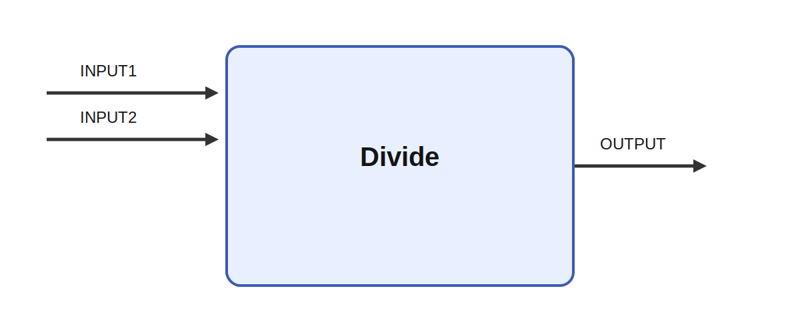

# Divide

## Description

Divides two inputs. Divide is a binary combination module that divides two incoming signals and
writes the result to a single output. In an Ikaros graph it is used as a simple arithmetic building
block for constructing larger data-flow expressions from streaming matrices.

It receives INPUT1 and INPUT2 and produces OUTPUT. A realistic use case is to combine converging
neural signals, such as excitatory and inhibitory drive in a simplified circuit model, or to merge
feedforward and feedback terms in a robot control law before sending the result onward.

## Inputs

| Name | Description | Optional |
| --- | --- | --- |
| INPUT1 | The first input |  |
| INPUT2 | The second input |  |

## Outputs

| Name | Description |
| --- | --- |
| OUTPUT | The output |

*This description was automatically created and may not be an accurate description of the module.*
