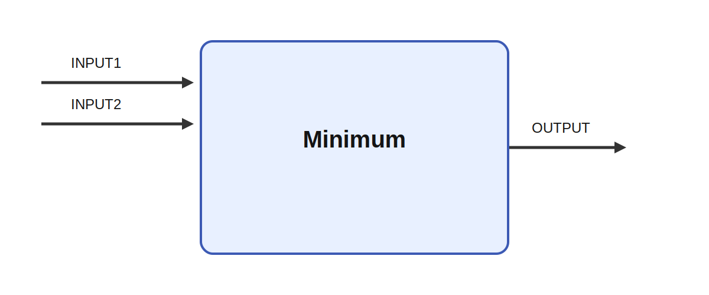

# Minimum

## Description

Takes the element-wise minimum of two inputs. Minimum is a binary combination module that compares
two incoming matrices and writes the smaller value from each pair of elements to the output.

It receives INPUT1 and INPUT2 and produces OUTPUT. A typical use case is to enforce a lower envelope
between two streams, such as clipping a response by a dynamic ceiling map.

## Inputs

| Name | Description | Optional |
| --- | --- | --- |
| INPUT1 | The first input |  |
| INPUT2 | The second input | yes |

## Outputs

| Name | Description |
| --- | --- |
| OUTPUT | The output |

*This description was automatically created and may not be an accurate description of the module.*
