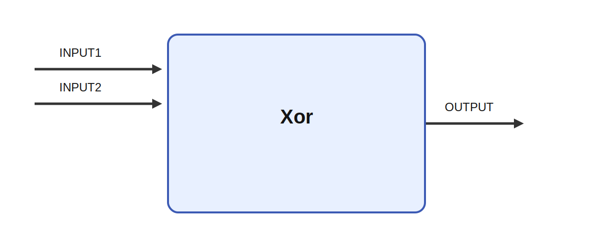

# Xor

## Description

Computes the element-wise logical xor of two inputs. Non-zero values are interpreted as true and
zero values as false, and the output is binary with values of 0 or 1.

It receives INPUT1 and INPUT2 and produces OUTPUT. A typical use case is to highlight elements that
are active in exactly one of two masks while suppressing overlap.

## Inputs

| Name | Description | Optional |
| --- | --- | --- |
| INPUT1 | The first input |  |
| INPUT2 | The second input | yes |

## Outputs

| Name | Description |
| --- | --- |
| OUTPUT | Binary output |

*This description was automatically created and may not be an accurate description of the module.*
