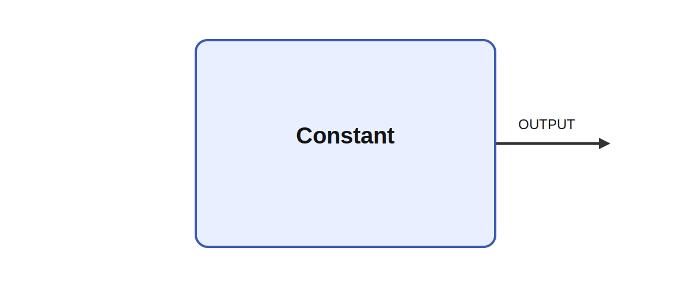

# Constant

## Description

Outputs a constant value. Constant provides a fixed matrix value to the rest of the network. In the
implementation, the configured data parameter is bound once and copied directly to OUTPUT every
tick, which makes the module useful for reference signals, thresholds, masks, lookup constants, and
test fixtures.

It produces OUTPUT while parameters such as data shape its behavior. A non-trivial use case is to
hold a learned posture template, a target muscle-synergy pattern, or a fixed neuromodulatory bias
that is injected into a larger circuit during a specific behavioral phase.

## Parameters

| Name | Description | Type | Default |
| --- | --- | --- | --- |
| data | output from module | matrix | 1, 2, 3, 4, 5, 6 |

## Outputs

| Name | Description |
| --- | --- |
| OUTPUT | The output |

*This description was automatically created and may not be an accurate description of the module.*
