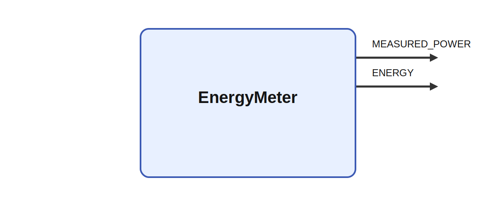

# EnergyMeter

## Description

Measures power and accumulates energy consumption. EnergyMeter samples power data from an HTTP
endpoint and integrates it over time. The code reads the current power value from the configured
address, stores that instantaneous reading in MEASURED_POWER, and accumulates ENERGY in watt-hours
using the Ikaros tick duration.

It produces MEASURED_POWER and ENERGY while parameters such as address shape its behavior. In robot
experiments it can be used to correlate energy consumption with behavior, for example when comparing
gaze-control strategies, adaptive locomotion policies, or manipulation plans that trade speed
against electrical cost.

## Parameters

| Name | Description | Type | Default |
| --- | --- | --- | --- |
| address | address of smart plug | string | 192.168.33.1/status |

## Outputs

| Name | Description |
| --- | --- |
| MEASURED_POWER | Current power consumption |
| ENERGY | Accumulated power consumption |

*This description was automatically created and may not be an accurate description of the module.*
