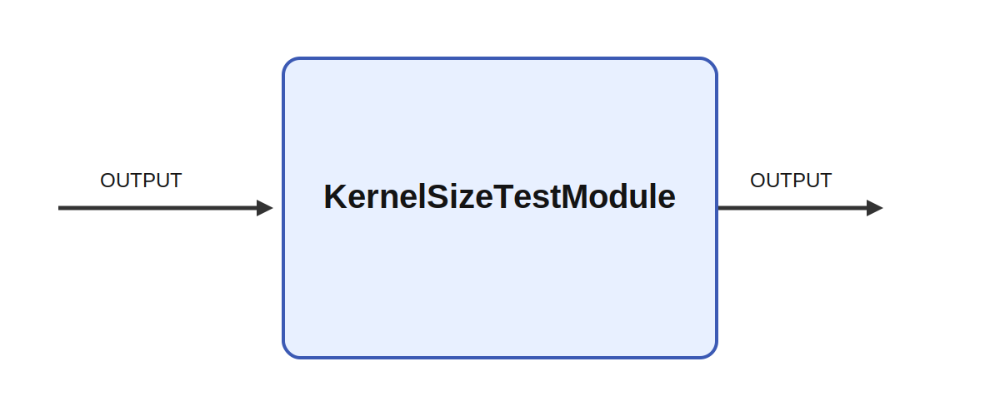

# KernelSizeTestModule

## Description

Used internally to test the Ikaros kernel.

It consumes OUTPUT and produces OUTPUT. A meaningful use case is to place the module inside a larger
sensorimotor or cognitive architecture where it helps transform, summarize, or route signals between
neural subsystems and robot effectors.

## Inputs

| Name | Description | Optional |
| --- | --- | --- |
| OUTPUT |  |  |

## Outputs

| Name | Description |
| --- | --- |
| OUTPUT | The output |

*This description was automatically created and may not be an accurate description of the module.*
