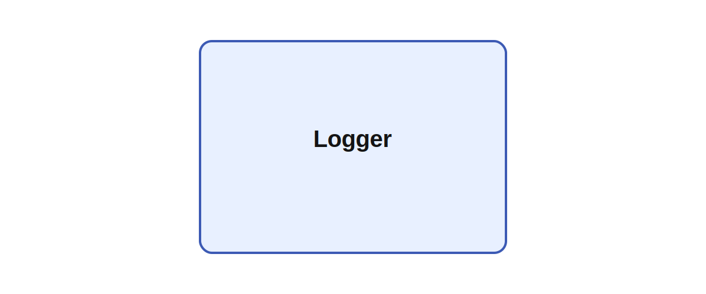

# Logger

## Description

Logs start to Ikaros site. Logger is a lightweight instrumentation hook for an Ikaros run. The
existing implementation is mostly scaffolding, but the code shows that it is meant to package module
instantiation metadata and send a startup log message to the Ikaros project site when a network
begins execution.

In larger embodied experiments, a startup logger is useful for tracking exactly which model
configuration, robot setup, and parameterization produced a given behavioral run so results remain
comparable across long experimental series.

*This description was automatically created and may not be an accurate description of the module.*

