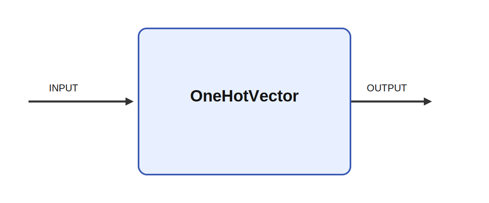

# OneHotVector

## Description

Generate a one hot vector from input value.

It consumes INPUT and produces OUTPUT while parameters such as value and output_size shape its
behavior. A meaningful use case is to place the module inside a larger sensorimotor or cognitive
architecture where it helps transform, summarize, or route signals between neural subsystems and
robot effectors.

## Parameters

| Name | Description | Type | Default |
| --- | --- | --- | --- |
| value | value | number | 1 |
| output_size | Size of output array | number | 10 |

## Inputs

| Name | Description | Optional |
| --- | --- | --- |
| INPUT |  |  |

## Outputs

| Name | Description |
| --- | --- |
| OUTPUT | One hot vector array |

*This description was automatically created and may not be an accurate description of the module.*
