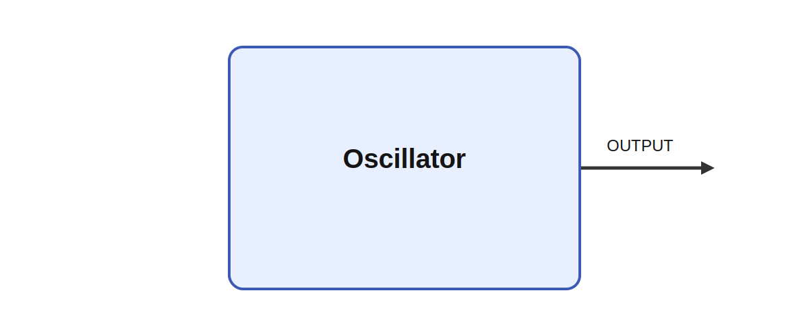

# Oscillator

## Description

Basic oscillator; one output per frequency value. Different types of oscillators. The type of the
oscillation is set by the type parameter. The frequencies are set by a matrix parameter and the
output has the same size as that parameter. If a sample_rate is set, the module will produce a
buffer with a requred number of samples to fill upp between two ticks. For example,

It produces OUTPUT while parameters such as type and frequency shape its behavior. A meaningful use
case is to place the module inside a larger sensorimotor or cognitive architecture where it helps
transform, summarize, or route signals between neural subsystems and robot effectors.

Rhythmic drive signals are central in both engineering and neuroscience because they provide a
simple way to organize repeated structure over time. In models they can stand in for central pattern
generators, periodic probes, pacing signals, or entrainment sources that coordinate distributed
subsystems during locomotion, breathing-like behavior, scanning, or exploratory sensing.

## Parameters

| Name | Description | Type | Default |
| --- | --- | --- | --- |
| type |  | number | sin |
| frequency | frequency in Hz | matrix | 1 |

## Outputs

| Name | Description |
| --- | --- |
| OUTPUT | The output |

*This description was automatically created and may not be an accurate description of the module.*
